# 건축물 음영 평가 모델을 위한 대전시 태양광 차폐율 데이터 분석

## 동기

* 인접 건물 등으로 인한 음영 효과는 태양광 발전에 큰 영향을 끼친다. 현재 음영 효과 계산에는 건물과 지형의 3D 모델 데이터를 이용하는데, 많은 데이터로 인해 막대한 계산 비용이 소요

## 목적

* **건물 옥상에서 측정한 일사량 데이터**와 **위성에서 측정한 일사량 데이터**와 **대전시 건물 정보 데이터**를 통해 건물 옥상에 태양 발전 시스템을 설치했을 때, 효율성을 도출할 수 있는 모델을 개발하려고 한다.


## 결과

* 랜덤포레스트와 딥러닝 학습 및 추론에 각기 7분과 4분 30초가 소요되어 기존에 1개 구의 데이터를 얻는데 5~7일이 걸리던 음영영역 계산 시간을 획기적으로 단축시켰다.
* 예측 성능은 결정계수를 기준으로 랜덤포레스트 0.6, MLP 0.623의 성능을 냈다


# 데이터 전처리

## 기본 환경 설정


```python
%matplotlib inline  

import pandas as pd
import numpy as np
import math
import gmplot
import statistics
from math import *
import time 
from scipy.stats.stats import pearsonr
import seaborn as sns
import os 
import json
from sklearn.cluster import KMeans
import copy
from sklearn.neighbors import KDTree
from numpy import array
import datetime
import datetime
from pysolar.solar import *
from math import *
import calendar 

from mpl_toolkits.mplot3d import axes3d, Axes3D 
import pylab
from mpl_toolkits.mplot3d import proj3d
from IPython.display import Image


sns.set(style='whitegrid')
sns.set(font_scale=1)

pd.set_option('display.max_columns', None)


```

## 한글 폰트 세팅

### Nanum 글꼴 설치


1. sudo apt-get install fonts-nanum*
2. sudo fc-cache -fv
3. sudo cp /usr/share/fonts/truetype/nanum/Nanum* /usr/local/lib/python3.6/dist-packages/matplotlib/mpl-data/fonts/ttf/


```python
import platform
system = platform.system()

%matplotlib inline
import matplotlib as mpl # 기본 설정 만지는 용도
import matplotlib.pyplot as plt # 그래프 그리는 용도
import matplotlib.font_manager as fm # 폰트 관련 용도

print ('버전: ', mpl.__version__)
print ('설치 위치: ', mpl.__file__)
print ('설정 위치: ', mpl.get_configdir())
print ('캐시 위치: ', mpl.get_cachedir())
print ('설정 파일 위치: ', mpl.matplotlib_fname())

font_list = fm.findSystemFonts(fontpaths=None, fontext='ttf')

if system == 'Windows':
    datapath = os.getcwd() + '\\'
    imagepath = datapath + 'images\\'
    # ttf 폰트 전체개수
    print(len(font_list))
    font_list[:10]
    f = [f.name for f in fm.fontManager.ttflist]
    print(len(font_list))

    f[:10]
    [(f.name, f.fname) for f in fm.fontManager.ttflist if 'Nanum' in f.name]
    path = 'C:\\Windows\\Fonts\\NanumBarunGothic.ttf'
    font_name = fm.FontProperties(fname=path, size=50).get_name()
    print(font_name)
    plt.rc('font', family=font_name)
elif system == 'Linux':
    datapath = os.getcwd() + '//'
    imagepath = datapath + 'images//'
    # !apt-get update -qq
    # !apt-get install fonts-nanum* -qq
    path = '/usr/share/fonts/truetype/nanum/NanumGothic.ttf' #
    font_name = fm.FontProperties(fname=path, size=10).get_name()
    print("linux",font_name)
    plt.rc('font', family=font_name)
    fm._rebuild()
    mpl.rcParams['axes.unicode_minus'] = False
else:
    print('# Sorry, my code has compatibility with Windows andLinux only.')
    exit(0)
    

```

    버전:  3.1.1
    설치 위치:  /usr/local/lib/python3.6/dist-packages/matplotlib/__init__.py
    설정 위치:  /home/junho/.config/matplotlib
    캐시 위치:  /home/junho/.cache/matplotlib
    설정 파일 위치:  /usr/local/lib/python3.6/dist-packages/matplotlib/mpl-data/matplotlibrc
    linux NanumGothic


```python
sns.set_style('whitegrid')
sns.palplot(sns.color_palette('muted'))
sns.set_context("talk")
plt.rc('font', family=font_name)
fm._rebuild()
mpl.rcParams['axes.unicode_minus'] = False
```


# 1. 데이터 탐색

##  **1.1. 대전시 건물 데이터**

> gid (참조용코드) : 무시 가능 (위치랑 관계가 있어보임)
> 
> buld_se_cd (건물위치) : 0 지상 , 1 지하 , 2 공중  
> bdtyp_cd (건물유형코드) : 단독주택 , 부대시설 , 경찰서 , 교회 등
>  
> apt_yn (아파트유무) : Y = 아파트  
>  
> gro_flo_c (층수) : 건물 층 수  
>  
> sig_cd  (시군구코드) : 30110 , 30140 ...  
> sig_nn (시군구명) : 동구 , 서구 ...  
>  
> emd_cd (읍면동코드) : 30110137 , 30110110 ...  
> emd_nm (읍면동명) : 대별동 , 가오동 ...  
>  
> tm_x (직교좌표 x)  
> tm_y (직교좌표 y)  
> lon (경도)   
> lat (위도)  
>  
> buld_area (건물넓이) :   
> buld_elev (표고) : 기본 지형의 높낮이 (높은 지역의 예: 산지)  
>  
> 음영반영 일사량 (m01 ... m12 월평균 , y17 월평균들의 총합) : 건물 옥상에서 측정한 일사량 ( 건물의 그림자 , 구름 고려 )  
> 음영미반영 위성일사량 (st_m01 ... st_m12 월평균 , st_y17 월평균들의 총합): 인공위성에서 측정한 일사량 ( 구름 고려 , 건물의 그림자 고려x )  


```python
build_data = pd.read_csv("./data/originDaejeonBuild/DaejeonBuildingData.csv" , dtype = { 'lat' : str , 'lon' : str ,'tm_x' : str  , 'tm_y' : str} )
# build_data = pd.("./df1.csv" , dtype = { 'lat' : str , 'lon' : str ,'tm_x' : str  , 'tm_y' : str} )
```


```python
build_data.head()
```


<div>
<style scoped>
    .dataframe tbody tr th:only-of-type {
        vertical-align: middle;
    }

    .dataframe tbody tr th {
        vertical-align: top;
    }

    .dataframe thead th {
        text-align: right;
    }
</style>
<table border="1" class="dataframe">
  <thead>
    <tr style="text-align: right;">
      <th></th>
      <th>gid</th>
      <th>buld_se_cd</th>
      <th>buld_se_nm</th>
      <th>bdtyp_cd</th>
      <th>apt_yn</th>
      <th>gro_flo_co</th>
      <th>sig_cd</th>
      <th>sig_nm</th>
      <th>emd_cd</th>
      <th>emd_nm</th>
      <th>tm_x</th>
      <th>tm_y</th>
      <th>lon</th>
      <th>lat</th>
      <th>buld_area</th>
      <th>buld_elev</th>
      <th>m01</th>
      <th>m02</th>
      <th>m03</th>
      <th>m04</th>
      <th>m05</th>
      <th>m06</th>
      <th>m07</th>
      <th>m08</th>
      <th>m09</th>
      <th>m10</th>
      <th>m11</th>
      <th>m12</th>
      <th>y17</th>
      <th>st_m01</th>
      <th>st_m02</th>
      <th>st_m03</th>
      <th>st_m04</th>
      <th>st_m05</th>
      <th>st_m06</th>
      <th>st_m07</th>
      <th>st_m08</th>
      <th>st_m09</th>
      <th>st_m10</th>
      <th>st_m11</th>
      <th>st_m12</th>
      <th>st_y17</th>
    </tr>
  </thead>
  <tbody>
    <tr>
      <th>0</th>
      <td>24300</td>
      <td>0</td>
      <td>지상</td>
      <td>4299</td>
      <td>N</td>
      <td>1</td>
      <td>30110</td>
      <td>동구</td>
      <td>30110137</td>
      <td>대별동</td>
      <td>241302.419829207</td>
      <td>409864.414379324</td>
      <td>127.459746194608</td>
      <td>36.2858798245272</td>
      <td>199.109760</td>
      <td>80.0</td>
      <td>61.587998</td>
      <td>76.368133</td>
      <td>108.372414</td>
      <td>130.399192</td>
      <td>153.301472</td>
      <td>138.981246</td>
      <td>94.119230</td>
      <td>116.160558</td>
      <td>107.075909</td>
      <td>76.058284</td>
      <td>63.246135</td>
      <td>57.791311</td>
      <td>1183.461879</td>
      <td>77.441429</td>
      <td>97.564735</td>
      <td>136.456909</td>
      <td>159.853821</td>
      <td>181.146118</td>
      <td>161.530762</td>
      <td>109.311691</td>
      <td>138.931046</td>
      <td>133.254684</td>
      <td>95.614578</td>
      <td>80.392227</td>
      <td>72.975700</td>
      <td>1444.473755</td>
    </tr>
    <tr>
      <th>1</th>
      <td>16295</td>
      <td>0</td>
      <td>지상</td>
      <td>1001</td>
      <td>N</td>
      <td>1</td>
      <td>30110</td>
      <td>동구</td>
      <td>30110105</td>
      <td>가오동</td>
      <td>240815.01297069</td>
      <td>412384.958080419</td>
      <td>127.454452653456</td>
      <td>36.3086147051094</td>
      <td>77.392318</td>
      <td>71.0</td>
      <td>54.658766</td>
      <td>74.324060</td>
      <td>109.983419</td>
      <td>131.021372</td>
      <td>148.915192</td>
      <td>136.026763</td>
      <td>91.462299</td>
      <td>112.346493</td>
      <td>109.010571</td>
      <td>75.964252</td>
      <td>59.752928</td>
      <td>48.710326</td>
      <td>1152.176436</td>
      <td>77.599655</td>
      <td>96.723419</td>
      <td>136.413635</td>
      <td>159.390518</td>
      <td>180.876144</td>
      <td>165.518311</td>
      <td>112.231346</td>
      <td>137.366898</td>
      <td>134.195908</td>
      <td>96.377113</td>
      <td>79.952248</td>
      <td>72.717972</td>
      <td>1449.363159</td>
    </tr>
    <tr>
      <th>2</th>
      <td>24341</td>
      <td>0</td>
      <td>지상</td>
      <td>1001</td>
      <td>N</td>
      <td>1</td>
      <td>30110</td>
      <td>동구</td>
      <td>30110137</td>
      <td>대별동</td>
      <td>241460.822383503</td>
      <td>410090.94543095</td>
      <td>127.461521377075</td>
      <td>36.2879144426327</td>
      <td>91.076386</td>
      <td>77.0</td>
      <td>62.304043</td>
      <td>78.038810</td>
      <td>110.389678</td>
      <td>130.250699</td>
      <td>150.068158</td>
      <td>135.022303</td>
      <td>92.270864</td>
      <td>114.937466</td>
      <td>108.497604</td>
      <td>77.568352</td>
      <td>64.558410</td>
      <td>58.305233</td>
      <td>1182.211623</td>
      <td>77.441429</td>
      <td>97.564735</td>
      <td>136.456909</td>
      <td>159.853821</td>
      <td>181.146118</td>
      <td>161.530762</td>
      <td>109.311691</td>
      <td>138.931046</td>
      <td>133.254684</td>
      <td>95.614578</td>
      <td>80.392227</td>
      <td>72.975700</td>
      <td>1444.473755</td>
    </tr>
    <tr>
      <th>3</th>
      <td>24345</td>
      <td>0</td>
      <td>지상</td>
      <td>4402</td>
      <td>N</td>
      <td>1</td>
      <td>30110</td>
      <td>동구</td>
      <td>30110137</td>
      <td>대별동</td>
      <td>241530.22297262</td>
      <td>410067.763074595</td>
      <td>127.462292655181</td>
      <td>36.2877025481814</td>
      <td>51.201706</td>
      <td>78.0</td>
      <td>48.680540</td>
      <td>60.641904</td>
      <td>86.469240</td>
      <td>105.063324</td>
      <td>123.864551</td>
      <td>112.271188</td>
      <td>75.391599</td>
      <td>93.429884</td>
      <td>85.668236</td>
      <td>60.352004</td>
      <td>50.002206</td>
      <td>45.656253</td>
      <td>947.490926</td>
      <td>77.441429</td>
      <td>97.564735</td>
      <td>136.456909</td>
      <td>159.853821</td>
      <td>181.146118</td>
      <td>161.530762</td>
      <td>109.311691</td>
      <td>138.931046</td>
      <td>133.254684</td>
      <td>95.614578</td>
      <td>80.392227</td>
      <td>72.975700</td>
      <td>1444.473755</td>
    </tr>
    <tr>
      <th>4</th>
      <td>24374</td>
      <td>0</td>
      <td>지상</td>
      <td>18999</td>
      <td>N</td>
      <td>1</td>
      <td>30110</td>
      <td>동구</td>
      <td>30110137</td>
      <td>대별동</td>
      <td>241500.967910986</td>
      <td>409605.204042476</td>
      <td>127.461942445015</td>
      <td>36.2835354035404</td>
      <td>455.844167</td>
      <td>80.0</td>
      <td>67.250476</td>
      <td>84.060162</td>
      <td>119.429691</td>
      <td>141.218665</td>
      <td>162.556833</td>
      <td>146.167080</td>
      <td>99.833438</td>
      <td>124.410167</td>
      <td>117.419093</td>
      <td>83.429842</td>
      <td>69.257649</td>
      <td>62.888074</td>
      <td>1277.921216</td>
      <td>77.441429</td>
      <td>97.564735</td>
      <td>136.456909</td>
      <td>159.853821</td>
      <td>181.146118</td>
      <td>161.530762</td>
      <td>109.311691</td>
      <td>138.931046</td>
      <td>133.254684</td>
      <td>95.614578</td>
      <td>80.392227</td>
      <td>72.975700</td>
      <td>1444.473755</td>
    </tr>
  </tbody>
</table>
</div>


### 1.1.1 column별 형식 확인


```python
build_data.info()
```

    <class 'pandas.core.frame.DataFrame'>
    RangeIndex: 147754 entries, 0 to 147753
    Data columns (total 42 columns):
    gid           147754 non-null int64
    buld_se_cd    147754 non-null int64
    buld_se_nm    147754 non-null object
    bdtyp_cd      147754 non-null int64
    apt_yn        147754 non-null object
    gro_flo_co    147754 non-null int64
    sig_cd        147754 non-null int64
    sig_nm        147754 non-null object
    emd_cd        147754 non-null int64
    emd_nm        147754 non-null object
    tm_x          147754 non-null object
    tm_y          147754 non-null object
    lon           147754 non-null object
    lat           147754 non-null object
    buld_area     147754 non-null float64
    buld_elev     147754 non-null float64
    m01           147754 non-null float64
    m02           147754 non-null float64
    m03           147754 non-null float64
    m04           147754 non-null float64
    m05           147754 non-null float64
    m06           147754 non-null float64
    m07           147754 non-null float64
    m08           147754 non-null float64
    m09           147754 non-null float64
    m10           147754 non-null float64
    m11           147754 non-null float64
    m12           147754 non-null float64
    y17           147754 non-null float64
    st_m01        147754 non-null float64
    st_m02        147754 non-null float64
    st_m03        147754 non-null float64
    st_m04        147754 non-null float64
    st_m05        147754 non-null float64
    st_m06        147754 non-null float64
    st_m07        147754 non-null float64
    st_m08        147754 non-null float64
    st_m09        147754 non-null float64
    st_m10        147754 non-null float64
    st_m11        147754 non-null float64
    st_m12        147754 non-null float64
    st_y17        147754 non-null float64
    dtypes: float64(28), int64(6), object(8)
    memory usage: 47.3+ MB


### 1.1.2 데이터 분포 훑어보기


```python
build_data.describe()
```


<div>
<style scoped>
    .dataframe tbody tr th:only-of-type {
        vertical-align: middle;
    }

    .dataframe tbody tr th {
        vertical-align: top;
    }

    .dataframe thead th {
        text-align: right;
    }
</style>
<table border="1" class="dataframe">
  <thead>
    <tr style="text-align: right;">
      <th></th>
      <th>gid</th>
      <th>buld_se_cd</th>
      <th>bdtyp_cd</th>
      <th>gro_flo_co</th>
      <th>sig_cd</th>
      <th>emd_cd</th>
      <th>buld_area</th>
      <th>buld_elev</th>
      <th>m01</th>
      <th>m02</th>
      <th>m03</th>
      <th>m04</th>
      <th>m05</th>
      <th>m06</th>
      <th>m07</th>
      <th>m08</th>
      <th>m09</th>
      <th>m10</th>
      <th>m11</th>
      <th>m12</th>
      <th>y17</th>
      <th>st_m01</th>
      <th>st_m02</th>
      <th>st_m03</th>
      <th>st_m04</th>
      <th>st_m05</th>
      <th>st_m06</th>
      <th>st_m07</th>
      <th>st_m08</th>
      <th>st_m09</th>
      <th>st_m10</th>
      <th>st_m11</th>
      <th>st_m12</th>
      <th>st_y17</th>
    </tr>
  </thead>
  <tbody>
    <tr>
      <th>count</th>
      <td>147754.000000</td>
      <td>147754.000000</td>
      <td>147754.000000</td>
      <td>147754.000000</td>
      <td>147754.000000</td>
      <td>1.477540e+05</td>
      <td>147754.000000</td>
      <td>147754.000000</td>
      <td>147754.000000</td>
      <td>147754.000000</td>
      <td>147754.000000</td>
      <td>147754.000000</td>
      <td>147754.000000</td>
      <td>147754.000000</td>
      <td>147754.000000</td>
      <td>147754.000000</td>
      <td>147754.000000</td>
      <td>147754.000000</td>
      <td>147754.000000</td>
      <td>147754.000000</td>
      <td>147754.000000</td>
      <td>147754.000000</td>
      <td>147754.000000</td>
      <td>147754.000000</td>
      <td>147754.000000</td>
      <td>147754.000000</td>
      <td>147754.000000</td>
      <td>147754.000000</td>
      <td>147754.000000</td>
      <td>147754.000000</td>
      <td>147754.000000</td>
      <td>147754.000000</td>
      <td>147754.000000</td>
      <td>147754.000000</td>
    </tr>
    <tr>
      <th>mean</th>
      <td>73879.886230</td>
      <td>0.000129</td>
      <td>2743.962999</td>
      <td>2.225192</td>
      <td>30163.558144</td>
      <td>3.016367e+07</td>
      <td>186.553186</td>
      <td>64.722290</td>
      <td>55.925631</td>
      <td>70.677156</td>
      <td>101.713438</td>
      <td>119.425253</td>
      <td>136.929229</td>
      <td>126.142181</td>
      <td>83.915675</td>
      <td>103.887353</td>
      <td>100.549598</td>
      <td>71.632038</td>
      <td>57.962761</td>
      <td>52.088693</td>
      <td>1080.849007</td>
      <td>77.050468</td>
      <td>96.618265</td>
      <td>136.530418</td>
      <td>158.612880</td>
      <td>180.166504</td>
      <td>165.272703</td>
      <td>109.550001</td>
      <td>137.084007</td>
      <td>134.208999</td>
      <td>97.014896</td>
      <td>80.035097</td>
      <td>73.029130</td>
      <td>1445.173369</td>
    </tr>
    <tr>
      <th>std</th>
      <td>42653.850793</td>
      <td>0.011339</td>
      <td>3563.400798</td>
      <td>2.640942</td>
      <td>41.590794</td>
      <td>4.159049e+04</td>
      <td>773.325543</td>
      <td>24.032289</td>
      <td>9.422654</td>
      <td>11.298384</td>
      <td>14.653770</td>
      <td>15.445972</td>
      <td>16.762203</td>
      <td>15.217830</td>
      <td>10.392281</td>
      <td>13.100767</td>
      <td>14.092994</td>
      <td>10.916987</td>
      <td>9.712493</td>
      <td>9.556732</td>
      <td>146.156608</td>
      <td>0.842217</td>
      <td>0.983732</td>
      <td>0.831234</td>
      <td>1.089945</td>
      <td>0.982429</td>
      <td>1.552964</td>
      <td>1.750496</td>
      <td>1.546151</td>
      <td>1.524393</td>
      <td>0.783346</td>
      <td>0.628085</td>
      <td>0.612128</td>
      <td>7.222999</td>
    </tr>
    <tr>
      <th>min</th>
      <td>1.000000</td>
      <td>0.000000</td>
      <td>1001.000000</td>
      <td>0.000000</td>
      <td>30110.000000</td>
      <td>3.011010e+07</td>
      <td>0.085259</td>
      <td>0.000000</td>
      <td>0.000000</td>
      <td>0.000000</td>
      <td>0.000000</td>
      <td>0.000000</td>
      <td>0.000000</td>
      <td>0.000000</td>
      <td>0.000000</td>
      <td>0.000000</td>
      <td>0.000000</td>
      <td>0.000000</td>
      <td>0.000000</td>
      <td>0.000000</td>
      <td>0.000000</td>
      <td>71.198448</td>
      <td>94.399231</td>
      <td>134.171249</td>
      <td>155.837372</td>
      <td>177.485138</td>
      <td>157.210220</td>
      <td>104.342499</td>
      <td>132.507645</td>
      <td>130.534683</td>
      <td>94.682899</td>
      <td>78.030434</td>
      <td>70.801079</td>
      <td>1429.468384</td>
    </tr>
    <tr>
      <th>25%</th>
      <td>36940.250000</td>
      <td>0.000000</td>
      <td>1001.000000</td>
      <td>1.000000</td>
      <td>30140.000000</td>
      <td>3.014010e+07</td>
      <td>72.208554</td>
      <td>50.000000</td>
      <td>51.381658</td>
      <td>65.216892</td>
      <td>94.470049</td>
      <td>111.487575</td>
      <td>128.115865</td>
      <td>118.061558</td>
      <td>78.240616</td>
      <td>96.991555</td>
      <td>93.275781</td>
      <td>66.342756</td>
      <td>53.297663</td>
      <td>47.628474</td>
      <td>1005.319831</td>
      <td>76.414169</td>
      <td>95.940933</td>
      <td>135.864822</td>
      <td>157.834381</td>
      <td>179.481567</td>
      <td>164.561935</td>
      <td>108.224854</td>
      <td>135.809494</td>
      <td>133.071228</td>
      <td>96.566551</td>
      <td>79.772346</td>
      <td>72.634338</td>
      <td>1440.258545</td>
    </tr>
    <tr>
      <th>50%</th>
      <td>73880.500000</td>
      <td>0.000000</td>
      <td>1001.000000</td>
      <td>1.000000</td>
      <td>30170.000000</td>
      <td>3.017010e+07</td>
      <td>105.244051</td>
      <td>59.000000</td>
      <td>57.513789</td>
      <td>72.409462</td>
      <td>103.742219</td>
      <td>121.099433</td>
      <td>138.134556</td>
      <td>127.118031</td>
      <td>84.709294</td>
      <td>104.999353</td>
      <td>102.269936</td>
      <td>73.224264</td>
      <td>59.529122</td>
      <td>53.857362</td>
      <td>1097.736867</td>
      <td>77.077156</td>
      <td>96.510239</td>
      <td>136.479599</td>
      <td>158.411438</td>
      <td>179.956604</td>
      <td>165.515732</td>
      <td>109.535027</td>
      <td>137.198929</td>
      <td>134.287460</td>
      <td>96.874321</td>
      <td>80.066132</td>
      <td>72.964104</td>
      <td>1444.666382</td>
    </tr>
    <tr>
      <th>75%</th>
      <td>110818.750000</td>
      <td>0.000000</td>
      <td>3001.000000</td>
      <td>3.000000</td>
      <td>30200.000000</td>
      <td>3.020012e+07</td>
      <td>153.676529</td>
      <td>73.360001</td>
      <td>62.375331</td>
      <td>78.376077</td>
      <td>111.554599</td>
      <td>129.584568</td>
      <td>147.732052</td>
      <td>135.959141</td>
      <td>90.856187</td>
      <td>112.477660</td>
      <td>110.065236</td>
      <td>78.948424</td>
      <td>64.590607</td>
      <td>58.648091</td>
      <td>1178.381805</td>
      <td>77.652016</td>
      <td>97.260674</td>
      <td>137.144516</td>
      <td>159.436966</td>
      <td>180.776505</td>
      <td>166.256500</td>
      <td>110.954002</td>
      <td>138.065933</td>
      <td>135.414658</td>
      <td>97.507172</td>
      <td>80.380775</td>
      <td>73.353889</td>
      <td>1450.675903</td>
    </tr>
    <tr>
      <th>max</th>
      <td>147757.000000</td>
      <td>1.000000</td>
      <td>27999.000000</td>
      <td>51.000000</td>
      <td>30230.000000</td>
      <td>3.023013e+07</td>
      <td>130409.550646</td>
      <td>575.000000</td>
      <td>78.468292</td>
      <td>98.541275</td>
      <td>138.905443</td>
      <td>160.837215</td>
      <td>183.110577</td>
      <td>170.121167</td>
      <td>111.944861</td>
      <td>139.990626</td>
      <td>136.316334</td>
      <td>98.873651</td>
      <td>81.471288</td>
      <td>75.043336</td>
      <td>1457.275539</td>
      <td>80.799583</td>
      <td>99.501114</td>
      <td>139.515732</td>
      <td>162.108368</td>
      <td>187.334869</td>
      <td>173.628052</td>
      <td>112.851799</td>
      <td>142.877274</td>
      <td>138.315613</td>
      <td>100.514954</td>
      <td>82.076706</td>
      <td>76.242668</td>
      <td>1482.603271</td>
    </tr>
  </tbody>
</table>
</div>


### 1.1.3 데이터 시각화 

* 1층 건물이 전체의 절반가량을 차지하고, 10층 이상 건물은 극히 적다.
* 건물의 면적은 100m^2 미만이 전체의 45.7%를 차지하고 1000m^2 미만이 98.1%를 차지한다.


```python
# plot : numerical distribution

import numpy as np
def dist_plot(df, xk, xv):

    fig, ax = plt.subplots(figsize=(6,6))
    f = sns.distplot(df[xk], kde=False, rug=False)

    if xv == '건물 면적':
        f.set(yscale='log')

    mean_val = df[xk].mean()
    std_val = df[xk].std()
    max_val = df[xk].max()
    min_val = df[xk].min()
    
    print('{}: mean= {:.2f}, st.dev.= {:.2f}, min= {:.2f}, max= {:.2f}'.format(xk, mean_val, std_val, min_val, max_val))

    heights = [h.get_height() for h in f.patches]
    index_max = np.argmax(heights)

    f.set(xlabel=xv)
    plt.tight_layout()    

xs = {
    'gro_flo_co' : '지상 층수',
    'buld_area' : '건물 면적',
    'buld_elev' : '건물 표고',
    'y17' : '음영반영 일사량',
    'st_y17': '위성일사량',
}
    
for xk, xv in xs.items():
    dist_plot(build_data, xk, xv)
    
```

    gro_flo_co: mean= 2.23, st.dev.= 2.64, min= 0.00, max= 51.00
    buld_area: mean= 186.55, st.dev.= 773.33, min= 0.09, max= 130409.55
    buld_elev: mean= 64.72, st.dev.= 24.03, min= 0.00, max= 575.00
    y17: mean= 1080.85, st.dev.= 146.16, min= 0.00, max= 1457.28
    st_y17: mean= 1445.17, st.dev.= 7.22, min= 1429.47, max= 1482.60


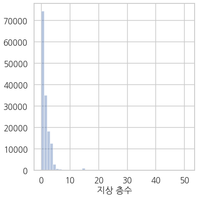


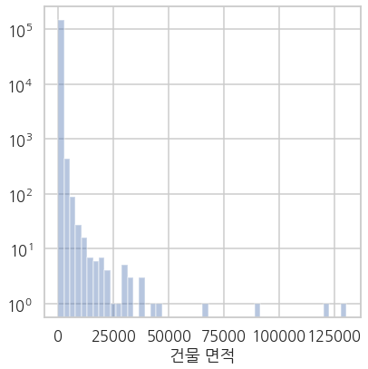


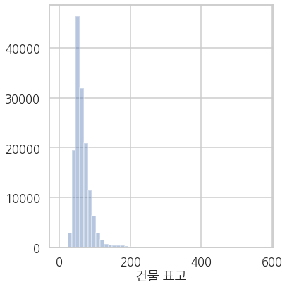


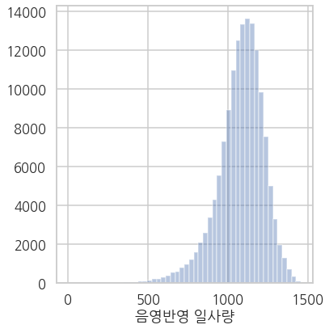


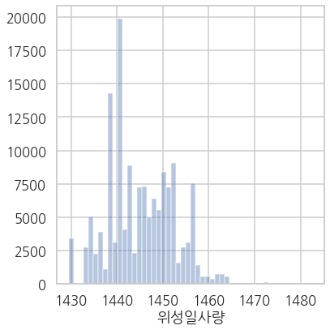


## **1.2 중복데이터 확인 : 동일 위치 중복 데이터 check**


```python
latlonCount = build_data.groupby(['lon', 'lat']).size().reset_index(name ='count')

if latlonCount.shape[0] == 147754:
  print('> 직교좌표 중복데이터 없음')

xyCount = build_data.groupby(['tm_x','tm_y']).size().reset_index(name='count')

if xyCount.shape[0] == 147754:
  print('> 위경도 중복데이터 없음')
```

    > 직교좌표 중복데이터 없음
    > 위경도 중복데이터 없음


## **1.3 gid와 빌딩의 연관성 조사**

* 플라스크와 네이버 지도 API를 이용하여 위도 경도를 이용하여 마커를 찍어 봄


```python
print("> 붙어있는 건물에서 gid 연관성 없음")
Image("./image/presentation/gid.png")
```

    > 붙어있는 건물에서 gid 연관성 없음


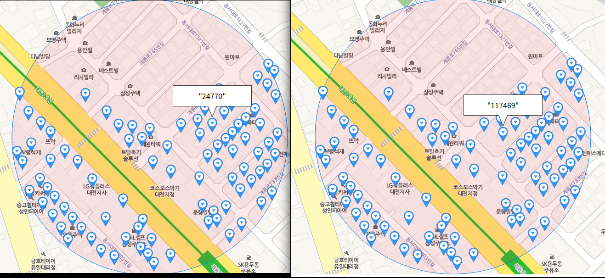


## 1.4 지하인 경우


```python
BuildLocation = build_data[['lon','lat']]

print("지상 : 0")
print("지하 : 1")
print(build_data['buld_se_cd'].value_counts())

print("\n> 지하 데이터가 오류 데이터가 아님")

build_data.loc[build_data['buld_se_cd'] == 1]
```

    지상 : 0
    지하 : 1
    0    147735
    1        19
    Name: buld_se_cd, dtype: int64
    
    > 지하 데이터가 오류 데이터가 아님


<div>
<style scoped>
    .dataframe tbody tr th:only-of-type {
        vertical-align: middle;
    }

    .dataframe tbody tr th {
        vertical-align: top;
    }

    .dataframe thead th {
        text-align: right;
    }
</style>
<table border="1" class="dataframe">
  <thead>
    <tr style="text-align: right;">
      <th></th>
      <th>gid</th>
      <th>buld_se_cd</th>
      <th>buld_se_nm</th>
      <th>bdtyp_cd</th>
      <th>apt_yn</th>
      <th>gro_flo_co</th>
      <th>sig_cd</th>
      <th>sig_nm</th>
      <th>emd_cd</th>
      <th>emd_nm</th>
      <th>tm_x</th>
      <th>tm_y</th>
      <th>lon</th>
      <th>lat</th>
      <th>buld_area</th>
      <th>buld_elev</th>
      <th>m01</th>
      <th>m02</th>
      <th>m03</th>
      <th>m04</th>
      <th>m05</th>
      <th>m06</th>
      <th>m07</th>
      <th>m08</th>
      <th>m09</th>
      <th>m10</th>
      <th>m11</th>
      <th>m12</th>
      <th>y17</th>
      <th>st_m01</th>
      <th>st_m02</th>
      <th>st_m03</th>
      <th>st_m04</th>
      <th>st_m05</th>
      <th>st_m06</th>
      <th>st_m07</th>
      <th>st_m08</th>
      <th>st_m09</th>
      <th>st_m10</th>
      <th>st_m11</th>
      <th>st_m12</th>
      <th>st_y17</th>
    </tr>
  </thead>
  <tbody>
    <tr>
      <th>22021</th>
      <td>89047</td>
      <td>1</td>
      <td>지하</td>
      <td>6305</td>
      <td>N</td>
      <td>0</td>
      <td>30170</td>
      <td>서구</td>
      <td>30170106</td>
      <td>탄방동</td>
      <td>234520.00356667</td>
      <td>416471.704088673</td>
      <td>127.384543667179</td>
      <td>36.3456888830466</td>
      <td>1770.754139</td>
      <td>55.000000</td>
      <td>54.097859</td>
      <td>68.970775</td>
      <td>99.749162</td>
      <td>117.809821</td>
      <td>137.399643</td>
      <td>126.815852</td>
      <td>81.839675</td>
      <td>100.975805</td>
      <td>99.024987</td>
      <td>69.391157</td>
      <td>56.366501</td>
      <td>50.576296</td>
      <td>1063.017532</td>
      <td>76.834938</td>
      <td>96.254860</td>
      <td>135.841019</td>
      <td>156.678741</td>
      <td>180.179794</td>
      <td>165.549576</td>
      <td>108.063553</td>
      <td>133.929565</td>
      <td>133.762146</td>
      <td>96.031113</td>
      <td>79.814529</td>
      <td>72.746582</td>
      <td>1435.686401</td>
    </tr>
    <tr>
      <th>30061</th>
      <td>67891</td>
      <td>1</td>
      <td>지하</td>
      <td>6305</td>
      <td>N</td>
      <td>0</td>
      <td>30170</td>
      <td>서구</td>
      <td>30170111</td>
      <td>갈마동</td>
      <td>233467.973062164</td>
      <td>417807.147156705</td>
      <td>127.372881941172</td>
      <td>36.3577605189151</td>
      <td>3726.100993</td>
      <td>43.000000</td>
      <td>66.016004</td>
      <td>83.266897</td>
      <td>117.184413</td>
      <td>137.947383</td>
      <td>158.596727</td>
      <td>147.030948</td>
      <td>92.348769</td>
      <td>117.385985</td>
      <td>115.890531</td>
      <td>83.053036</td>
      <td>68.652726</td>
      <td>62.246634</td>
      <td>1249.620050</td>
      <td>77.377419</td>
      <td>96.398186</td>
      <td>135.873993</td>
      <td>157.802536</td>
      <td>180.651764</td>
      <td>167.502411</td>
      <td>107.795853</td>
      <td>135.130707</td>
      <td>134.122223</td>
      <td>96.681183</td>
      <td>79.717972</td>
      <td>72.788322</td>
      <td>1441.842529</td>
    </tr>
    <tr>
      <th>48841</th>
      <td>72818</td>
      <td>1</td>
      <td>지하</td>
      <td>6305</td>
      <td>N</td>
      <td>0</td>
      <td>30170</td>
      <td>서구</td>
      <td>30170112</td>
      <td>둔산동</td>
      <td>234712.482175202</td>
      <td>417107.265063677</td>
      <td>127.38671610625</td>
      <td>36.3514093895446</td>
      <td>1971.922709</td>
      <td>50.000000</td>
      <td>53.695903</td>
      <td>68.956052</td>
      <td>99.048140</td>
      <td>116.717241</td>
      <td>133.903336</td>
      <td>122.216826</td>
      <td>80.150380</td>
      <td>99.331053</td>
      <td>97.951689</td>
      <td>69.515844</td>
      <td>56.503946</td>
      <td>50.356874</td>
      <td>1048.347287</td>
      <td>76.872414</td>
      <td>96.057961</td>
      <td>135.854706</td>
      <td>157.590836</td>
      <td>180.085236</td>
      <td>164.561935</td>
      <td>109.361656</td>
      <td>134.790131</td>
      <td>133.793762</td>
      <td>96.575462</td>
      <td>79.753235</td>
      <td>72.973488</td>
      <td>1438.270874</td>
    </tr>
    <tr>
      <th>51580</th>
      <td>103073</td>
      <td>1</td>
      <td>지하</td>
      <td>6305</td>
      <td>N</td>
      <td>0</td>
      <td>30200</td>
      <td>유성구</td>
      <td>30200120</td>
      <td>지족동</td>
      <td>228526.500275495</td>
      <td>419606.976542112</td>
      <td>127.317893541331</td>
      <td>36.3741390691511</td>
      <td>2463.744534</td>
      <td>65.000000</td>
      <td>66.140594</td>
      <td>82.962684</td>
      <td>118.779243</td>
      <td>140.361680</td>
      <td>161.176283</td>
      <td>150.419396</td>
      <td>95.817305</td>
      <td>120.024356</td>
      <td>119.396251</td>
      <td>84.346824</td>
      <td>69.219462</td>
      <td>60.862894</td>
      <td>1269.506968</td>
      <td>77.472229</td>
      <td>95.801392</td>
      <td>135.761124</td>
      <td>158.393463</td>
      <td>180.430862</td>
      <td>167.994629</td>
      <td>108.018616</td>
      <td>135.247406</td>
      <td>135.818878</td>
      <td>97.039185</td>
      <td>80.677711</td>
      <td>72.330093</td>
      <td>1444.985596</td>
    </tr>
    <tr>
      <th>57949</th>
      <td>39950</td>
      <td>1</td>
      <td>지하</td>
      <td>3199</td>
      <td>N</td>
      <td>0</td>
      <td>30140</td>
      <td>중구</td>
      <td>30140102</td>
      <td>선화동</td>
      <td>237670.473981022</td>
      <td>414164.92543329</td>
      <td>127.419526773333</td>
      <td>36.3247830566921</td>
      <td>2354.822554</td>
      <td>56.000000</td>
      <td>57.490670</td>
      <td>74.328704</td>
      <td>106.124367</td>
      <td>125.894830</td>
      <td>140.356277</td>
      <td>128.050177</td>
      <td>85.674141</td>
      <td>107.076241</td>
      <td>103.927707</td>
      <td>74.180212</td>
      <td>59.994429</td>
      <td>52.992235</td>
      <td>1116.089991</td>
      <td>77.879814</td>
      <td>97.888649</td>
      <td>137.650177</td>
      <td>161.103668</td>
      <td>179.430313</td>
      <td>164.030396</td>
      <td>110.965584</td>
      <td>137.935226</td>
      <td>134.604645</td>
      <td>97.507172</td>
      <td>80.282341</td>
      <td>73.184540</td>
      <td>1452.462524</td>
    </tr>
    <tr>
      <th>63424</th>
      <td>39258</td>
      <td>1</td>
      <td>지하</td>
      <td>3199</td>
      <td>N</td>
      <td>0</td>
      <td>30140</td>
      <td>중구</td>
      <td>30140112</td>
      <td>용두동</td>
      <td>237044.008003055</td>
      <td>413902.763799622</td>
      <td>127.412537688857</td>
      <td>36.3224448400471</td>
      <td>4240.016309</td>
      <td>54.000000</td>
      <td>73.716364</td>
      <td>92.134533</td>
      <td>129.608036</td>
      <td>151.800827</td>
      <td>169.167153</td>
      <td>154.688288</td>
      <td>104.569815</td>
      <td>129.945516</td>
      <td>126.689992</td>
      <td>91.542468</td>
      <td>75.412278</td>
      <td>69.396951</td>
      <td>1368.672224</td>
      <td>77.879814</td>
      <td>97.888649</td>
      <td>137.650177</td>
      <td>161.103668</td>
      <td>179.430313</td>
      <td>164.030396</td>
      <td>110.965584</td>
      <td>137.935226</td>
      <td>134.604645</td>
      <td>97.507172</td>
      <td>80.282341</td>
      <td>73.184540</td>
      <td>1452.462524</td>
    </tr>
    <tr>
      <th>63614</th>
      <td>2590</td>
      <td>1</td>
      <td>지하</td>
      <td>6305</td>
      <td>N</td>
      <td>0</td>
      <td>30110</td>
      <td>동구</td>
      <td>30110110</td>
      <td>대동</td>
      <td>239765.428533184</td>
      <td>414702.697100751</td>
      <td>127.442884576914</td>
      <td>36.3295450635349</td>
      <td>2921.925631</td>
      <td>54.840000</td>
      <td>66.559104</td>
      <td>87.340471</td>
      <td>126.359535</td>
      <td>147.254018</td>
      <td>167.745104</td>
      <td>154.305695</td>
      <td>101.571464</td>
      <td>127.896821</td>
      <td>122.397969</td>
      <td>87.594734</td>
      <td>71.135159</td>
      <td>60.247488</td>
      <td>1320.407561</td>
      <td>76.609047</td>
      <td>96.309921</td>
      <td>136.589111</td>
      <td>157.949249</td>
      <td>179.909332</td>
      <td>165.700577</td>
      <td>109.821457</td>
      <td>137.624756</td>
      <td>132.033554</td>
      <td>95.887871</td>
      <td>80.126312</td>
      <td>72.308029</td>
      <td>1440.869263</td>
    </tr>
    <tr>
      <th>67177</th>
      <td>68850</td>
      <td>1</td>
      <td>지하</td>
      <td>6305</td>
      <td>N</td>
      <td>0</td>
      <td>30170</td>
      <td>서구</td>
      <td>30170105</td>
      <td>용문동</td>
      <td>235307.680218489</td>
      <td>415651.775149602</td>
      <td>127.39328083833</td>
      <td>36.3382714472239</td>
      <td>2607.288564</td>
      <td>44.000000</td>
      <td>61.778868</td>
      <td>79.764934</td>
      <td>113.779419</td>
      <td>134.896840</td>
      <td>152.249312</td>
      <td>140.716931</td>
      <td>91.617867</td>
      <td>115.491600</td>
      <td>113.287518</td>
      <td>79.949445</td>
      <td>65.136850</td>
      <td>57.288473</td>
      <td>1205.958057</td>
      <td>77.077156</td>
      <td>96.288536</td>
      <td>135.632965</td>
      <td>158.402588</td>
      <td>178.739777</td>
      <td>165.578018</td>
      <td>109.926201</td>
      <td>136.628952</td>
      <td>134.580078</td>
      <td>96.596909</td>
      <td>80.066132</td>
      <td>73.059441</td>
      <td>1442.576782</td>
    </tr>
    <tr>
      <th>70447</th>
      <td>104574</td>
      <td>1</td>
      <td>지하</td>
      <td>6305</td>
      <td>N</td>
      <td>0</td>
      <td>30200</td>
      <td>유성구</td>
      <td>30200139</td>
      <td>반석동</td>
      <td>228227.752705897</td>
      <td>421596.634772285</td>
      <td>127.314636628979</td>
      <td>36.3920779323552</td>
      <td>5670.102560</td>
      <td>78.000000</td>
      <td>65.686056</td>
      <td>83.140934</td>
      <td>120.593357</td>
      <td>143.263313</td>
      <td>166.111670</td>
      <td>153.206105</td>
      <td>96.134948</td>
      <td>121.281013</td>
      <td>120.477338</td>
      <td>84.174646</td>
      <td>68.160251</td>
      <td>60.016438</td>
      <td>1282.246070</td>
      <td>77.583694</td>
      <td>96.906067</td>
      <td>137.022003</td>
      <td>159.436966</td>
      <td>181.917984</td>
      <td>166.483414</td>
      <td>104.980453</td>
      <td>133.753906</td>
      <td>135.743942</td>
      <td>96.931839</td>
      <td>80.813034</td>
      <td>72.607880</td>
      <td>1444.181152</td>
    </tr>
    <tr>
      <th>72861</th>
      <td>1473</td>
      <td>1</td>
      <td>지하</td>
      <td>1001</td>
      <td>N</td>
      <td>0</td>
      <td>30110</td>
      <td>동구</td>
      <td>30110107</td>
      <td>판암동</td>
      <td>240301.538244694</td>
      <td>413608.178431638</td>
      <td>127.448798734459</td>
      <td>36.3196594576009</td>
      <td>1709.177906</td>
      <td>60.840000</td>
      <td>72.894204</td>
      <td>90.603162</td>
      <td>128.643510</td>
      <td>151.500803</td>
      <td>172.415351</td>
      <td>158.612502</td>
      <td>105.997781</td>
      <td>131.390017</td>
      <td>126.762441</td>
      <td>89.729985</td>
      <td>74.465617</td>
      <td>67.885848</td>
      <td>1370.901236</td>
      <td>77.717712</td>
      <td>96.778458</td>
      <td>136.463394</td>
      <td>159.861801</td>
      <td>180.900986</td>
      <td>165.957764</td>
      <td>110.677010</td>
      <td>138.077377</td>
      <td>134.046005</td>
      <td>95.374947</td>
      <td>79.627419</td>
      <td>72.616722</td>
      <td>1448.099609</td>
    </tr>
    <tr>
      <th>82187</th>
      <td>1474</td>
      <td>1</td>
      <td>지하</td>
      <td>6305</td>
      <td>N</td>
      <td>0</td>
      <td>30110</td>
      <td>동구</td>
      <td>30110107</td>
      <td>판암동</td>
      <td>241168.38585049</td>
      <td>413314.819316397</td>
      <td>127.458436209644</td>
      <td>36.3169791998225</td>
      <td>1119.721133</td>
      <td>69.199997</td>
      <td>47.930993</td>
      <td>75.294761</td>
      <td>116.682295</td>
      <td>141.145006</td>
      <td>160.585916</td>
      <td>145.288422</td>
      <td>95.934128</td>
      <td>121.313035</td>
      <td>116.658128</td>
      <td>79.872218</td>
      <td>58.915467</td>
      <td>39.653387</td>
      <td>1199.273756</td>
      <td>77.503838</td>
      <td>96.908691</td>
      <td>136.848389</td>
      <td>160.937195</td>
      <td>181.377182</td>
      <td>163.947510</td>
      <td>109.846504</td>
      <td>138.308075</td>
      <td>134.904373</td>
      <td>96.673363</td>
      <td>80.045990</td>
      <td>72.833519</td>
      <td>1450.134644</td>
    </tr>
    <tr>
      <th>90780</th>
      <td>10791</td>
      <td>1</td>
      <td>지하</td>
      <td>6305</td>
      <td>N</td>
      <td>0</td>
      <td>30110</td>
      <td>동구</td>
      <td>30110120</td>
      <td>중동</td>
      <td>238877.504212429</td>
      <td>414897.141792571</td>
      <td>127.433005337998</td>
      <td>36.3313335514613</td>
      <td>3316.379611</td>
      <td>47.000000</td>
      <td>74.074855</td>
      <td>93.049352</td>
      <td>132.833399</td>
      <td>154.673439</td>
      <td>177.339702</td>
      <td>163.839102</td>
      <td>108.658968</td>
      <td>135.327543</td>
      <td>128.877389</td>
      <td>92.978165</td>
      <td>77.227705</td>
      <td>69.588532</td>
      <td>1408.468125</td>
      <td>76.609047</td>
      <td>96.309921</td>
      <td>136.589111</td>
      <td>157.949249</td>
      <td>179.909332</td>
      <td>165.700577</td>
      <td>109.821457</td>
      <td>137.624756</td>
      <td>132.033554</td>
      <td>95.887871</td>
      <td>80.126312</td>
      <td>72.308029</td>
      <td>1440.869263</td>
    </tr>
    <tr>
      <th>113308</th>
      <td>67397</td>
      <td>1</td>
      <td>지하</td>
      <td>6305</td>
      <td>N</td>
      <td>0</td>
      <td>30170</td>
      <td>서구</td>
      <td>30170113</td>
      <td>월평동</td>
      <td>231786.514612539</td>
      <td>417416.422336739</td>
      <td>127.354132427784</td>
      <td>36.3542964451852</td>
      <td>2651.403088</td>
      <td>45.000000</td>
      <td>72.775700</td>
      <td>90.916911</td>
      <td>128.936369</td>
      <td>151.398033</td>
      <td>172.974820</td>
      <td>159.884838</td>
      <td>103.565537</td>
      <td>129.300206</td>
      <td>127.901893</td>
      <td>91.644218</td>
      <td>74.177050</td>
      <td>67.617509</td>
      <td>1371.093087</td>
      <td>77.952530</td>
      <td>97.260674</td>
      <td>136.668915</td>
      <td>159.579117</td>
      <td>181.366867</td>
      <td>167.271255</td>
      <td>108.116493</td>
      <td>135.809494</td>
      <td>135.297134</td>
      <td>97.663841</td>
      <td>79.737335</td>
      <td>72.864891</td>
      <td>1449.588501</td>
    </tr>
    <tr>
      <th>125592</th>
      <td>101610</td>
      <td>1</td>
      <td>지하</td>
      <td>6305</td>
      <td>N</td>
      <td>0</td>
      <td>30200</td>
      <td>유성구</td>
      <td>30200111</td>
      <td>봉명동</td>
      <td>230660.156376599</td>
      <td>417342.394954041</td>
      <td>127.341581001246</td>
      <td>36.3536658673968</td>
      <td>5182.636832</td>
      <td>45.000000</td>
      <td>60.544807</td>
      <td>73.827617</td>
      <td>104.079838</td>
      <td>123.942823</td>
      <td>143.041753</td>
      <td>132.475354</td>
      <td>85.322337</td>
      <td>106.263833</td>
      <td>104.317426</td>
      <td>73.471045</td>
      <td>59.982568</td>
      <td>56.810441</td>
      <td>1124.079843</td>
      <td>78.529594</td>
      <td>97.676369</td>
      <td>136.734756</td>
      <td>160.168137</td>
      <td>181.905945</td>
      <td>167.250458</td>
      <td>108.500229</td>
      <td>136.102280</td>
      <td>136.210403</td>
      <td>97.361115</td>
      <td>79.917480</td>
      <td>73.367653</td>
      <td>1453.724365</td>
    </tr>
    <tr>
      <th>128487</th>
      <td>101867</td>
      <td>1</td>
      <td>지하</td>
      <td>6305</td>
      <td>N</td>
      <td>0</td>
      <td>30200</td>
      <td>유성구</td>
      <td>30200112</td>
      <td>구암동</td>
      <td>228844.257876801</td>
      <td>417945.433011805</td>
      <td>127.321372936436</td>
      <td>36.3591563580677</td>
      <td>4242.356031</td>
      <td>55.959999</td>
      <td>73.942853</td>
      <td>91.447075</td>
      <td>129.795054</td>
      <td>153.421453</td>
      <td>176.490733</td>
      <td>165.870334</td>
      <td>107.892924</td>
      <td>133.197763</td>
      <td>131.165339</td>
      <td>93.207617</td>
      <td>76.231159</td>
      <td>68.817250</td>
      <td>1401.479644</td>
      <td>77.369232</td>
      <td>96.210258</td>
      <td>135.293472</td>
      <td>158.332397</td>
      <td>179.994278</td>
      <td>168.203964</td>
      <td>109.237434</td>
      <td>136.388443</td>
      <td>136.386902</td>
      <td>97.514626</td>
      <td>80.273201</td>
      <td>72.222778</td>
      <td>1447.427002</td>
    </tr>
    <tr>
      <th>131831</th>
      <td>67890</td>
      <td>1</td>
      <td>지하</td>
      <td>6305</td>
      <td>N</td>
      <td>0</td>
      <td>30170</td>
      <td>서구</td>
      <td>30170113</td>
      <td>월평동</td>
      <td>232735.833520751</td>
      <td>417858.295927189</td>
      <td>127.364727142298</td>
      <td>36.3582466287845</td>
      <td>5546.592215</td>
      <td>42.000000</td>
      <td>67.967319</td>
      <td>87.254522</td>
      <td>123.955787</td>
      <td>145.513219</td>
      <td>166.575276</td>
      <td>154.350410</td>
      <td>97.518841</td>
      <td>123.745484</td>
      <td>122.679471</td>
      <td>87.492812</td>
      <td>71.303490</td>
      <td>62.845389</td>
      <td>1311.202017</td>
      <td>77.377419</td>
      <td>96.398186</td>
      <td>135.873993</td>
      <td>157.802536</td>
      <td>180.651764</td>
      <td>167.502411</td>
      <td>107.795853</td>
      <td>135.130707</td>
      <td>134.122223</td>
      <td>96.681183</td>
      <td>79.717972</td>
      <td>72.788322</td>
      <td>1441.842529</td>
    </tr>
    <tr>
      <th>131839</th>
      <td>67892</td>
      <td>1</td>
      <td>지하</td>
      <td>6305</td>
      <td>N</td>
      <td>0</td>
      <td>30170</td>
      <td>서구</td>
      <td>30170112</td>
      <td>둔산동</td>
      <td>234224.674079454</td>
      <td>417805.66093434</td>
      <td>127.381312460047</td>
      <td>36.3577205190385</td>
      <td>4844.677089</td>
      <td>40.000000</td>
      <td>73.593557</td>
      <td>92.343422</td>
      <td>131.525842</td>
      <td>153.718859</td>
      <td>177.784594</td>
      <td>164.413811</td>
      <td>105.058039</td>
      <td>132.092576</td>
      <td>129.697417</td>
      <td>93.068221</td>
      <td>76.162933</td>
      <td>69.235481</td>
      <td>1398.694756</td>
      <td>76.959183</td>
      <td>96.023911</td>
      <td>135.821625</td>
      <td>157.313095</td>
      <td>180.908279</td>
      <td>166.957336</td>
      <td>107.214241</td>
      <td>135.027771</td>
      <td>133.568848</td>
      <td>96.560287</td>
      <td>79.558311</td>
      <td>72.792572</td>
      <td>1438.705444</td>
    </tr>
    <tr>
      <th>136449</th>
      <td>100596</td>
      <td>1</td>
      <td>지하</td>
      <td>6305</td>
      <td>N</td>
      <td>0</td>
      <td>30200</td>
      <td>유성구</td>
      <td>30200119</td>
      <td>노은동</td>
      <td>228529.858090468</td>
      <td>418792.46017895</td>
      <td>127.3179010949</td>
      <td>36.3667988415221</td>
      <td>6454.417539</td>
      <td>59.000000</td>
      <td>66.764498</td>
      <td>83.129357</td>
      <td>120.150574</td>
      <td>142.517270</td>
      <td>164.628398</td>
      <td>154.191165</td>
      <td>98.749388</td>
      <td>122.544424</td>
      <td>120.890782</td>
      <td>84.822553</td>
      <td>69.104032</td>
      <td>61.306546</td>
      <td>1288.798985</td>
      <td>77.472229</td>
      <td>95.801392</td>
      <td>135.761124</td>
      <td>158.393463</td>
      <td>180.430862</td>
      <td>167.994629</td>
      <td>108.018616</td>
      <td>135.247406</td>
      <td>135.818878</td>
      <td>97.039185</td>
      <td>80.677711</td>
      <td>72.330093</td>
      <td>1444.985596</td>
    </tr>
    <tr>
      <th>137586</th>
      <td>39257</td>
      <td>1</td>
      <td>지하</td>
      <td>3199</td>
      <td>N</td>
      <td>0</td>
      <td>30140</td>
      <td>중구</td>
      <td>30140113</td>
      <td>오류동</td>
      <td>236357.586682591</td>
      <td>414588.600840955</td>
      <td>127.404925560651</td>
      <td>36.3286514810201</td>
      <td>5449.871190</td>
      <td>46.000000</td>
      <td>57.539579</td>
      <td>76.910251</td>
      <td>112.823900</td>
      <td>134.873861</td>
      <td>152.790799</td>
      <td>140.631964</td>
      <td>93.671523</td>
      <td>115.333829</td>
      <td>112.554992</td>
      <td>78.257219</td>
      <td>61.827956</td>
      <td>51.473117</td>
      <td>1188.688989</td>
      <td>77.130775</td>
      <td>96.629761</td>
      <td>136.258987</td>
      <td>159.122604</td>
      <td>179.481567</td>
      <td>165.486053</td>
      <td>110.692055</td>
      <td>136.476456</td>
      <td>135.001099</td>
      <td>96.694443</td>
      <td>80.147911</td>
      <td>73.174896</td>
      <td>1446.296631</td>
    </tr>
  </tbody>
</table>
</div>


# 2. 파생데이터 분석


해가 위 사진 같이 움직이니까, 자신의 건물보다 남쪽에 있는 건물들을 대상으로만 분석 ( 북쪽에 있는 건물들의 그림자에는 영향을 안 받을테니 )

* x축 y축의 첫째 자리 단위가 m이다. 즉, 1차이나면 1m 차이
* 일사량은 건물 옥상에서 잰 일사량이 평균(?) wat/m^2
* 건물의 넓이는 m^2 이다.
* 직각좌표 , 경도 , 위도는 건물의 중심


## 고려사항

* <u>건물간 거리 잴때 그 건물의 넓이도 고려를 해서 재야하지 않을까</u>
* <u>건물당 층의 높이가 다르지 않을까</u>
* <u>방위각 240도를 잘게 나눠서 영역당 태양의 고도와 비교하여 차폐 여부를 1, 0 으로 해서 모든 영역을 계산할 수 있지 않을까</u>


# 2.1 일사량 손실 비율 계산 ( rate of solar radiation loss )

* (위성 일사량 - 음영 반영 일사량) / 위성 일사량
     * <u>위성 일사량과 음영 일사량 모두 구름같은 요소들을 포함한 일사량이나 음영 반영 일사량에만 주변 건물의 그림자 영향이 들어가 있기 때문에 두 일사량을 연산하여 주변 건물의 차폐율을 계산 가능</u>
* 위성 일사량 , 음영 반영 일사량 삭제


```python

for i in range(1,13) :
    build_data['sL'+str(i).zfill(2)] = (build_data['st_m'+str(i).zfill(2)] -  build_data["m"+str(i).zfill(2)]) / build_data['st_m'+str(i).zfill(2)]
    del build_data['st_m'+str(i).zfill(2)]
    del build_data["m"+str(i).zfill(2)]

build_data['sL_y17'] = (build_data['st_y17'] -  build_data['y17']) / build_data['st_y17']
del build_data['y17']
del build_data['st_y17']

    
build_data.head()
```


<div>
<style scoped>
    .dataframe tbody tr th:only-of-type {
        vertical-align: middle;
    }

    .dataframe tbody tr th {
        vertical-align: top;
    }

    .dataframe thead th {
        text-align: right;
    }
</style>
<table border="1" class="dataframe">
  <thead>
    <tr style="text-align: right;">
      <th></th>
      <th>gid</th>
      <th>buld_se_cd</th>
      <th>buld_se_nm</th>
      <th>bdtyp_cd</th>
      <th>apt_yn</th>
      <th>gro_flo_co</th>
      <th>sig_cd</th>
      <th>sig_nm</th>
      <th>emd_cd</th>
      <th>emd_nm</th>
      <th>tm_x</th>
      <th>tm_y</th>
      <th>lon</th>
      <th>lat</th>
      <th>buld_area</th>
      <th>buld_elev</th>
      <th>sL01</th>
      <th>sL02</th>
      <th>sL03</th>
      <th>sL04</th>
      <th>sL05</th>
      <th>sL06</th>
      <th>sL07</th>
      <th>sL08</th>
      <th>sL09</th>
      <th>sL10</th>
      <th>sL11</th>
      <th>sL12</th>
      <th>sL_y17</th>
    </tr>
  </thead>
  <tbody>
    <tr>
      <th>0</th>
      <td>24300</td>
      <td>0</td>
      <td>지상</td>
      <td>4299</td>
      <td>N</td>
      <td>1</td>
      <td>30110</td>
      <td>동구</td>
      <td>30110137</td>
      <td>대별동</td>
      <td>241302.419829207</td>
      <td>409864.414379324</td>
      <td>127.459746194608</td>
      <td>36.2858798245272</td>
      <td>199.109760</td>
      <td>80.0</td>
      <td>0.204715</td>
      <td>0.217257</td>
      <td>0.205812</td>
      <td>0.184260</td>
      <td>0.153714</td>
      <td>0.139599</td>
      <td>0.138983</td>
      <td>0.163898</td>
      <td>0.196457</td>
      <td>0.204533</td>
      <td>0.213280</td>
      <td>0.208075</td>
      <td>0.180697</td>
    </tr>
    <tr>
      <th>1</th>
      <td>16295</td>
      <td>0</td>
      <td>지상</td>
      <td>1001</td>
      <td>N</td>
      <td>1</td>
      <td>30110</td>
      <td>동구</td>
      <td>30110105</td>
      <td>가오동</td>
      <td>240815.01297069</td>
      <td>412384.958080419</td>
      <td>127.454452653456</td>
      <td>36.3086147051094</td>
      <td>77.392318</td>
      <td>71.0</td>
      <td>0.295631</td>
      <td>0.231582</td>
      <td>0.193751</td>
      <td>0.177985</td>
      <td>0.176701</td>
      <td>0.178177</td>
      <td>0.185056</td>
      <td>0.182143</td>
      <td>0.187676</td>
      <td>0.211802</td>
      <td>0.252642</td>
      <td>0.330147</td>
      <td>0.205046</td>
    </tr>
    <tr>
      <th>2</th>
      <td>24341</td>
      <td>0</td>
      <td>지상</td>
      <td>1001</td>
      <td>N</td>
      <td>1</td>
      <td>30110</td>
      <td>동구</td>
      <td>30110137</td>
      <td>대별동</td>
      <td>241460.822383503</td>
      <td>410090.94543095</td>
      <td>127.461521377075</td>
      <td>36.2879144426327</td>
      <td>91.076386</td>
      <td>77.0</td>
      <td>0.195469</td>
      <td>0.200133</td>
      <td>0.191029</td>
      <td>0.185189</td>
      <td>0.171563</td>
      <td>0.164108</td>
      <td>0.155892</td>
      <td>0.172701</td>
      <td>0.185788</td>
      <td>0.188739</td>
      <td>0.196957</td>
      <td>0.201032</td>
      <td>0.181562</td>
    </tr>
    <tr>
      <th>3</th>
      <td>24345</td>
      <td>0</td>
      <td>지상</td>
      <td>4402</td>
      <td>N</td>
      <td>1</td>
      <td>30110</td>
      <td>동구</td>
      <td>30110137</td>
      <td>대별동</td>
      <td>241530.22297262</td>
      <td>410067.763074595</td>
      <td>127.462292655181</td>
      <td>36.2877025481814</td>
      <td>51.201706</td>
      <td>78.0</td>
      <td>0.371389</td>
      <td>0.378444</td>
      <td>0.366326</td>
      <td>0.342754</td>
      <td>0.316217</td>
      <td>0.304955</td>
      <td>0.310306</td>
      <td>0.327509</td>
      <td>0.357109</td>
      <td>0.368799</td>
      <td>0.378022</td>
      <td>0.374364</td>
      <td>0.344058</td>
    </tr>
    <tr>
      <th>4</th>
      <td>24374</td>
      <td>0</td>
      <td>지상</td>
      <td>18999</td>
      <td>N</td>
      <td>1</td>
      <td>30110</td>
      <td>동구</td>
      <td>30110137</td>
      <td>대별동</td>
      <td>241500.967910986</td>
      <td>409605.204042476</td>
      <td>127.461942445015</td>
      <td>36.2835354035404</td>
      <td>455.844167</td>
      <td>80.0</td>
      <td>0.131596</td>
      <td>0.138417</td>
      <td>0.124781</td>
      <td>0.116576</td>
      <td>0.102620</td>
      <td>0.095113</td>
      <td>0.086709</td>
      <td>0.104519</td>
      <td>0.118837</td>
      <td>0.127436</td>
      <td>0.138503</td>
      <td>0.138233</td>
      <td>0.115303</td>
    </tr>
  </tbody>
</table>
</div>


# 2.2 건물의 너비 계산

* 건물을 원이라고 가정하고 건물의 너비를 계산
    * <u>건물의 형태를 나타내는 변수가 없기 때문에 원이 모든 형태와의 오차 합이 가장 적을 것이라고 생각 </u>


```python
build_data['buld_length']= build_data['buld_area'].apply(lambda x : np.sqrt(x/np.pi)*2)

build_data.head()
```


<div>
<style scoped>
    .dataframe tbody tr th:only-of-type {
        vertical-align: middle;
    }

    .dataframe tbody tr th {
        vertical-align: top;
    }

    .dataframe thead th {
        text-align: right;
    }
</style>
<table border="1" class="dataframe">
  <thead>
    <tr style="text-align: right;">
      <th></th>
      <th>gid</th>
      <th>buld_se_cd</th>
      <th>buld_se_nm</th>
      <th>bdtyp_cd</th>
      <th>apt_yn</th>
      <th>gro_flo_co</th>
      <th>sig_cd</th>
      <th>sig_nm</th>
      <th>emd_cd</th>
      <th>emd_nm</th>
      <th>tm_x</th>
      <th>tm_y</th>
      <th>lon</th>
      <th>lat</th>
      <th>buld_area</th>
      <th>buld_elev</th>
      <th>sL01</th>
      <th>sL02</th>
      <th>sL03</th>
      <th>sL04</th>
      <th>sL05</th>
      <th>sL06</th>
      <th>sL07</th>
      <th>sL08</th>
      <th>sL09</th>
      <th>sL10</th>
      <th>sL11</th>
      <th>sL12</th>
      <th>sL_y17</th>
      <th>buld_length</th>
    </tr>
  </thead>
  <tbody>
    <tr>
      <th>0</th>
      <td>24300</td>
      <td>0</td>
      <td>지상</td>
      <td>4299</td>
      <td>N</td>
      <td>1</td>
      <td>30110</td>
      <td>동구</td>
      <td>30110137</td>
      <td>대별동</td>
      <td>241302.419829207</td>
      <td>409864.414379324</td>
      <td>127.459746194608</td>
      <td>36.2858798245272</td>
      <td>199.109760</td>
      <td>80.0</td>
      <td>0.204715</td>
      <td>0.217257</td>
      <td>0.205812</td>
      <td>0.184260</td>
      <td>0.153714</td>
      <td>0.139599</td>
      <td>0.138983</td>
      <td>0.163898</td>
      <td>0.196457</td>
      <td>0.204533</td>
      <td>0.213280</td>
      <td>0.208075</td>
      <td>0.180697</td>
      <td>15.922136</td>
    </tr>
    <tr>
      <th>1</th>
      <td>16295</td>
      <td>0</td>
      <td>지상</td>
      <td>1001</td>
      <td>N</td>
      <td>1</td>
      <td>30110</td>
      <td>동구</td>
      <td>30110105</td>
      <td>가오동</td>
      <td>240815.01297069</td>
      <td>412384.958080419</td>
      <td>127.454452653456</td>
      <td>36.3086147051094</td>
      <td>77.392318</td>
      <td>71.0</td>
      <td>0.295631</td>
      <td>0.231582</td>
      <td>0.193751</td>
      <td>0.177985</td>
      <td>0.176701</td>
      <td>0.178177</td>
      <td>0.185056</td>
      <td>0.182143</td>
      <td>0.187676</td>
      <td>0.211802</td>
      <td>0.252642</td>
      <td>0.330147</td>
      <td>0.205046</td>
      <td>9.926679</td>
    </tr>
    <tr>
      <th>2</th>
      <td>24341</td>
      <td>0</td>
      <td>지상</td>
      <td>1001</td>
      <td>N</td>
      <td>1</td>
      <td>30110</td>
      <td>동구</td>
      <td>30110137</td>
      <td>대별동</td>
      <td>241460.822383503</td>
      <td>410090.94543095</td>
      <td>127.461521377075</td>
      <td>36.2879144426327</td>
      <td>91.076386</td>
      <td>77.0</td>
      <td>0.195469</td>
      <td>0.200133</td>
      <td>0.191029</td>
      <td>0.185189</td>
      <td>0.171563</td>
      <td>0.164108</td>
      <td>0.155892</td>
      <td>0.172701</td>
      <td>0.185788</td>
      <td>0.188739</td>
      <td>0.196957</td>
      <td>0.201032</td>
      <td>0.181562</td>
      <td>10.768568</td>
    </tr>
    <tr>
      <th>3</th>
      <td>24345</td>
      <td>0</td>
      <td>지상</td>
      <td>4402</td>
      <td>N</td>
      <td>1</td>
      <td>30110</td>
      <td>동구</td>
      <td>30110137</td>
      <td>대별동</td>
      <td>241530.22297262</td>
      <td>410067.763074595</td>
      <td>127.462292655181</td>
      <td>36.2877025481814</td>
      <td>51.201706</td>
      <td>78.0</td>
      <td>0.371389</td>
      <td>0.378444</td>
      <td>0.366326</td>
      <td>0.342754</td>
      <td>0.316217</td>
      <td>0.304955</td>
      <td>0.310306</td>
      <td>0.327509</td>
      <td>0.357109</td>
      <td>0.368799</td>
      <td>0.378022</td>
      <td>0.374364</td>
      <td>0.344058</td>
      <td>8.074159</td>
    </tr>
    <tr>
      <th>4</th>
      <td>24374</td>
      <td>0</td>
      <td>지상</td>
      <td>18999</td>
      <td>N</td>
      <td>1</td>
      <td>30110</td>
      <td>동구</td>
      <td>30110137</td>
      <td>대별동</td>
      <td>241500.967910986</td>
      <td>409605.204042476</td>
      <td>127.461942445015</td>
      <td>36.2835354035404</td>
      <td>455.844167</td>
      <td>80.0</td>
      <td>0.131596</td>
      <td>0.138417</td>
      <td>0.124781</td>
      <td>0.116576</td>
      <td>0.102620</td>
      <td>0.095113</td>
      <td>0.086709</td>
      <td>0.104519</td>
      <td>0.118837</td>
      <td>0.127436</td>
      <td>0.138503</td>
      <td>0.138233</td>
      <td>0.115303</td>
      <td>24.091468</td>
    </tr>
  </tbody>
</table>
</div>


# 2.3 건물의 절대 높이 ( Absolute height of building )

* 전 건물의 높이를 동일한 기준에서 평가하기 위해 **표고 + 건물 높이**를 절대 높이로 계산
* <u>같은 건물이라도 표고가 다르면 그림자를 드리울 수 있기 때문에 실제 일사량에 영향을 주는 주변 건물을 찾기 위해서 절대 높이를 계산</u>


```python
Image("./image/presentation/2.3.png")
```


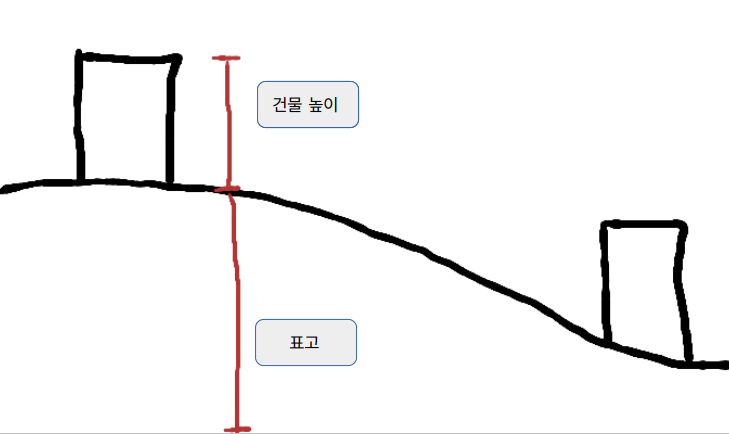


## 2.3.1 건물 높이 

* 국가공간정보포털에서 건물 높이 데이터 수집 (http://data.nsdi.go.kr/dataset/12623)
* 높이나 건물 층수 데이터가 0인 데이터는 오류 데이터로 판단하여 삭제
* <u>건물 층수 , 높이 데이터로 선형 회귀식을 그린 후 기울기 값을 층 당 높이 값으로 계산</u>


```python
a= pd.read_csv("./data/DaejeonBuild/F_FAC_BUILDING_30_201906.CSV" , encoding = "ISO-8859-1")
```

    /usr/local/lib/python3.6/dist-packages/IPython/core/interactiveshell.py:2717: DtypeWarning: Columns (15,21) have mixed types. Specify dtype option on import or set low_memory=False.
      interactivity=interactivity, compiler=compiler, result=result)


```python
print("원본 데이터 개수 : ",len(a))
a.head()
```

    원본 데이터 개수 :  176050


<div>
<style scoped>
    .dataframe tbody tr th:only-of-type {
        vertical-align: middle;
    }

    .dataframe tbody tr th {
        vertical-align: top;
    }

    .dataframe thead th {
        text-align: right;
    }
</style>
<table border="1" class="dataframe">
  <thead>
    <tr style="text-align: right;">
      <th></th>
      <th>UFID</th>
      <th>BLD_NM</th>
      <th>DONG_NM</th>
      <th>GRND_FLR</th>
      <th>UGRND_FLR</th>
      <th>PNU</th>
      <th>ARCHAREA</th>
      <th>TOTALAREA</th>
      <th>PLATAREA</th>
      <th>HEIGHT</th>
      <th>STRCT_CD</th>
      <th>USABILITY</th>
      <th>BC_RAT</th>
      <th>VL_RAT</th>
      <th>BLDRGST_PK</th>
      <th>USEAPR_DAY</th>
      <th>REGIST_DAY</th>
      <th>GB_CD</th>
      <th>VIOL_BD_YN</th>
      <th>GEOIDN</th>
      <th>BLDG_PNU</th>
      <th>BLDG_PNU_Y</th>
      <th>BLD_UNLICE</th>
      <th>BD_MGT_SN</th>
      <th>SGG_OID</th>
      <th>COL_ADM_SE</th>
    </tr>
  </thead>
  <tbody>
    <tr>
      <th>0</th>
      <td>0000239636943130022900000000</td>
      <td>NaN</td>
      <td>NaN</td>
      <td>0</td>
      <td>0</td>
      <td>3.011010e+18</td>
      <td>0.00</td>
      <td>0.00</td>
      <td>0.0</td>
      <td>0.0</td>
      <td>NaN</td>
      <td>NaN</td>
      <td>0.00</td>
      <td>0.00</td>
      <td>NaN</td>
      <td>NaN</td>
      <td>20111117.0</td>
      <td>NaN</td>
      <td>NaN</td>
      <td>NaN</td>
      <td>NaN</td>
      <td>NaN</td>
      <td>NaN</td>
      <td>NaN</td>
      <td>90</td>
      <td>30110</td>
    </tr>
    <tr>
      <th>1</th>
      <td>0000239636643130087800000000</td>
      <td>NaN</td>
      <td>NaN</td>
      <td>0</td>
      <td>0</td>
      <td>3.011010e+18</td>
      <td>0.00</td>
      <td>0.00</td>
      <td>0.0</td>
      <td>0.0</td>
      <td>NaN</td>
      <td>NaN</td>
      <td>0.00</td>
      <td>0.00</td>
      <td>NaN</td>
      <td>NaN</td>
      <td>20111117.0</td>
      <td>NaN</td>
      <td>NaN</td>
      <td>B001000000051FXLH</td>
      <td>NaN</td>
      <td>NaN</td>
      <td>NaN</td>
      <td>NaN</td>
      <td>92</td>
      <td>30110</td>
    </tr>
    <tr>
      <th>2</th>
      <td>1977239658843130089800000000</td>
      <td>NaN</td>
      <td>NaN</td>
      <td>2</td>
      <td>0</td>
      <td>3.011010e+18</td>
      <td>83.37</td>
      <td>135.21</td>
      <td>187.0</td>
      <td>8.0</td>
      <td>11.0</td>
      <td>01000</td>
      <td>44.58</td>
      <td>72.30</td>
      <td>3965.0</td>
      <td>1.97708e+07</td>
      <td>20111117.0</td>
      <td>0.0</td>
      <td>0.0</td>
      <td>B001000000051KAHU</td>
      <td>NaN</td>
      <td>NaN</td>
      <td>NaN</td>
      <td>3011010300101650008031519</td>
      <td>94</td>
      <td>30110</td>
    </tr>
    <tr>
      <th>3</th>
      <td>1977239623393129884100000000</td>
      <td>NaN</td>
      <td>NaN</td>
      <td>2</td>
      <td>0</td>
      <td>3.011010e+18</td>
      <td>69.25</td>
      <td>115.33</td>
      <td>145.0</td>
      <td>8.0</td>
      <td>11.0</td>
      <td>01000</td>
      <td>47.08</td>
      <td>79.54</td>
      <td>3942.0</td>
      <td>1.97705e+07</td>
      <td>20111117.0</td>
      <td>0.0</td>
      <td>0.0</td>
      <td>B001000000051JT1W</td>
      <td>NaN</td>
      <td>NaN</td>
      <td>NaN</td>
      <td>3011010300101530010031603</td>
      <td>96</td>
      <td>30110</td>
    </tr>
    <tr>
      <th>4</th>
      <td>0000239703503129322000000000</td>
      <td>NaN</td>
      <td>NaN</td>
      <td>0</td>
      <td>0</td>
      <td>3.011010e+18</td>
      <td>0.00</td>
      <td>0.00</td>
      <td>0.0</td>
      <td>0.0</td>
      <td>NaN</td>
      <td>NaN</td>
      <td>0.00</td>
      <td>0.00</td>
      <td>NaN</td>
      <td>NaN</td>
      <td>20111117.0</td>
      <td>NaN</td>
      <td>NaN</td>
      <td>NaN</td>
      <td>NaN</td>
      <td>NaN</td>
      <td>NaN</td>
      <td>NaN</td>
      <td>97</td>
      <td>30110</td>
    </tr>
  </tbody>
</table>
</div>


```python
afh = a.loc[(a["GRND_FLR"] > 0) & (a['HEIGHT'] > 0)]

z = afh.groupby(['GRND_FLR'])['HEIGHT'].mean().reset_index(name="height")
b = afh.groupby(['GRND_FLR'])['HEIGHT'].count().reset_index(name="count")
s = pd.merge(z,b , on = 'GRND_FLR')

s = s.rename(columns = {'GRND_FLR': 'gro_flo_co'})
# fllor ,height로 그래프 그린다음에 기울기로 사용
print("높이 , 층수가 0을 넘는 데이터 개수 : " , len(afh))
s.head()
```

    높이 , 층수가 0을 넘는 데이터 개수 :  84194


<div>
<style scoped>
    .dataframe tbody tr th:only-of-type {
        vertical-align: middle;
    }

    .dataframe tbody tr th {
        vertical-align: top;
    }

    .dataframe thead th {
        text-align: right;
    }
</style>
<table border="1" class="dataframe">
  <thead>
    <tr style="text-align: right;">
      <th></th>
      <th>gro_flo_co</th>
      <th>height</th>
      <th>count</th>
    </tr>
  </thead>
  <tbody>
    <tr>
      <th>0</th>
      <td>1</td>
      <td>4.603371</td>
      <td>25281</td>
    </tr>
    <tr>
      <th>1</th>
      <td>2</td>
      <td>8.013415</td>
      <td>24371</td>
    </tr>
    <tr>
      <th>2</th>
      <td>3</td>
      <td>11.532237</td>
      <td>15803</td>
    </tr>
    <tr>
      <th>3</th>
      <td>4</td>
      <td>13.658547</td>
      <td>11735</td>
    </tr>
    <tr>
      <th>4</th>
      <td>5</td>
      <td>18.225957</td>
      <td>2611</td>
    </tr>
  </tbody>
</table>
</div>


```python
X = s.drop(['height', 'count'] , axis = 1)
y = s.drop(['gro_flo_co', 'count'], axis=1)

```


```python
from sklearn import linear_model

lR_model = linear_model.LinearRegression()
lR_model.fit(X,y)
```


    LinearRegression(copy_X=True, fit_intercept=True, n_jobs=None, normalize=False)


```python
plt.scatter(X , y , color = 'red')
plt.title('가격의 변화')
print("> 기울기 :",lR_model.coef_)
print("> 절편 :",lR_model.intercept_)
plt.plot(X , lR_model.predict(X) , color = 'green')
```

    > 기울기 : [[3.14153245]]
    > 절편 : [-0.34726967]


    [<matplotlib.lines.Line2D at 0x7f598ea11710>]


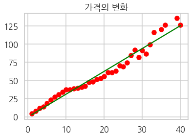


```python
build_data['buld_height'] = build_data['gro_flo_co']*round(lR_model.coef_[0][0],2)

build_data.head()
```


<div>
<style scoped>
    .dataframe tbody tr th:only-of-type {
        vertical-align: middle;
    }

    .dataframe tbody tr th {
        vertical-align: top;
    }

    .dataframe thead th {
        text-align: right;
    }
</style>
<table border="1" class="dataframe">
  <thead>
    <tr style="text-align: right;">
      <th></th>
      <th>gid</th>
      <th>buld_se_cd</th>
      <th>buld_se_nm</th>
      <th>bdtyp_cd</th>
      <th>apt_yn</th>
      <th>gro_flo_co</th>
      <th>sig_cd</th>
      <th>sig_nm</th>
      <th>emd_cd</th>
      <th>emd_nm</th>
      <th>tm_x</th>
      <th>tm_y</th>
      <th>lon</th>
      <th>lat</th>
      <th>buld_area</th>
      <th>buld_elev</th>
      <th>sL01</th>
      <th>sL02</th>
      <th>sL03</th>
      <th>sL04</th>
      <th>sL05</th>
      <th>sL06</th>
      <th>sL07</th>
      <th>sL08</th>
      <th>sL09</th>
      <th>sL10</th>
      <th>sL11</th>
      <th>sL12</th>
      <th>sL_y17</th>
      <th>buld_length</th>
      <th>buld_height</th>
    </tr>
  </thead>
  <tbody>
    <tr>
      <th>0</th>
      <td>24300</td>
      <td>0</td>
      <td>지상</td>
      <td>4299</td>
      <td>N</td>
      <td>1</td>
      <td>30110</td>
      <td>동구</td>
      <td>30110137</td>
      <td>대별동</td>
      <td>241302.419829207</td>
      <td>409864.414379324</td>
      <td>127.459746194608</td>
      <td>36.2858798245272</td>
      <td>199.109760</td>
      <td>80.0</td>
      <td>0.204715</td>
      <td>0.217257</td>
      <td>0.205812</td>
      <td>0.184260</td>
      <td>0.153714</td>
      <td>0.139599</td>
      <td>0.138983</td>
      <td>0.163898</td>
      <td>0.196457</td>
      <td>0.204533</td>
      <td>0.213280</td>
      <td>0.208075</td>
      <td>0.180697</td>
      <td>15.922136</td>
      <td>3.14</td>
    </tr>
    <tr>
      <th>1</th>
      <td>16295</td>
      <td>0</td>
      <td>지상</td>
      <td>1001</td>
      <td>N</td>
      <td>1</td>
      <td>30110</td>
      <td>동구</td>
      <td>30110105</td>
      <td>가오동</td>
      <td>240815.01297069</td>
      <td>412384.958080419</td>
      <td>127.454452653456</td>
      <td>36.3086147051094</td>
      <td>77.392318</td>
      <td>71.0</td>
      <td>0.295631</td>
      <td>0.231582</td>
      <td>0.193751</td>
      <td>0.177985</td>
      <td>0.176701</td>
      <td>0.178177</td>
      <td>0.185056</td>
      <td>0.182143</td>
      <td>0.187676</td>
      <td>0.211802</td>
      <td>0.252642</td>
      <td>0.330147</td>
      <td>0.205046</td>
      <td>9.926679</td>
      <td>3.14</td>
    </tr>
    <tr>
      <th>2</th>
      <td>24341</td>
      <td>0</td>
      <td>지상</td>
      <td>1001</td>
      <td>N</td>
      <td>1</td>
      <td>30110</td>
      <td>동구</td>
      <td>30110137</td>
      <td>대별동</td>
      <td>241460.822383503</td>
      <td>410090.94543095</td>
      <td>127.461521377075</td>
      <td>36.2879144426327</td>
      <td>91.076386</td>
      <td>77.0</td>
      <td>0.195469</td>
      <td>0.200133</td>
      <td>0.191029</td>
      <td>0.185189</td>
      <td>0.171563</td>
      <td>0.164108</td>
      <td>0.155892</td>
      <td>0.172701</td>
      <td>0.185788</td>
      <td>0.188739</td>
      <td>0.196957</td>
      <td>0.201032</td>
      <td>0.181562</td>
      <td>10.768568</td>
      <td>3.14</td>
    </tr>
    <tr>
      <th>3</th>
      <td>24345</td>
      <td>0</td>
      <td>지상</td>
      <td>4402</td>
      <td>N</td>
      <td>1</td>
      <td>30110</td>
      <td>동구</td>
      <td>30110137</td>
      <td>대별동</td>
      <td>241530.22297262</td>
      <td>410067.763074595</td>
      <td>127.462292655181</td>
      <td>36.2877025481814</td>
      <td>51.201706</td>
      <td>78.0</td>
      <td>0.371389</td>
      <td>0.378444</td>
      <td>0.366326</td>
      <td>0.342754</td>
      <td>0.316217</td>
      <td>0.304955</td>
      <td>0.310306</td>
      <td>0.327509</td>
      <td>0.357109</td>
      <td>0.368799</td>
      <td>0.378022</td>
      <td>0.374364</td>
      <td>0.344058</td>
      <td>8.074159</td>
      <td>3.14</td>
    </tr>
    <tr>
      <th>4</th>
      <td>24374</td>
      <td>0</td>
      <td>지상</td>
      <td>18999</td>
      <td>N</td>
      <td>1</td>
      <td>30110</td>
      <td>동구</td>
      <td>30110137</td>
      <td>대별동</td>
      <td>241500.967910986</td>
      <td>409605.204042476</td>
      <td>127.461942445015</td>
      <td>36.2835354035404</td>
      <td>455.844167</td>
      <td>80.0</td>
      <td>0.131596</td>
      <td>0.138417</td>
      <td>0.124781</td>
      <td>0.116576</td>
      <td>0.102620</td>
      <td>0.095113</td>
      <td>0.086709</td>
      <td>0.104519</td>
      <td>0.118837</td>
      <td>0.127436</td>
      <td>0.138503</td>
      <td>0.138233</td>
      <td>0.115303</td>
      <td>24.091468</td>
      <td>3.14</td>
    </tr>
  </tbody>
</table>
</div>


## 2.3.2 절대높이 계산


```python
build_data['height'] = build_data['buld_height'] + build_data['buld_elev']
```


```python
build_data.to_csv("./data/2.3/build_data_height.csv" , index=False ,encoding='utf-8')

build_data.head()
```


<div>
<style scoped>
    .dataframe tbody tr th:only-of-type {
        vertical-align: middle;
    }

    .dataframe tbody tr th {
        vertical-align: top;
    }

    .dataframe thead th {
        text-align: right;
    }
</style>
<table border="1" class="dataframe">
  <thead>
    <tr style="text-align: right;">
      <th></th>
      <th>gid</th>
      <th>buld_se_cd</th>
      <th>buld_se_nm</th>
      <th>bdtyp_cd</th>
      <th>apt_yn</th>
      <th>gro_flo_co</th>
      <th>sig_cd</th>
      <th>sig_nm</th>
      <th>emd_cd</th>
      <th>emd_nm</th>
      <th>tm_x</th>
      <th>tm_y</th>
      <th>lon</th>
      <th>lat</th>
      <th>buld_area</th>
      <th>buld_elev</th>
      <th>sL01</th>
      <th>sL02</th>
      <th>sL03</th>
      <th>sL04</th>
      <th>sL05</th>
      <th>sL06</th>
      <th>sL07</th>
      <th>sL08</th>
      <th>sL09</th>
      <th>sL10</th>
      <th>sL11</th>
      <th>sL12</th>
      <th>sL_y17</th>
      <th>buld_length</th>
      <th>buld_height</th>
      <th>height</th>
    </tr>
  </thead>
  <tbody>
    <tr>
      <th>0</th>
      <td>24300</td>
      <td>0</td>
      <td>지상</td>
      <td>4299</td>
      <td>N</td>
      <td>1</td>
      <td>30110</td>
      <td>동구</td>
      <td>30110137</td>
      <td>대별동</td>
      <td>241302.419829207</td>
      <td>409864.414379324</td>
      <td>127.459746194608</td>
      <td>36.2858798245272</td>
      <td>199.109760</td>
      <td>80.0</td>
      <td>0.204715</td>
      <td>0.217257</td>
      <td>0.205812</td>
      <td>0.184260</td>
      <td>0.153714</td>
      <td>0.139599</td>
      <td>0.138983</td>
      <td>0.163898</td>
      <td>0.196457</td>
      <td>0.204533</td>
      <td>0.213280</td>
      <td>0.208075</td>
      <td>0.180697</td>
      <td>15.922136</td>
      <td>3.14</td>
      <td>83.14</td>
    </tr>
    <tr>
      <th>1</th>
      <td>16295</td>
      <td>0</td>
      <td>지상</td>
      <td>1001</td>
      <td>N</td>
      <td>1</td>
      <td>30110</td>
      <td>동구</td>
      <td>30110105</td>
      <td>가오동</td>
      <td>240815.01297069</td>
      <td>412384.958080419</td>
      <td>127.454452653456</td>
      <td>36.3086147051094</td>
      <td>77.392318</td>
      <td>71.0</td>
      <td>0.295631</td>
      <td>0.231582</td>
      <td>0.193751</td>
      <td>0.177985</td>
      <td>0.176701</td>
      <td>0.178177</td>
      <td>0.185056</td>
      <td>0.182143</td>
      <td>0.187676</td>
      <td>0.211802</td>
      <td>0.252642</td>
      <td>0.330147</td>
      <td>0.205046</td>
      <td>9.926679</td>
      <td>3.14</td>
      <td>74.14</td>
    </tr>
    <tr>
      <th>2</th>
      <td>24341</td>
      <td>0</td>
      <td>지상</td>
      <td>1001</td>
      <td>N</td>
      <td>1</td>
      <td>30110</td>
      <td>동구</td>
      <td>30110137</td>
      <td>대별동</td>
      <td>241460.822383503</td>
      <td>410090.94543095</td>
      <td>127.461521377075</td>
      <td>36.2879144426327</td>
      <td>91.076386</td>
      <td>77.0</td>
      <td>0.195469</td>
      <td>0.200133</td>
      <td>0.191029</td>
      <td>0.185189</td>
      <td>0.171563</td>
      <td>0.164108</td>
      <td>0.155892</td>
      <td>0.172701</td>
      <td>0.185788</td>
      <td>0.188739</td>
      <td>0.196957</td>
      <td>0.201032</td>
      <td>0.181562</td>
      <td>10.768568</td>
      <td>3.14</td>
      <td>80.14</td>
    </tr>
    <tr>
      <th>3</th>
      <td>24345</td>
      <td>0</td>
      <td>지상</td>
      <td>4402</td>
      <td>N</td>
      <td>1</td>
      <td>30110</td>
      <td>동구</td>
      <td>30110137</td>
      <td>대별동</td>
      <td>241530.22297262</td>
      <td>410067.763074595</td>
      <td>127.462292655181</td>
      <td>36.2877025481814</td>
      <td>51.201706</td>
      <td>78.0</td>
      <td>0.371389</td>
      <td>0.378444</td>
      <td>0.366326</td>
      <td>0.342754</td>
      <td>0.316217</td>
      <td>0.304955</td>
      <td>0.310306</td>
      <td>0.327509</td>
      <td>0.357109</td>
      <td>0.368799</td>
      <td>0.378022</td>
      <td>0.374364</td>
      <td>0.344058</td>
      <td>8.074159</td>
      <td>3.14</td>
      <td>81.14</td>
    </tr>
    <tr>
      <th>4</th>
      <td>24374</td>
      <td>0</td>
      <td>지상</td>
      <td>18999</td>
      <td>N</td>
      <td>1</td>
      <td>30110</td>
      <td>동구</td>
      <td>30110137</td>
      <td>대별동</td>
      <td>241500.967910986</td>
      <td>409605.204042476</td>
      <td>127.461942445015</td>
      <td>36.2835354035404</td>
      <td>455.844167</td>
      <td>80.0</td>
      <td>0.131596</td>
      <td>0.138417</td>
      <td>0.124781</td>
      <td>0.116576</td>
      <td>0.102620</td>
      <td>0.095113</td>
      <td>0.086709</td>
      <td>0.104519</td>
      <td>0.118837</td>
      <td>0.127436</td>
      <td>0.138503</td>
      <td>0.138233</td>
      <td>0.115303</td>
      <td>24.091468</td>
      <td>3.14</td>
      <td>83.14</td>
    </tr>
  </tbody>
</table>
</div>


# 2.4 인접한 빌딩


* 모든 빌딩을 돌면서 그 빌딩 주변 N미터 안에 있으면서 , 남쪽에있는 빌딩과 위로 30도 까지의 빌딩들을 수집
    * <u>여름에는 방위각이 60도 일 때 일출이 발생하고 240도 일 때 일몰이 발생하기에 이 방위각 사이에 있는 모든 건물들이 영향을 줄 것이라고 판단</u>


```python
Image("./image/presentation/nearBuild.png")
```


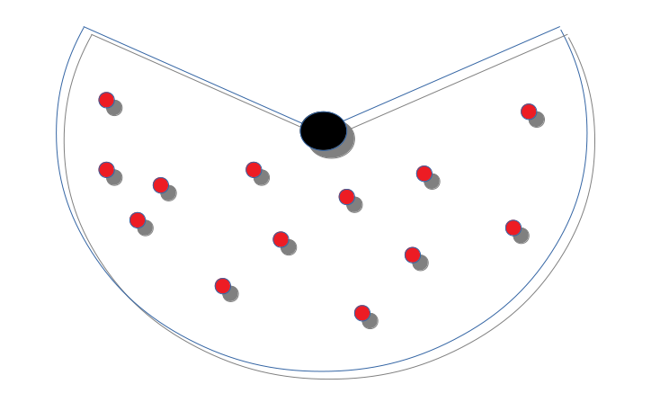


```python
build_data['tm_x'] = build_data['tm_x'].astype(float)
build_data['tm_y'] = build_data['tm_y'].astype(float)
```

## 2.4.1 인접 빌딩 수집

* 모든 빌딩을 돌면서 KDTree로 현재 빌딩의 최근접 빌딩 1000개를 뽑아내서 N미터 이하이고 , 방위각이 60 ~ 300 사이에 있는 빌딩들의 인덱스와 거리를 수집
* 조건에 맞는 빌딩이 없어서 list 가 비어있다면 에러가 나기 때문에 , 그런 경우네는 자기 자신의 index를 추가


```python
from sklearn.neighbors import KDTree
from numpy import array


def nearestBuild(build_data , meter) :

    start = time.time()

    # gu_locat
    xylocation = pd.DataFrame()
    xylocation['tm_x'] = build_data['tm_x']
    xylocation['tm_y'] = build_data['tm_y']
    xylocation['tm_x'] = xylocation['tm_x'].astype(float)
    xylocation['tm_y'] = xylocation['tm_y'].astype(float)

    xylocation_list = xylocation.values.tolist()
    xylocation_np = array(xylocation_list)
    tree = KDTree(xylocation_np)


    realnearest_ind = []
    realnearest_dist = []

    build_count_list = []
    realnearest_ind_list = []
    realnearest_dist_list = []

    for i in range(len(xylocation_np)) :

        # 기준 빌딩의 xy좌표와 최단거리에 있는 1000개의 인접 빌딩들을 탐색
        nearest_dist , nearest_ind = tree.query([xylocation_np[i]] , k = 1000)
        for j in range(1,len(nearest_dist[0])) :
            
            # 100 미터 안이고
            if nearest_dist[0][j] <= meter : 


                # 남쪽 + 양쪽 30도 위에도 포함
#                 buildsAngle = np.arctan2(xylocation_np[i][1]-xylocation_np[nearest_ind[0][j]][1] , xylocation_np[i][0]-xylocation_np[nearest_ind[0][j]][0])  * 180 /  np.pi

#                 if not ( -150 < buildsAngle <-30 ) :    
#                     realnearest_ind.append(nearest_ind[0][j])
#                     realnearest_dist.append(nearest_dist[0][j])


    #           남쪽에있는 빌딩들 만을 위한 처리 
                if  xylocation_np[i][1]-xylocation_np[nearest_ind[0][j]][1] > 0 :
                    realnearest_ind.append(nearest_ind[0][j])
                    realnearest_dist.append(nearest_dist[0][j])

            else :
                break

        nearest_ind = np.delete(nearest_ind[0][:j] , 0)
        build_count_list.append(len(realnearest_ind))
        realnearest_ind_list.append(realnearest_ind)
        realnearest_dist_list.append(realnearest_dist)

        realnearest_ind = []
        realnearest_dist = []
    
    # 조건에 맞는 빌딩이 없는경우 자기 자신을 넣준다 ( 에러방지 , 빈 list가 있다면 에러가 남 )
    nearZero_list = []
    for i in range(len(realnearest_ind_list)) :
        if len(realnearest_ind_list[i]) == 0 :
            nearZero_list.append(i)
            realnearest_ind_list[i].append(i)
            realnearest_dist_list[i].append(0)

    print("find nearestBuild time :", time.time() - start) 

    
    return realnearest_ind_list , realnearest_dist_list , nearZero_list


build_data['tm_x'] = build_data['tm_x'].astype(float)
build_data['tm_y'] = build_data['tm_y'].astype(float)
realnearest_ind_list , realnearest_dist_list , nearZero_list = nearestBuild(build_data , 100)
```

    find nearestBuild time : 55.8835334777832


## 2.4.2 검증

### 거리가 마이너스나 제로가 있거나 기준 m를 넘어가는 데이터가 있는지 체크


```python
def minmaxCheck(realnearest_dist_list) :
    maxNum = 0 
    minNum = 100000
    maxIdx = 0
    minIdx = 0
    for i in range(len(realnearest_dist_list)) :
        for num in realnearest_dist_list[i] :
            if num > maxNum :
                maxNum = num
                maxIdx = i
            if minNum > num and num > 0 :
                minNum = num
                minIdx = i
    print("Dist min 값 : " , minNum , "max 값 : " , maxNum)
    print("Dist min idx : " , minIdx , "max idx : " , maxIdx)
    return minIdx , maxIdx

minIdx , maxIdx =  minmaxCheck(realnearest_dist_list)
```

    Dist min 값 :  0.6699526599160539 max 값 :  99.99997302055972
    Dist min idx :  145753 max idx :  59338


### 재대로 빈 list가 없는지 확인


```python
def validifyDisZero(realnearest_dist_list) :
    for i in range(len(realnearest_dist_list)) :
        for num in realnearest_dist_list[i] :
            if num == 0 :
                if i != realnearest_ind_list[i][0] :
                    print(str(i) +"번째 인덱스 에러")
                    return 0
    
    print("> 빈 list 없음")

validifyDisZero(realnearest_dist_list)
```

    > 빈 list 없음


### 방위각 계산 검증

* gmap으로 그려서 방위각 계산이 잘 되는지 확인


```python
# angle_between이 방위각을 찾는 용도
def angle_between(p1, p2 ):
    ang1 = np.arctan2(*p1[::-1])
    ang2 = np.arctan2(*p2[::-1])
    return np.rad2deg((ang1 - ang2) % (2 * np.pi))

def checkCalAngle(build_data , nearest_ind_list , buildIndex ) : # ex ) 53번째 건물의 nearest_ind  , realnearest_ind_list[53]

    
    nowBuild = build_data.iloc[buildIndex]
    nearBuild = build_data.iloc[realnearest_ind_list[buildIndex]]
    re_height = (nearBuild['height'] - nowBuild['height']).apply(lambda x : max(x,0))
    re_angle = np.arctan2(re_height , np.array(realnearest_dist_list[buildIndex])) * 180 /  np.pi
        
    # 주변건물들과 x,y 좌표로 각도를 계산
    nearbuilds_angle = list(np.arctan2((nowBuild['tm_y']-nearBuild['tm_y']) ,(nowBuild['tm_x'] - nearBuild['tm_x'] )) * 180 /  np.pi)

    calibX = nearBuild['tm_x'] - nowBuild['tm_x']
    calibY = nearBuild['tm_y'] - nowBuild['tm_y']
        
    result = calibX.combine(calibY , (lambda x1,x2 : (x1,x2)))
    result.apply(lambda x : angle_between((0,40) , x))
    
    result_list = list(result.apply(lambda x : angle_between((0,40) , x)))
        
    gidLocation = build_data.iloc[nearest_ind_list[buildIndex]]
    gidLocation['lat'] = gidLocation['lat'].astype(float)
    gidLocation['lon'] = gidLocation['lon'].astype(float)

    gid = list(gidLocation['gid'])
    lat = list(gidLocation['lat'])
    lon = list(gidLocation['lon'])

    gmap = gmplot.GoogleMapPlotter(statistics.median(lat), statistics.median(lon) , 14)
    for i in range(len(gid)) :
        
        title = "index : "+ str(gid[i]) + "                                                                          방위각 : " + str(result_list[i])
        gmap.marker(lat[i] , lon[i] , title = title) 

    gmap.marker(float(build_data.iloc[buildIndex]['lat']) , float(build_data.iloc[buildIndex]['lon']) , title="BASE" )

    st = "./image/validation/ind"+str(buildIndex)+"_calculateAngle"+".html"
    gmap.draw(st)

checkCalAngle(build_data , realnearest_ind_list , 1000)
```

    /usr/lib/python3/dist-packages/ipykernel_launcher.py:27: SettingWithCopyWarning: 
    A value is trying to be set on a copy of a slice from a DataFrame.
    Try using .loc[row_indexer,col_indexer] = value instead
    
    See the caveats in the documentation: http://pandas.pydata.org/pandas-docs/stable/indexing.html#indexing-view-versus-copy
    /usr/lib/python3/dist-packages/ipykernel_launcher.py:28: SettingWithCopyWarning: 
    A value is trying to be set on a copy of a slice from a DataFrame.
    Try using .loc[row_indexer,col_indexer] = value instead
    
    See the caveats in the documentation: http://pandas.pydata.org/pandas-docs/stable/indexing.html#indexing-view-versus-copy


```python
print("> Base를 기준으로 방위각 60도 에서 300도 사이의 값들만 수집")
Image("./image/presentation/azimuthVal.png")
```

    > Base를 기준으로 방위각 60도 에서 300도 사이의 값들만 수집


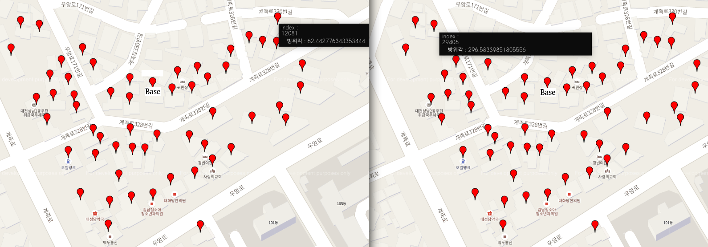


# 2.5 인접 건물 최대 앙각, 건물 수, 높이

* x,y 좌표로 기준 건물과 인접 건물간의 방위각을 구함 
* 방위각을 3분할을 해서 각 영역에 해당하는 인접 건물들과의 높이 중 최대값, 앙각 중 최대값, 영역 안의 건물 수, 평균 높이, 평균 층 수 계산


```python
print("> 총 240도를 80도로 3등분")
Image("./image/presentation/nearBuild80.png")
```

    > 총 240도를 80도로 3등분


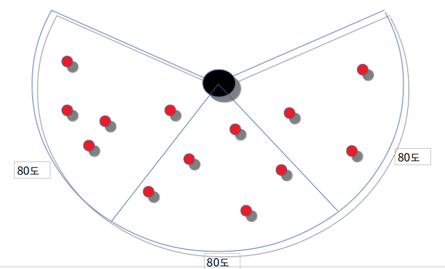


## 2.5.1 3분할 파생 데이터 계산

* <font color='red'>반지름까지 고려해서 구하는 앙각을 추가 해야함</font>


```python
def derivedData(build_data,realnearest_ind_list , realnearest_dist_list) :
    
    xylocation = pd.DataFrame()
    xylocation['tm_x'] = build_data['tm_x']
    xylocation['tm_y'] = build_data['tm_y']

    xylocation_list = xylocation.values.tolist()
    xylocation_np = array(xylocation_list)
    
    start = time.time()

    maxAngle_list = []
    relHeight_list = []
    relFloor_list = []

    angle80_angle = [] 
    angle160_angle = []  
    angle240_angle = [] 

    angle80_count = []
    angle160_count = []
    angle240_count = []

    angle80_height = []
    angle160_height = []
    angle240_height = []

    angle80_lenangle = [] 
    angle160_lenangle = []
    angle240_lenangle = []

    a = pd.DataFrame()
    nearsum = 0
    for i in range(len(xylocation_np)) :
    # for i in range(1) :

        if i%10000 == 0 :
            print(i)

        nowBuild = build_data.iloc[i]
        nearBuild = build_data.iloc[realnearest_ind_list[i]]

        # 반지름까지 고려해서 계산하는 코드 밑
#         print("-"*20)
#         print(np.array(realnearest_dist_list[i]))
#         print(nearBuild['buld_length'] + nowBuild['buld_length'])
#         print(np.array(realnearest_dist_list[i]) - nearBuild['buld_length'] - nowBuild['buld_length'] )
        
        re_height = (nearBuild['height'] - nowBuild['height']).apply(lambda x : max(x,0))
        re_angle = np.arctan2(re_height , np.array(realnearest_dist_list[i])) * 180 /  np.pi
        re_lenangle = np.arctan2(re_height , np.array(realnearest_dist_list[i])) * 180 /  np.pi

        # 주변 최대각도 , 상대 건물 수 , 상대 높이 
        relFloor_list.append((nearBuild['gro_flo_co'] - nowBuild['gro_flo_co']).apply(lambda x : max(x,0)).replace(0,np.NaN).mean())
        relHeight_list.append((nearBuild['height'] - nowBuild['height']).apply(lambda x : max(x,0)).replace(0,np.NaN).mean())
        maxAngle_list.append(max(re_angle))

        # 주변건물들과 x,y 좌표로 각도를 계산
        nearbuilds_angle = np.arctan2((nowBuild['tm_y']-nearBuild['tm_y']) ,(nowBuild['tm_x'] - nearBuild['tm_x'] )) * 180 /  np.pi

        angle80_df = nearbuilds_angle.loc[(-30<nearbuilds_angle) * (nearbuilds_angle<50)]
        angle160_df = nearbuilds_angle.loc[(50<=nearbuilds_angle) & (nearbuilds_angle<130)]
        angle240_df = nearbuilds_angle.loc[(nearbuilds_angle>=130) | (nearbuilds_angle<-150)]

        a = len(angle80_df) + len(angle160_df) + len(angle240_df) 
        if a != len(nearBuild) :
            print("오류발생")
            break

        if angle80_df.any() :

            t = re_angle.loc[angle80_df.index]

            angle80_angle.append(re_angle.loc[angle80_df.index].max())    
            angle80_count.append(len(angle80_df))
            angle80_height.append(nearBuild.loc[angle80_df.index]['height'].mean())

        else :
            angle80_angle.append(0)
            angle80_count.append(0)
            angle80_height.append(0)

        if angle160_df.any() :

            t = re_angle.loc[angle160_df.index]

            angle160_angle.append(re_angle.loc[angle160_df.index].max())
            angle160_count.append(len(angle160_df))
            angle160_height.append(nearBuild.loc[angle160_df.index]['height'].mean())

        else :
            angle160_angle.append(0)
            angle160_count.append(0)
            angle160_height.append(0)

        if angle240_df.any() :

            t = re_angle.loc[angle240_df.index]

            angle240_angle.append(re_angle.loc[angle240_df.index].max())
            angle240_count.append(len(angle240_df))
            angle240_height.append(nearBuild.loc[angle240_df.index]['height'].mean())

        else :
            angle240_angle.append(0)
            angle240_count.append(0)
            angle240_height.append(0)


    print(len(maxAngle_list))
    
    build_data['rad_angle_max'] = maxAngle_list
    build_data['rad_rel_fl'] = relFloor_list
    build_data['rad_rel_height'] = relHeight_list

    build_data['rad_rel_fl'] = build_data['rad_rel_fl'].fillna(0)
    build_data['rad_rel_height'] = build_data['rad_rel_height'].fillna(0)

    build_data['rad_angle_max_80'] = angle80_angle
    build_data['rad_angle_max_160'] = angle160_angle
    build_data['rad_angle_max_240'] = angle240_angle

    build_data['count_80'] = angle80_count
    build_data['count_160'] = angle160_count
    build_data['count_240'] = angle240_count

    build_data['height_80'] = angle80_height
    build_data['height_160'] = angle160_height
    build_data['height_240'] = angle240_height
    
    print("time :", time.time() - start) 

    return build_data
build_data = derivedData(build_data,realnearest_ind_list , realnearest_dist_list)

build_data.to_csv("./data/2.5/build_data_3group_80100.csv",  index=False,encoding='utf-8')
```

    0


    /usr/local/lib/python3.6/dist-packages/pandas/core/computation/expressions.py:183: UserWarning: evaluating in Python space because the '*' operator is not supported by numexpr for the bool dtype, use '&' instead
      .format(op=op_str, alt_op=unsupported[op_str]))


    10000
    20000
    30000
    40000
    50000
    60000
    70000
    80000
    90000
    100000
    110000
    120000
    130000
    140000
    147754
    time : 1308.471496105194


## 2.5.2 높이, 앙각 계산 검증

* 빌딩 데이터, 원하는 인접 빌딩 반경미터 리스트, 인접 빌딩 인덱스 리스트, 보고싶은 빌딩의 인덱스, 계산에 사용한 반경미터 를 입력
    * 위에서 계산한 2.4.1 인접 빌딩 수집의 결과 리스트들인 **반경미터 리스트, 인덱스 리스트**
* matplolib으로 입체적으로 그려줌


## buildNear_3d


```python
%matplotlib qt5
# %matplotlib inline  
def buildNear_3d (build_data , realnearest_dist_list , realnearest_ind_list ,buildIndex , meter) :  # meter에는 근처 몇미터까지 쟀는지가 나와있다.

    
    build_data['tm_x'] = build_data['tm_x'].astype(float)
    build_data['tm_y'] = build_data['tm_y'].astype(float)
    
    fig = plt.figure(figsize=(16,12))
    ax = plt.axes(projection="3d")
    
    # 축 설정 
    plt.xlim([0,meter*2])
    ticksx =list(range(0, meter*2+10, 10))
    ticksx[round(len(ticksx)/2)] = "S"  
    plt.xticks(np.arange(0, meter*2+10, 10), ticksx , weight='bold' , fontsize=15)
    
    ticksy =list(range(0, meter*2+10, 10))
    ticksy[round(len(ticksx)/2)] = "E"  
    plt.yticks(np.arange(0, meter*2+10, 10), ticksy , weight='bold' , fontsize=15)
    plt.ylim([0,meter*2])
    
    ax.set_xlabel('\ntm_X')
    ax.set_ylabel('\ntm_Y')
    ax.set_zlabel('\nHeight')
    
        
        
    baseBuild = pd.DataFrame(columns = build_data.columns)
    baseBuild.loc[0] = build_data.loc[buildIndex]
    print("Base Building gid : " , baseBuild['gid'])
    
    nearBuild = build_data.loc[realnearest_ind_list[buildIndex]][['tm_x','tm_y' , 'height','buld_length']]
    num_bars = len(nearBuild)

    
    # 건물간의 높이차로 인한 각도를 계산하는 코드
    re_height = (nearBuild['height'] - float(baseBuild['height'])).apply(lambda x : max(x,0))
    
    re_angle = np.arctan2(re_height , np.array(realnearest_dist_list[buildIndex])) * 180 /  np.pi
    
    angle_dict = dict(zip(realnearest_ind_list[buildIndex], re_angle))
    maxAngle_ind = max(angle_dict, key=angle_dict.get)
    
    
    # 원뿔의 높이 
    coneHeight = nearBuild['height'].max() - baseBuild['height']
    
    
    # x y 좌표를 건물 넓이를 포함하여 중간 지점으로 오게 하기 위해
    nearBuild['tm_x'] = nearBuild['tm_x'] - float(baseBuild['tm_x']) + meter - nearBuild['buld_length']
    nearBuild['tm_y'] = nearBuild['tm_y'] - float(baseBuild['tm_y']) + meter - nearBuild['buld_length']
    
    
    # 최소 높이 값으로 빼서 높이 스케일링
    zrange = list(baseBuild['height']) + list(nearBuild['height'])
    nearBuild['height'] = nearBuild['height'] - round(min(zrange) - 1)
    baseBuild['height'] = baseBuild['height'] - round(min(zrange) - 1)
    
    # nearBuild 들 좌표 넣기
    x_pos = list(nearBuild['tm_x'])
    y_pos = list(nearBuild['tm_y'])
    z_pos = [0] * num_bars

    x_size = list(nearBuild['buld_length']*2)
    y_size = list(nearBuild['buld_length']*2)
    z_size = list(nearBuild['height'])

    # baseBuild 좌표 넣기
    basePoint = meter - float(baseBuild['buld_length'])
    
    x_pos.append(basePoint)
    y_pos.append(basePoint)
    z_pos.append(0)
    x_size.append(float(baseBuild['buld_length'])*2)
    y_size.append(float(baseBuild['buld_length'])*2)
    z_size.append(float(baseBuild['height']))

    
    colors = ['aqua'] * num_bars
    colors.append('red')

    # text 좌표
    x_text_pos = list(nearBuild['tm_x'] + nearBuild['buld_length'])
    y_text_pos = list(nearBuild['tm_y'] + nearBuild['buld_length'])
    x_text_pos.append(meter)
    y_text_pos.append(meter)
    height_text = list(map( lambda x : round(x,2) , z_size))  # 높이가 길어서 소수점밑 2까지만
    
    ax.bar3d(x_pos, y_pos, z_pos, x_size, y_size, z_size, color = colors)
 
    nearBuild.loc[maxAngle_ind]['height']
    
    # 높이 text annotation
    for i in range(len(x_pos)) :  
        ax.text(x_text_pos[i],y_text_pos[i],z_size[i]+0.5,  height_text[i], size=20, zorder=2,  color='k') 
    
    
    # 최대각도의 index를 annotaiton
    maxRadBuild = nearBuild.loc[maxAngle_ind]
        
    x2, y2, _ = proj3d.proj_transform(maxRadBuild['tm_x'],maxRadBuild['tm_y'],maxRadBuild['height'], ax.get_proj())

    label = pylab.annotate(
        str(maxAngle_ind), 
        xy = (x2, y2), xytext = (-20, 20),
        textcoords = 'offset points', ha = 'right', va = 'bottom',
        bbox = dict(boxstyle = 'round,pad=0.5', fc = 'red', alpha = 1),
        arrowprops = dict(arrowstyle="simple",
                            connectionstyle="arc3,rad=-0.5"))

    def update_position(e):
        x2, y2, _ = proj3d.proj_transform(maxRadBuild['tm_x'],maxRadBuild['tm_y'],maxRadBuild['height'], ax.get_proj())
        label.xy = x2,y2
        label.update_positions(fig.canvas.renderer)
        fig.canvas.draw()
    fig.canvas.mpl_connect('button_release_event', update_position)
    pylab.show()
    
    

    # 최대각도 부분을 원뿔로 그림
    # tan 값이 기울기가 나오게하는 높이값을 찾고 그대로 그림
    z = np.arange(0, ceil(coneHeight)*10, 1)  # 두번째 인자가 반지름값 , 세번째 인자는  많아지면 선이 많아지는거  , ceil(coneHeight) 저거는 바꿔야 할 수도 
    theta = np.arange(0, 2 * pi + pi / 50, pi / 50)  # 이 나누는 수가 적으면 원같지 않음
    
    for zval in z:
        # 원뿔의 총 높이가 최고 높이보다는 크면 멈추게
        if zval * tan(angle_dict[maxAngle_ind] * pi / 180) + float(baseBuild['height']) > nearBuild['height'].max() :
            break
        
        x = zval * np.array([sin(q) for q in theta])
        y = zval * np.array([cos(q) for q in theta])
        ax.plot(x + meter, y + meter, zval * tan(angle_dict[maxAngle_ind] * pi / 180) + baseBuild['height'], 'b-')  # 이거하나가 줄 하나

            

    plt.show()
    
    print("최대앙각 index " , maxAngle_ind)
    print("주위 건물 수 : " , num_bars)
    print("rad_angle_max : " , float(baseBuild['rad_angle_max']))
    print("rad_angle_max_80 : " , float(baseBuild['rad_angle_max_80']))
    print("rad_angle_max_160 : " , float(baseBuild['rad_angle_max_160']))
    print("rad_angle_max_240 : " , float(baseBuild['rad_angle_max_240']))
    print("count_80 : " , float(baseBuild['count_80']))
    print("count_160 : " , float(baseBuild['count_160']))
    print("count_240 : " , float(baseBuild['count_240']))
    
buildNear_3d(build_data ,realnearest_dist_list , realnearest_ind_list , 920 , 100)

```

    Base Building gid :  0    45276
    Name: gid, dtype: object
    최대앙각 index  93412
    주위 건물 수 :  31
    rad_angle_max :  5.537418069968963
    rad_angle_max_80 :  0.0
    rad_angle_max_160 :  5.537418069968963
    rad_angle_max_240 :  0.0
    count_80 :  14.0
    count_160 :  16.0
    count_240 :  1.0


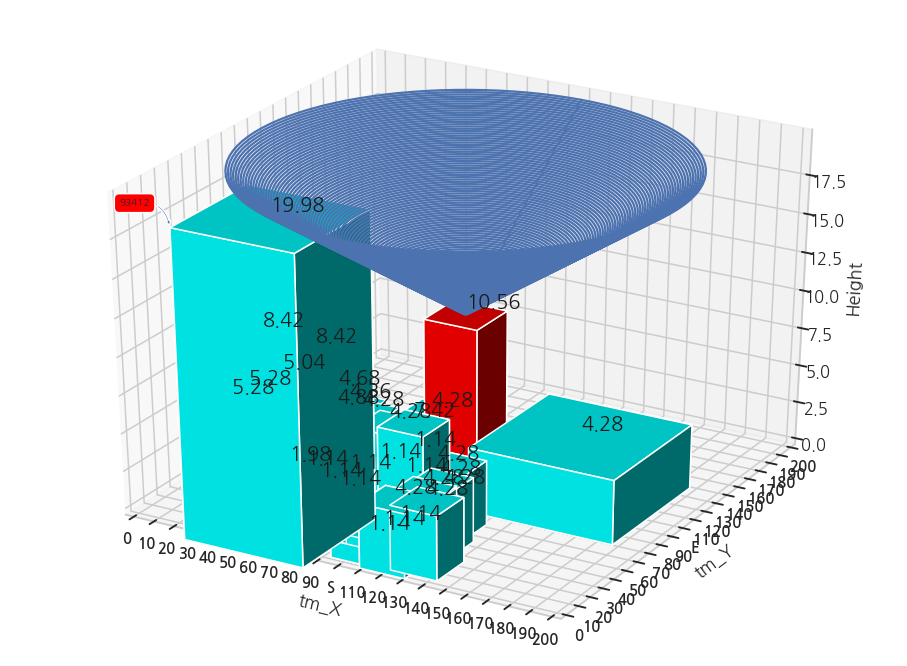


```python
print("> 위 코드 실행 화면")
Image("./image/presentation/buildNear.png")
```

    > 위 코드 실행 화면


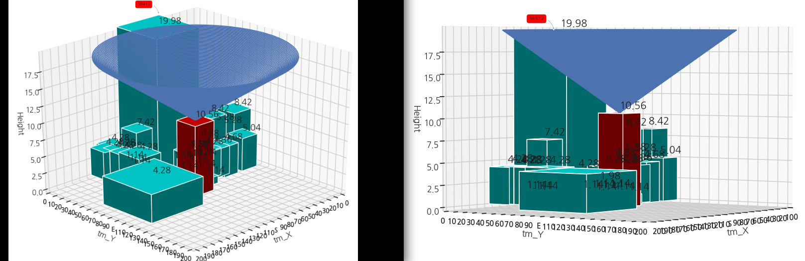


```python
build_data = pd.read_csv("./data/2.5/build_data_3group_80100.csv" )
```

# 모든 태양 위치에 기준점은 충남대학교

* 충남대학교에서의 시간당 고도 , 방위각 , 일출 일몰 시간 등등..

# 2.6 근처 건물들의 그림자 길이

* 인접 건물들의 그림자 영향에 따른 차폐율을 찾고 싶은거니까, 주변 건물의 그림자 길이를 계산하여 변수로 사용
* 해당 달의 태양의 최고 고도와 건물의 높이로 이 건물의 그림자 길이를 계산 ( 여기선 6월로 고정 )
    * <font color='red'>모든 위치의 건물에 태양의 최고 고도로 그림자의 길이를 계산하기 때문에 오차가 발생한 듯, 개선 필요</font>


* 밑의 그림과 같이 태양의 고도와 건물의 높이를 안다면 그림자의 길이를 계산할 수 있다.
    


## 2.6.1 2019년 모든날 태양이 떠있는 시간 , 이동 방위각 계산

* 모든 날의 일출 일몰 시간 크롤링 (https://astro.kasi.re.kr/life/pageView/9?lat=36.362530384433434&lng=127.34486028545953&date=2019-06-22&address=%EB%8C%80%EC%A0%84%EA%B4%91%EC%97%AD%EC%8B%9C+%EC%9C%A0%EC%84%B1%EA%B5%AC+%EB%8C%80%ED%95%99%EB%A1%9C+99)
* pysolar를 이용하여 모든날의 태양 떠있는 시간 , 일몰 방위각 , 일출 방위각 , 이동 방위각 계산
* 월 별로 평균


### 참고 

* timezone : https://spoqa.github.io/2019/02/15/python-timezone.html


```python
sunTime_data = pd.read_csv('./data/solar/sunTime_data.csv')

print("> DF 길이:",len(sunTime_data))
sunTime_data.head(10)
```

    > DF 길이: 365


<div>
<style scoped>
    .dataframe tbody tr th:only-of-type {
        vertical-align: middle;
    }

    .dataframe tbody tr th {
        vertical-align: top;
    }

    .dataframe thead th {
        text-align: right;
    }
</style>
<table border="1" class="dataframe">
  <thead>
    <tr style="text-align: right;">
      <th></th>
      <th>year</th>
      <th>month</th>
      <th>day</th>
      <th>sunrise</th>
      <th>sunset</th>
    </tr>
  </thead>
  <tbody>
    <tr>
      <th>0</th>
      <td>2019</td>
      <td>1</td>
      <td>1</td>
      <td>07시 42분</td>
      <td>17시 25분</td>
    </tr>
    <tr>
      <th>1</th>
      <td>2019</td>
      <td>1</td>
      <td>2</td>
      <td>07시 42분</td>
      <td>17시 26분</td>
    </tr>
    <tr>
      <th>2</th>
      <td>2019</td>
      <td>1</td>
      <td>3</td>
      <td>07시 42분</td>
      <td>17시 27분</td>
    </tr>
    <tr>
      <th>3</th>
      <td>2019</td>
      <td>1</td>
      <td>4</td>
      <td>07시 42분</td>
      <td>17시 27분</td>
    </tr>
    <tr>
      <th>4</th>
      <td>2019</td>
      <td>1</td>
      <td>5</td>
      <td>07시 42분</td>
      <td>17시 28분</td>
    </tr>
    <tr>
      <th>5</th>
      <td>2019</td>
      <td>1</td>
      <td>6</td>
      <td>07시 42분</td>
      <td>17시 29분</td>
    </tr>
    <tr>
      <th>6</th>
      <td>2019</td>
      <td>1</td>
      <td>7</td>
      <td>07시 42분</td>
      <td>17시 30분</td>
    </tr>
    <tr>
      <th>7</th>
      <td>2019</td>
      <td>1</td>
      <td>8</td>
      <td>07시 42분</td>
      <td>17시 31분</td>
    </tr>
    <tr>
      <th>8</th>
      <td>2019</td>
      <td>1</td>
      <td>9</td>
      <td>07시 42분</td>
      <td>17시 32분</td>
    </tr>
    <tr>
      <th>9</th>
      <td>2019</td>
      <td>1</td>
      <td>10</td>
      <td>07시 42분</td>
      <td>17시 33분</td>
    </tr>
  </tbody>
</table>
</div>


```python
KST = datetime.timezone(datetime.timedelta(hours=9))

ssAzi_list = []
srAzi_list = []
dayAzi_list = []
date_list = []
dayHour_list =[]

for i in range(len(sunTime_data)) :
    baseDate = sunTime_data.iloc[i]

    year = baseDate.year 
    month = baseDate.month 
    day = baseDate.day 


    ssHour , ssMin = list(map(lambda x : int(x[:-1]) ,baseDate.sunset.split()))

    srHour , srMin = list(map(lambda x : int(x[:-1]) ,baseDate.sunrise.split()))


    ssDate = datetime.datetime(baseDate.year , baseDate.month , baseDate.day , ssHour , ssMin , 0, 0, tzinfo=KST)
    srDate = datetime.datetime(baseDate.year , baseDate.month , baseDate.day , srHour , srMin , 0, 0, tzinfo=KST)
    
    date_list.append(datetime.datetime(baseDate.year , baseDate.month , baseDate.day))
    ssAzi_list.append(get_azimuth(36.3679381,127.3442986, srDate))
    srAzi_list.append(get_azimuth(36.3679381,127.3442986, ssDate))
    dayAzi_list.append(get_azimuth(36.3679381,127.3442986, ssDate) - get_azimuth(36.3679381,127.3442986, srDate))
    dayHour_list.append((ssDate - srDate))

azi_df = pd.DataFrame({'time' : date_list ,'dayHour' : dayHour_list,  'ssAzimuth' : ssAzi_list , 'srAzimuth' : srAzi_list , 'dayAzimuth' : dayAzi_list})

print("> DF 길이 :",len(azi_df))
azi_df.head(10)
```

    /usr/local/lib/python3.6/dist-packages/pysolar/solartime.py:112: UserWarning: I don't know about leap seconds after 2018
      (leap_seconds_base_year + len(leap_seconds_adjustments) - 1)


    > DF 길이 : 365


<div>
<style scoped>
    .dataframe tbody tr th:only-of-type {
        vertical-align: middle;
    }

    .dataframe tbody tr th {
        vertical-align: top;
    }

    .dataframe thead th {
        text-align: right;
    }
</style>
<table border="1" class="dataframe">
  <thead>
    <tr style="text-align: right;">
      <th></th>
      <th>time</th>
      <th>dayHour</th>
      <th>ssAzimuth</th>
      <th>srAzimuth</th>
      <th>dayAzimuth</th>
    </tr>
  </thead>
  <tbody>
    <tr>
      <th>0</th>
      <td>2019-01-01</td>
      <td>09:43:00</td>
      <td>118.381596</td>
      <td>241.542061</td>
      <td>123.160465</td>
    </tr>
    <tr>
      <th>1</th>
      <td>2019-01-02</td>
      <td>09:44:00</td>
      <td>118.249296</td>
      <td>241.685158</td>
      <td>123.435862</td>
    </tr>
    <tr>
      <th>2</th>
      <td>2019-01-03</td>
      <td>09:45:00</td>
      <td>118.111590</td>
      <td>241.834941</td>
      <td>123.723351</td>
    </tr>
    <tr>
      <th>3</th>
      <td>2019-01-04</td>
      <td>09:45:00</td>
      <td>117.968853</td>
      <td>241.844409</td>
      <td>123.875556</td>
    </tr>
    <tr>
      <th>4</th>
      <td>2019-01-05</td>
      <td>09:46:00</td>
      <td>117.821196</td>
      <td>242.007785</td>
      <td>124.186589</td>
    </tr>
    <tr>
      <th>5</th>
      <td>2019-01-06</td>
      <td>09:47:00</td>
      <td>117.668732</td>
      <td>242.178016</td>
      <td>124.509285</td>
    </tr>
    <tr>
      <th>6</th>
      <td>2019-01-07</td>
      <td>09:48:00</td>
      <td>117.511573</td>
      <td>242.355152</td>
      <td>124.843578</td>
    </tr>
    <tr>
      <th>7</th>
      <td>2019-01-08</td>
      <td>09:49:00</td>
      <td>117.349834</td>
      <td>242.539234</td>
      <td>125.189399</td>
    </tr>
    <tr>
      <th>8</th>
      <td>2019-01-09</td>
      <td>09:50:00</td>
      <td>117.183628</td>
      <td>242.730299</td>
      <td>125.546671</td>
    </tr>
    <tr>
      <th>9</th>
      <td>2019-01-10</td>
      <td>09:51:00</td>
      <td>117.013067</td>
      <td>242.928377</td>
      <td>125.915311</td>
    </tr>
  </tbody>
</table>
</div>


```python
azi_df['month'] = azi_df['time'].apply(lambda x : "sun"+str(x)[5:7])
azi_df['daySecond'] = azi_df['dayHour'].apply(lambda x : x.total_seconds() / 60)
azi_df
monthlySun_df = azi_df.groupby(['month']).mean()
monthlySun_df
```


<div>
<style scoped>
    .dataframe tbody tr th:only-of-type {
        vertical-align: middle;
    }

    .dataframe tbody tr th {
        vertical-align: top;
    }

    .dataframe thead th {
        text-align: right;
    }
</style>
<table border="1" class="dataframe">
  <thead>
    <tr style="text-align: right;">
      <th></th>
      <th>ssAzimuth</th>
      <th>srAzimuth</th>
      <th>dayAzimuth</th>
      <th>daySecond</th>
    </tr>
    <tr>
      <th>month</th>
      <th></th>
      <th></th>
      <th></th>
      <th></th>
    </tr>
  </thead>
  <tbody>
    <tr>
      <th>sun01</th>
      <td>115.389027</td>
      <td>244.528968</td>
      <td>129.139941</td>
      <td>599.419355</td>
    </tr>
    <tr>
      <th>sun02</th>
      <td>105.435214</td>
      <td>254.574452</td>
      <td>149.139238</td>
      <td>650.714286</td>
    </tr>
    <tr>
      <th>sun03</th>
      <td>91.743389</td>
      <td>268.296445</td>
      <td>176.553056</td>
      <td>716.935484</td>
    </tr>
    <tr>
      <th>sun04</th>
      <td>77.288749</td>
      <td>282.727924</td>
      <td>205.439175</td>
      <td>786.300000</td>
    </tr>
    <tr>
      <th>sun05</th>
      <td>65.720600</td>
      <td>294.246265</td>
      <td>228.525665</td>
      <td>845.258065</td>
    </tr>
    <tr>
      <th>sun06</th>
      <td>60.149417</td>
      <td>299.728561</td>
      <td>239.579144</td>
      <td>875.500000</td>
    </tr>
    <tr>
      <th>sun07</th>
      <td>62.538505</td>
      <td>297.253417</td>
      <td>234.714912</td>
      <td>862.161290</td>
    </tr>
    <tr>
      <th>sun08</th>
      <td>72.070118</td>
      <td>287.663508</td>
      <td>215.593390</td>
      <td>812.032258</td>
    </tr>
    <tr>
      <th>sun09</th>
      <td>85.545584</td>
      <td>274.173296</td>
      <td>188.627712</td>
      <td>746.100000</td>
    </tr>
    <tr>
      <th>sun10</th>
      <td>100.011629</td>
      <td>259.736581</td>
      <td>159.724953</td>
      <td>676.935484</td>
    </tr>
    <tr>
      <th>sun11</th>
      <td>112.204407</td>
      <td>247.597756</td>
      <td>135.393349</td>
      <td>616.033333</td>
    </tr>
    <tr>
      <th>sun12</th>
      <td>118.223981</td>
      <td>241.597457</td>
      <td>123.373476</td>
      <td>584.000000</td>
    </tr>
  </tbody>
</table>
</div>


## 2.6.2 그 월의 평균 최대 고도

* 매일 방위각 10도당 시간과 태양의 고도를 구한뒤 매일 최대 고도의 평균값을 월 평균 최대 고도로 
    * <font color='red'>너무 느림 ,개선 필요 (하루 태양 고도 , 방위각 을 알려주는 사이트가 있으니까 그냥 긁어와도 괜찮을 듯)</font>


```python
# 충남대학교에서의 해당 월의 방위각과 고도 
def getAziAlt(month , day) :
    
    # 영국 기준이라서 한국은 9를 더해줘야함 , timezone 설정 안하면 pysolar 못씀
    KST = datetime.timezone(datetime.timedelta(hours=9))
    date = datetime.datetime(2019, month, day, 0, 0, 0, 0, tzinfo=KST)
    enddate = date + datetime.timedelta(days=1)

    time_list = []
    alt_list = []
    azi_list = []
    stand = int(get_azimuth(36.3679381,127.3442986, date)/10)
    
    # 1분단위로 체크하면서 방위각이 10도단위로 바뀔때마다의 방위각과 고도를 체크
    while date < enddate  :
        now = int(get_azimuth(36.3679381,127.3442986, date)/10)
        
        if stand != now :
            
                stand =  int(get_azimuth(36.3679381,127.3442986, date)/10)
                time_list.append(date.strftime("%Y-%m-%d-%H-%M"))
                alt_list.append(get_altitude(36.3679381,127.3442986 , date))
                azi_list.append(get_azimuth(36.3679381,127.3442986, date))
        
        date = date+datetime.timedelta(minutes=1)
    
    return pd.DataFrame({'time' : time_list , 'azimuth' : azi_list , 'altitude' : alt_list})
    

        
azialt_df = pd.DataFrame(columns = ['time','azimuth' , 'altitude'])

for month in range(1,13) :
#     print(month)
    for day in range(1, calendar.monthrange(2019, month)[1] + 1) :
        azialt_df = pd.concat([ azialt_df,getAziAlt(month,day)])

azialt_df.loc[azialt_df['altitude'] == azialt_df['altitude'].max()]
```

    /usr/local/lib/python3.6/dist-packages/pysolar/solartime.py:112: UserWarning: I don't know about leap seconds after 2018
      (leap_seconds_base_year + len(leap_seconds_adjustments) - 1)


<div>
<style scoped>
    .dataframe tbody tr th:only-of-type {
        vertical-align: middle;
    }

    .dataframe tbody tr th {
        vertical-align: top;
    }

    .dataframe thead th {
        text-align: right;
    }
</style>
<table border="1" class="dataframe">
  <thead>
    <tr style="text-align: right;">
      <th></th>
      <th>time</th>
      <th>azimuth</th>
      <th>altitude</th>
    </tr>
  </thead>
  <tbody>
    <tr>
      <th>18</th>
      <td>2019-06-22-12-33</td>
      <td>180.555388</td>
      <td>77.069423</td>
    </tr>
  </tbody>
</table>
</div>


```python
azialt_df['month'] = azialt_df['time'].apply(lambda x : "sun"+x[5:7])
azialt_df['date'] = azialt_df['time'].apply(lambda x : x[5:10])

# 그날의 최대 고도들을 뽑아내고
daily_df = azialt_df[azialt_df.groupby(['date'])['altitude'].transform(max) == azialt_df['altitude']].sort_values(['date'])

# daily 최대 고도들을 month로 묶어서 평균
monthlyAlt_df = daily_df.groupby(['month']).mean()


monthlyAll_df = pd.concat([monthlyAlt_df['altitude'],monthlySun_df] , axis=1)

monthlyAll_df.to_csv("./data/solar/montlySolar.csv" )

monthlyAll_df
```


<div>
<style scoped>
    .dataframe tbody tr th:only-of-type {
        vertical-align: middle;
    }

    .dataframe tbody tr th {
        vertical-align: top;
    }

    .dataframe thead th {
        text-align: right;
    }
</style>
<table border="1" class="dataframe">
  <thead>
    <tr style="text-align: right;">
      <th></th>
      <th>altitude</th>
      <th>ssAzimuth</th>
      <th>srAzimuth</th>
      <th>dayAzimuth</th>
      <th>daySecond</th>
    </tr>
    <tr>
      <th>month</th>
      <th></th>
      <th></th>
      <th></th>
      <th></th>
      <th></th>
    </tr>
  </thead>
  <tbody>
    <tr>
      <th>sun01</th>
      <td>32.922185</td>
      <td>115.389027</td>
      <td>244.528968</td>
      <td>129.139941</td>
      <td>599.419355</td>
    </tr>
    <tr>
      <th>sun02</th>
      <td>40.796738</td>
      <td>105.435214</td>
      <td>254.574452</td>
      <td>149.139238</td>
      <td>650.714286</td>
    </tr>
    <tr>
      <th>sun03</th>
      <td>51.771304</td>
      <td>91.743389</td>
      <td>268.296445</td>
      <td>176.553056</td>
      <td>716.935484</td>
    </tr>
    <tr>
      <th>sun04</th>
      <td>63.352836</td>
      <td>77.288749</td>
      <td>282.727924</td>
      <td>205.439175</td>
      <td>786.300000</td>
    </tr>
    <tr>
      <th>sun05</th>
      <td>72.436378</td>
      <td>65.720600</td>
      <td>294.246265</td>
      <td>228.525665</td>
      <td>845.258065</td>
    </tr>
    <tr>
      <th>sun06</th>
      <td>76.690152</td>
      <td>60.149417</td>
      <td>299.728561</td>
      <td>239.579144</td>
      <td>875.500000</td>
    </tr>
    <tr>
      <th>sun07</th>
      <td>74.809500</td>
      <td>62.538505</td>
      <td>297.253417</td>
      <td>234.714912</td>
      <td>862.161290</td>
    </tr>
    <tr>
      <th>sun08</th>
      <td>67.337235</td>
      <td>72.070118</td>
      <td>287.663508</td>
      <td>215.593390</td>
      <td>812.032258</td>
    </tr>
    <tr>
      <th>sun09</th>
      <td>56.582371</td>
      <td>85.545584</td>
      <td>274.173296</td>
      <td>188.627712</td>
      <td>746.100000</td>
    </tr>
    <tr>
      <th>sun10</th>
      <td>44.987479</td>
      <td>100.011629</td>
      <td>259.736581</td>
      <td>159.724953</td>
      <td>676.935484</td>
    </tr>
    <tr>
      <th>sun11</th>
      <td>35.348526</td>
      <td>112.204407</td>
      <td>247.597756</td>
      <td>135.393349</td>
      <td>616.033333</td>
    </tr>
    <tr>
      <th>sun12</th>
      <td>30.672813</td>
      <td>118.223981</td>
      <td>241.597457</td>
      <td>123.373476</td>
      <td>584.000000</td>
    </tr>
  </tbody>
</table>
</div>


```python
monthlyAll_df = pd.read_csv("./data/solar/montlySolar.csv")
monthlyAll_df = monthlyAll_df.set_index("month")
monthlyAll_df
```


<div>
<style scoped>
    .dataframe tbody tr th:only-of-type {
        vertical-align: middle;
    }

    .dataframe tbody tr th {
        vertical-align: top;
    }

    .dataframe thead th {
        text-align: right;
    }
</style>
<table border="1" class="dataframe">
  <thead>
    <tr style="text-align: right;">
      <th></th>
      <th>altitude</th>
      <th>ssAzimuth</th>
      <th>srAzimuth</th>
      <th>dayAzimuth</th>
      <th>daySecond</th>
    </tr>
    <tr>
      <th>month</th>
      <th></th>
      <th></th>
      <th></th>
      <th></th>
      <th></th>
    </tr>
  </thead>
  <tbody>
    <tr>
      <th>sun01</th>
      <td>32.922185</td>
      <td>115.389027</td>
      <td>244.528968</td>
      <td>129.139941</td>
      <td>599.419355</td>
    </tr>
    <tr>
      <th>sun02</th>
      <td>40.796738</td>
      <td>105.435214</td>
      <td>254.574452</td>
      <td>149.139238</td>
      <td>650.714286</td>
    </tr>
    <tr>
      <th>sun03</th>
      <td>51.771304</td>
      <td>91.743389</td>
      <td>268.296445</td>
      <td>176.553056</td>
      <td>716.935484</td>
    </tr>
    <tr>
      <th>sun04</th>
      <td>63.352836</td>
      <td>77.288749</td>
      <td>282.727924</td>
      <td>205.439175</td>
      <td>786.300000</td>
    </tr>
    <tr>
      <th>sun05</th>
      <td>72.436378</td>
      <td>65.720600</td>
      <td>294.246265</td>
      <td>228.525665</td>
      <td>845.258065</td>
    </tr>
    <tr>
      <th>sun06</th>
      <td>76.690152</td>
      <td>60.149417</td>
      <td>299.728561</td>
      <td>239.579144</td>
      <td>875.500000</td>
    </tr>
    <tr>
      <th>sun07</th>
      <td>74.809500</td>
      <td>62.538505</td>
      <td>297.253417</td>
      <td>234.714912</td>
      <td>862.161290</td>
    </tr>
    <tr>
      <th>sun08</th>
      <td>67.337235</td>
      <td>72.070118</td>
      <td>287.663508</td>
      <td>215.593390</td>
      <td>812.032258</td>
    </tr>
    <tr>
      <th>sun09</th>
      <td>56.582371</td>
      <td>85.545584</td>
      <td>274.173296</td>
      <td>188.627712</td>
      <td>746.100000</td>
    </tr>
    <tr>
      <th>sun10</th>
      <td>44.987479</td>
      <td>100.011629</td>
      <td>259.736581</td>
      <td>159.724953</td>
      <td>676.935484</td>
    </tr>
    <tr>
      <th>sun11</th>
      <td>35.348526</td>
      <td>112.204407</td>
      <td>247.597756</td>
      <td>135.393349</td>
      <td>616.033333</td>
    </tr>
    <tr>
      <th>sun12</th>
      <td>30.672813</td>
      <td>118.223981</td>
      <td>241.597457</td>
      <td>123.373476</td>
      <td>584.000000</td>
    </tr>
  </tbody>
</table>
</div>


## 2.6.3 빌딩의 그림자 길이 계산


```python
build_data['shadowLength'] = build_data['height'] / np.tan(np.deg2rad(monthlyAll_df.loc['sun06']['altitude']))
build_data.head()
```


<div>
<style scoped>
    .dataframe tbody tr th:only-of-type {
        vertical-align: middle;
    }

    .dataframe tbody tr th {
        vertical-align: top;
    }

    .dataframe thead th {
        text-align: right;
    }
</style>
<table border="1" class="dataframe">
  <thead>
    <tr style="text-align: right;">
      <th></th>
      <th>gid</th>
      <th>buld_se_cd</th>
      <th>buld_se_nm</th>
      <th>bdtyp_cd</th>
      <th>apt_yn</th>
      <th>gro_flo_co</th>
      <th>sig_cd</th>
      <th>sig_nm</th>
      <th>emd_cd</th>
      <th>emd_nm</th>
      <th>tm_x</th>
      <th>tm_y</th>
      <th>lon</th>
      <th>lat</th>
      <th>buld_area</th>
      <th>buld_elev</th>
      <th>sL01</th>
      <th>sL02</th>
      <th>sL03</th>
      <th>sL04</th>
      <th>sL05</th>
      <th>sL06</th>
      <th>sL07</th>
      <th>sL08</th>
      <th>sL09</th>
      <th>sL10</th>
      <th>sL11</th>
      <th>sL12</th>
      <th>sL_y17</th>
      <th>buld_length</th>
      <th>buld_height</th>
      <th>height</th>
      <th>rad_angle_max</th>
      <th>rad_rel_fl</th>
      <th>rad_rel_height</th>
      <th>rad_angle_max_80</th>
      <th>rad_angle_max_160</th>
      <th>rad_angle_max_240</th>
      <th>count_80</th>
      <th>count_160</th>
      <th>count_240</th>
      <th>height_80</th>
      <th>height_160</th>
      <th>height_240</th>
      <th>shadowLength</th>
    </tr>
  </thead>
  <tbody>
    <tr>
      <th>0</th>
      <td>24300</td>
      <td>0</td>
      <td>지상</td>
      <td>4299</td>
      <td>N</td>
      <td>1</td>
      <td>30110</td>
      <td>동구</td>
      <td>30110137</td>
      <td>대별동</td>
      <td>241302.419829</td>
      <td>409864.414379</td>
      <td>127.459746</td>
      <td>36.285880</td>
      <td>199.109760</td>
      <td>80.0</td>
      <td>0.204715</td>
      <td>0.217257</td>
      <td>0.205812</td>
      <td>0.184260</td>
      <td>0.153714</td>
      <td>0.139599</td>
      <td>0.138983</td>
      <td>0.163898</td>
      <td>0.196457</td>
      <td>0.204533</td>
      <td>0.213280</td>
      <td>0.208075</td>
      <td>0.180697</td>
      <td>15.922136</td>
      <td>3.14</td>
      <td>83.14</td>
      <td>5.011625</td>
      <td>1.000000</td>
      <td>1.587692</td>
      <td>0.902407</td>
      <td>5.011625</td>
      <td>0.000000</td>
      <td>11</td>
      <td>9</td>
      <td>6</td>
      <td>83.874546</td>
      <td>84.186667</td>
      <td>82.306667</td>
      <td>19.668552</td>
    </tr>
    <tr>
      <th>1</th>
      <td>16295</td>
      <td>0</td>
      <td>지상</td>
      <td>1001</td>
      <td>N</td>
      <td>1</td>
      <td>30110</td>
      <td>동구</td>
      <td>30110105</td>
      <td>가오동</td>
      <td>240815.012971</td>
      <td>412384.958080</td>
      <td>127.454453</td>
      <td>36.308615</td>
      <td>77.392318</td>
      <td>71.0</td>
      <td>0.295631</td>
      <td>0.231582</td>
      <td>0.193751</td>
      <td>0.177985</td>
      <td>0.176701</td>
      <td>0.178177</td>
      <td>0.185056</td>
      <td>0.182143</td>
      <td>0.187676</td>
      <td>0.211802</td>
      <td>0.252642</td>
      <td>0.330147</td>
      <td>0.205046</td>
      <td>9.926679</td>
      <td>3.14</td>
      <td>74.14</td>
      <td>35.570123</td>
      <td>2.473684</td>
      <td>6.327369</td>
      <td>1.182603</td>
      <td>35.570123</td>
      <td>15.608649</td>
      <td>14</td>
      <td>20</td>
      <td>5</td>
      <td>73.260000</td>
      <td>77.880000</td>
      <td>80.340001</td>
      <td>17.539409</td>
    </tr>
    <tr>
      <th>2</th>
      <td>24341</td>
      <td>0</td>
      <td>지상</td>
      <td>1001</td>
      <td>N</td>
      <td>1</td>
      <td>30110</td>
      <td>동구</td>
      <td>30110137</td>
      <td>대별동</td>
      <td>241460.822384</td>
      <td>410090.945431</td>
      <td>127.461521</td>
      <td>36.287914</td>
      <td>91.076386</td>
      <td>77.0</td>
      <td>0.195469</td>
      <td>0.200133</td>
      <td>0.191029</td>
      <td>0.185189</td>
      <td>0.171563</td>
      <td>0.164108</td>
      <td>0.155892</td>
      <td>0.172701</td>
      <td>0.185788</td>
      <td>0.188739</td>
      <td>0.196957</td>
      <td>0.201032</td>
      <td>0.181562</td>
      <td>10.768568</td>
      <td>3.14</td>
      <td>80.14</td>
      <td>5.080622</td>
      <td>1.333333</td>
      <td>2.356000</td>
      <td>5.080622</td>
      <td>4.332678</td>
      <td>3.259005</td>
      <td>1</td>
      <td>4</td>
      <td>6</td>
      <td>84.280000</td>
      <td>82.710000</td>
      <td>81.663333</td>
      <td>18.958838</td>
    </tr>
    <tr>
      <th>3</th>
      <td>24345</td>
      <td>0</td>
      <td>지상</td>
      <td>4402</td>
      <td>N</td>
      <td>1</td>
      <td>30110</td>
      <td>동구</td>
      <td>30110137</td>
      <td>대별동</td>
      <td>241530.222973</td>
      <td>410067.763075</td>
      <td>127.462293</td>
      <td>36.287703</td>
      <td>51.201706</td>
      <td>78.0</td>
      <td>0.371389</td>
      <td>0.378444</td>
      <td>0.366326</td>
      <td>0.342754</td>
      <td>0.316217</td>
      <td>0.304955</td>
      <td>0.310306</td>
      <td>0.327509</td>
      <td>0.357109</td>
      <td>0.368799</td>
      <td>0.378022</td>
      <td>0.374364</td>
      <td>0.344058</td>
      <td>8.074159</td>
      <td>3.14</td>
      <td>81.14</td>
      <td>1.555146</td>
      <td>0.000000</td>
      <td>1.000000</td>
      <td>0.000000</td>
      <td>1.555146</td>
      <td>0.000000</td>
      <td>3</td>
      <td>4</td>
      <td>0</td>
      <td>81.140000</td>
      <td>81.640000</td>
      <td>0.000000</td>
      <td>19.195409</td>
    </tr>
    <tr>
      <th>4</th>
      <td>24374</td>
      <td>0</td>
      <td>지상</td>
      <td>18999</td>
      <td>N</td>
      <td>1</td>
      <td>30110</td>
      <td>동구</td>
      <td>30110137</td>
      <td>대별동</td>
      <td>241500.967911</td>
      <td>409605.204042</td>
      <td>127.461942</td>
      <td>36.283535</td>
      <td>455.844167</td>
      <td>80.0</td>
      <td>0.131596</td>
      <td>0.138417</td>
      <td>0.124781</td>
      <td>0.116576</td>
      <td>0.102620</td>
      <td>0.095113</td>
      <td>0.086709</td>
      <td>0.104519</td>
      <td>0.118837</td>
      <td>0.127436</td>
      <td>0.138503</td>
      <td>0.138233</td>
      <td>0.115303</td>
      <td>24.091468</td>
      <td>3.14</td>
      <td>83.14</td>
      <td>7.164204</td>
      <td>1.000000</td>
      <td>2.859999</td>
      <td>1.343876</td>
      <td>3.126923</td>
      <td>7.164204</td>
      <td>1</td>
      <td>1</td>
      <td>2</td>
      <td>84.140000</td>
      <td>85.099999</td>
      <td>87.379998</td>
      <td>19.668552</td>
    </tr>
  </tbody>
</table>
</div>


## 2.6.4 주변 빌딩의 그림자 길이 계산

* scaledShadow : 근처 n미터 안에 있는 건물들의 그림자 길이인데, n미터가 넘어가는것은 n미터로 보정해준 그림자 길이
* nearShadow : 근방에 있는 건물들의 그림자 길이의 총합
* rel_nearShadow : 그림자길이 / 건물간의 길이. 즉, 1보다 크면 영향을 끼치는 건물들


* <font color='red'> 개선 필요 (주변 빌딩의 그림자 길이를 모두 합하는게 아니라 기준 빌딩의 높이보다 높은 건물들만 더해야 할거 같음 )</font>


```python
def derivedNearShadow(build_data,realnearest_ind_list , realnearest_dist_list , meter) :
    
    xylocation = pd.DataFrame()
    xylocation['tm_x'] = build_data['tm_x']
    xylocation['tm_y'] = build_data['tm_y']

    xylocation_list = xylocation.values.tolist()
    xylocation_np = array(xylocation_list)
    
    nearShadow = []
    nearScaledShadow = []
    rel_nearShadow = []
    rel_nearScaledShadow = []
    
    
    build_data['scaledshadowLength'] = build_data['shadowLength'].apply(lambda x : min(x,meter))
    
    start = time.time()

    a = pd.DataFrame()
    nearsum = 0
    for i in range(len(xylocation_np)) :

#         if i%10000 == 0 :
#             print(i)

        nowBuild = build_data.iloc[i]
        nearBuild = build_data.iloc[realnearest_ind_list[i]]
        
        if [i] == realnearest_ind_list[i] :
            nearShadow.append(0)
            nearScaledShadow.append(0)
            rel_nearShadow.append(0)
            rel_nearScaledShadow.append(0)
        
        else :
            
            
            nearShadow.append(nearBuild['shadowLength'].sum())
            nearScaledShadow.append(nearBuild['scaledshadowLength'].sum())
            
        
            rel_nearShadow.append((nearBuild['shadowLength'].values/realnearest_dist_list[i]).sum())
            rel_nearScaledShadow.append((nearBuild['scaledshadowLength'].values/realnearest_dist_list[i]).sum())
            # 주변에 아무 빌딩도 없으면 자기 자신을 넣게 해놨기 떄문에 자기자신은 빼줘야 함
        
    build_data['nearShadow'] = nearShadow
    build_data['nearScaledShadow'] = nearScaledShadow
    build_data['rel_nearShadow'] = rel_nearShadow
    build_data['rel_nearScaledShadow'] = rel_nearScaledShadow
    
    print("time :", time.time() - start) 

    return build_data

build_data = derivedNearShadow(build_data,realnearest_ind_list , realnearest_dist_list , 100)
```

    time : 121.92092823982239


```python
del build_data['shadowLength']
del build_data['scaledshadowLength']

build_data.head()
```


<div>
<style scoped>
    .dataframe tbody tr th:only-of-type {
        vertical-align: middle;
    }

    .dataframe tbody tr th {
        vertical-align: top;
    }

    .dataframe thead th {
        text-align: right;
    }
</style>
<table border="1" class="dataframe">
  <thead>
    <tr style="text-align: right;">
      <th></th>
      <th>gid</th>
      <th>buld_se_cd</th>
      <th>buld_se_nm</th>
      <th>bdtyp_cd</th>
      <th>apt_yn</th>
      <th>gro_flo_co</th>
      <th>sig_cd</th>
      <th>sig_nm</th>
      <th>emd_cd</th>
      <th>emd_nm</th>
      <th>tm_x</th>
      <th>tm_y</th>
      <th>lon</th>
      <th>lat</th>
      <th>buld_area</th>
      <th>buld_elev</th>
      <th>sL01</th>
      <th>sL02</th>
      <th>sL03</th>
      <th>sL04</th>
      <th>sL05</th>
      <th>sL06</th>
      <th>sL07</th>
      <th>sL08</th>
      <th>sL09</th>
      <th>sL10</th>
      <th>sL11</th>
      <th>sL12</th>
      <th>sL_y17</th>
      <th>buld_length</th>
      <th>buld_height</th>
      <th>height</th>
      <th>rad_angle_max</th>
      <th>rad_rel_fl</th>
      <th>rad_rel_height</th>
      <th>rad_angle_max_80</th>
      <th>rad_angle_max_160</th>
      <th>rad_angle_max_240</th>
      <th>count_80</th>
      <th>count_160</th>
      <th>count_240</th>
      <th>height_80</th>
      <th>height_160</th>
      <th>height_240</th>
      <th>nearShadow</th>
      <th>nearScaledShadow</th>
      <th>rel_nearShadow</th>
      <th>rel_nearScaledShadow</th>
    </tr>
  </thead>
  <tbody>
    <tr>
      <th>0</th>
      <td>24300</td>
      <td>0</td>
      <td>지상</td>
      <td>4299</td>
      <td>N</td>
      <td>1</td>
      <td>30110</td>
      <td>동구</td>
      <td>30110137</td>
      <td>대별동</td>
      <td>241302.419829</td>
      <td>409864.414379</td>
      <td>127.459746</td>
      <td>36.285880</td>
      <td>199.109760</td>
      <td>80.0</td>
      <td>0.204715</td>
      <td>0.217257</td>
      <td>0.205812</td>
      <td>0.184260</td>
      <td>0.153714</td>
      <td>0.139599</td>
      <td>0.138983</td>
      <td>0.163898</td>
      <td>0.196457</td>
      <td>0.204533</td>
      <td>0.213280</td>
      <td>0.208075</td>
      <td>0.180697</td>
      <td>15.922136</td>
      <td>3.14</td>
      <td>83.14</td>
      <td>5.011625</td>
      <td>1.000000</td>
      <td>1.587692</td>
      <td>0.902407</td>
      <td>5.011625</td>
      <td>0.000000</td>
      <td>11</td>
      <td>9</td>
      <td>6</td>
      <td>83.874546</td>
      <td>84.186667</td>
      <td>82.306667</td>
      <td>514.339502</td>
      <td>514.339502</td>
      <td>10.375585</td>
      <td>10.375585</td>
    </tr>
    <tr>
      <th>1</th>
      <td>16295</td>
      <td>0</td>
      <td>지상</td>
      <td>1001</td>
      <td>N</td>
      <td>1</td>
      <td>30110</td>
      <td>동구</td>
      <td>30110105</td>
      <td>가오동</td>
      <td>240815.012971</td>
      <td>412384.958080</td>
      <td>127.454453</td>
      <td>36.308615</td>
      <td>77.392318</td>
      <td>71.0</td>
      <td>0.295631</td>
      <td>0.231582</td>
      <td>0.193751</td>
      <td>0.177985</td>
      <td>0.176701</td>
      <td>0.178177</td>
      <td>0.185056</td>
      <td>0.182143</td>
      <td>0.187676</td>
      <td>0.211802</td>
      <td>0.252642</td>
      <td>0.330147</td>
      <td>0.205046</td>
      <td>9.926679</td>
      <td>3.14</td>
      <td>74.14</td>
      <td>35.570123</td>
      <td>2.473684</td>
      <td>6.327369</td>
      <td>1.182603</td>
      <td>35.570123</td>
      <td>15.608649</td>
      <td>14</td>
      <td>20</td>
      <td>5</td>
      <td>73.260000</td>
      <td>77.880000</td>
      <td>80.340001</td>
      <td>706.151655</td>
      <td>706.151655</td>
      <td>16.730038</td>
      <td>16.730038</td>
    </tr>
    <tr>
      <th>2</th>
      <td>24341</td>
      <td>0</td>
      <td>지상</td>
      <td>1001</td>
      <td>N</td>
      <td>1</td>
      <td>30110</td>
      <td>동구</td>
      <td>30110137</td>
      <td>대별동</td>
      <td>241460.822384</td>
      <td>410090.945431</td>
      <td>127.461521</td>
      <td>36.287914</td>
      <td>91.076386</td>
      <td>77.0</td>
      <td>0.195469</td>
      <td>0.200133</td>
      <td>0.191029</td>
      <td>0.185189</td>
      <td>0.171563</td>
      <td>0.164108</td>
      <td>0.155892</td>
      <td>0.172701</td>
      <td>0.185788</td>
      <td>0.188739</td>
      <td>0.196957</td>
      <td>0.201032</td>
      <td>0.181562</td>
      <td>10.768568</td>
      <td>3.14</td>
      <td>80.14</td>
      <td>5.080622</td>
      <td>1.333333</td>
      <td>2.356000</td>
      <td>5.080622</td>
      <td>4.332678</td>
      <td>3.259005</td>
      <td>1</td>
      <td>4</td>
      <td>6</td>
      <td>84.280000</td>
      <td>82.710000</td>
      <td>81.663333</td>
      <td>214.120840</td>
      <td>214.120840</td>
      <td>3.661072</td>
      <td>3.661072</td>
    </tr>
    <tr>
      <th>3</th>
      <td>24345</td>
      <td>0</td>
      <td>지상</td>
      <td>4402</td>
      <td>N</td>
      <td>1</td>
      <td>30110</td>
      <td>동구</td>
      <td>30110137</td>
      <td>대별동</td>
      <td>241530.222973</td>
      <td>410067.763075</td>
      <td>127.462293</td>
      <td>36.287703</td>
      <td>51.201706</td>
      <td>78.0</td>
      <td>0.371389</td>
      <td>0.378444</td>
      <td>0.366326</td>
      <td>0.342754</td>
      <td>0.316217</td>
      <td>0.304955</td>
      <td>0.310306</td>
      <td>0.327509</td>
      <td>0.357109</td>
      <td>0.368799</td>
      <td>0.378022</td>
      <td>0.374364</td>
      <td>0.344058</td>
      <td>8.074159</td>
      <td>3.14</td>
      <td>81.14</td>
      <td>1.555146</td>
      <td>0.000000</td>
      <td>1.000000</td>
      <td>0.000000</td>
      <td>1.555146</td>
      <td>0.000000</td>
      <td>3</td>
      <td>4</td>
      <td>0</td>
      <td>81.140000</td>
      <td>81.640000</td>
      <td>0.000000</td>
      <td>134.841008</td>
      <td>134.841008</td>
      <td>4.020769</td>
      <td>4.020769</td>
    </tr>
    <tr>
      <th>4</th>
      <td>24374</td>
      <td>0</td>
      <td>지상</td>
      <td>18999</td>
      <td>N</td>
      <td>1</td>
      <td>30110</td>
      <td>동구</td>
      <td>30110137</td>
      <td>대별동</td>
      <td>241500.967911</td>
      <td>409605.204042</td>
      <td>127.461942</td>
      <td>36.283535</td>
      <td>455.844167</td>
      <td>80.0</td>
      <td>0.131596</td>
      <td>0.138417</td>
      <td>0.124781</td>
      <td>0.116576</td>
      <td>0.102620</td>
      <td>0.095113</td>
      <td>0.086709</td>
      <td>0.104519</td>
      <td>0.118837</td>
      <td>0.127436</td>
      <td>0.138503</td>
      <td>0.138233</td>
      <td>0.115303</td>
      <td>24.091468</td>
      <td>3.14</td>
      <td>83.14</td>
      <td>7.164204</td>
      <td>1.000000</td>
      <td>2.859999</td>
      <td>1.343876</td>
      <td>3.126923</td>
      <td>7.164204</td>
      <td>1</td>
      <td>1</td>
      <td>2</td>
      <td>84.140000</td>
      <td>85.099999</td>
      <td>87.379998</td>
      <td>81.380586</td>
      <td>81.380586</td>
      <td>1.843745</td>
      <td>1.843745</td>
    </tr>
  </tbody>
</table>
</div>


## 2.7 태양의 고도 보다 높은 건물들 개수

* 방위각 10도 당 영역을 나누고 그 영역의 태양의 고도 보다 높은 건물의 수 카운트
    * <u>방위각 10도 당 영향을 주는 건물의 개수를 변수로 두면 각 방위각에서의 태양의 세기가 다르니 일사량에도 다르게 영향을 줄 텐데, 이 값까지 학습 할 수 있지 않을까</u>

### 2.7.1 방위각 , 고도 

* 6월 한달 동안 모든 날짜에서 방위각 10도 마다의 고도 데이터 계산 
* 6월의 방위각 당 평균 고도를 14일 날의 고도로 사용
* pysolar를 사용


* #### 방위각과 고도의 계산을 밑의 사이트에서 방위각과 고도로 검증 

https://astro.kasi.re.kr/life/pageView/10?useElevation=1&lat=36.362530384433434&lng=127.34486028545953&elevation=-117.25547986247638&output_range=1&date=2018-06-22&hour=&minute=&second=&address=%EB%8C%80%EC%A0%84%EA%B4%91%EC%97%AD%EC%8B%9C+%EC%9C%A0%EC%84%B1%EA%B5%AC+%EB%8C%80%ED%95%99%EB%A1%9C+99 


```python
# 해당 월의 방위각과 고도 계산
def getAziAlt(month , day) :
    
    # 영국 기준이라서 한국은 9를 더해줘야함 , timezone 설정 안하면 pysolar 못씀
    KST = datetime.timezone(datetime.timedelta(hours=9))
    date = datetime.datetime(2019, month, day, 0, 0, 0, 0, tzinfo=KST)
    enddate = date + datetime.timedelta(days=1)

    time_list = []
    alt_list = []
    azi_list = []
    stand = int(get_azimuth(36.3679381,127.3442986, date)/10)
    
    # 1분단위로 체크하면서 방위각이 10도단위로 바뀔때마다의 방위각과 고도를 체크
    while date < enddate  :
        now = int(get_azimuth(36.3679381,127.3442986, date)/10)
        
        if stand != now :
            
                stand =  int(get_azimuth(36.3679381,127.3442986, date)/10)
                time_list.append(date.strftime("%Y-%m-%d-%H-%M"))
                alt_list.append(get_altitude(36.3679381,127.3442986 , date))
                azi_list.append(get_azimuth(36.3679381,127.3442986, date))
                
        date = date+datetime.timedelta(minutes=1)
    
    return pd.DataFrame({'time' : time_list , 'azimuth' : azi_list , 'altitude' : alt_list})
    

```


```python
azialt_df = pd.DataFrame(columns = ['time','azimuth' , 'altitude'])
for day in range(1,31) :
    azialt_df = pd.concat([ azialt_df,getAziAlt(6,day)])

azialt_df.to_csv("./data/solar/azialt_azi10.csv",  index=False)
```


```python
# 시간 분 의 평균값까지 내고 싶었는데 , 그냥 15일꺼로 해도 괜찮을거같음.

azialt_df = pd.read_csv("./data/solar/azialt_azi10.csv")
azialt_df['group'] = azialt_df.azimuth.apply(lambda x : int(x))
azialt_df['day'] = azialt_df['time'].apply(lambda x : x[8:10])

azialtMean_df = azialt_df.loc[azialt_df['day'] == '14']
del azialtMean_df['day']

azialtMean_df.to_csv("./data/solar/azialtMean_csv", index=False ,encoding='utf-8')

azialtMean_df
```


<div>
<style scoped>
    .dataframe tbody tr th:only-of-type {
        vertical-align: middle;
    }

    .dataframe tbody tr th {
        vertical-align: top;
    }

    .dataframe thead th {
        text-align: right;
    }
</style>
<table border="1" class="dataframe">
  <thead>
    <tr style="text-align: right;">
      <th></th>
      <th>time</th>
      <th>azimuth</th>
      <th>altitude</th>
      <th>group</th>
    </tr>
  </thead>
  <tbody>
    <tr>
      <th>468</th>
      <td>2019-06-14-00-31</td>
      <td>0.096818</td>
      <td>-30.418961</td>
      <td>0</td>
    </tr>
    <tr>
      <th>469</th>
      <td>2019-06-14-01-09</td>
      <td>10.154639</td>
      <td>-29.732957</td>
      <td>10</td>
    </tr>
    <tr>
      <th>470</th>
      <td>2019-06-14-01-48</td>
      <td>20.099002</td>
      <td>-27.679635</td>
      <td>20</td>
    </tr>
    <tr>
      <th>471</th>
      <td>2019-06-14-02-30</td>
      <td>30.055536</td>
      <td>-24.089785</td>
      <td>30</td>
    </tr>
    <tr>
      <th>472</th>
      <td>2019-06-14-03-17</td>
      <td>40.071417</td>
      <td>-18.646906</td>
      <td>40</td>
    </tr>
    <tr>
      <th>473</th>
      <td>2019-06-14-04-11</td>
      <td>50.128435</td>
      <td>-10.940098</td>
      <td>50</td>
    </tr>
    <tr>
      <th>474</th>
      <td>2019-06-14-05-13</td>
      <td>60.082429</td>
      <td>-0.113958</td>
      <td>60</td>
    </tr>
    <tr>
      <th>475</th>
      <td>2019-06-14-06-24</td>
      <td>70.046794</td>
      <td>12.326709</td>
      <td>70</td>
    </tr>
    <tr>
      <th>476</th>
      <td>2019-06-14-07-41</td>
      <td>80.088138</td>
      <td>27.244326</td>
      <td>80</td>
    </tr>
    <tr>
      <th>477</th>
      <td>2019-06-14-08-54</td>
      <td>90.096904</td>
      <td>41.850899</td>
      <td>90</td>
    </tr>
    <tr>
      <th>478</th>
      <td>2019-06-14-09-53</td>
      <td>100.026882</td>
      <td>53.664434</td>
      <td>100</td>
    </tr>
    <tr>
      <th>479</th>
      <td>2019-06-14-10-37</td>
      <td>110.257004</td>
      <td>62.211808</td>
      <td>110</td>
    </tr>
    <tr>
      <th>480</th>
      <td>2019-06-14-11-07</td>
      <td>120.217209</td>
      <td>67.678559</td>
      <td>120</td>
    </tr>
    <tr>
      <th>481</th>
      <td>2019-06-14-11-29</td>
      <td>130.317076</td>
      <td>71.300012</td>
      <td>130</td>
    </tr>
    <tr>
      <th>482</th>
      <td>2019-06-14-11-46</td>
      <td>140.576532</td>
      <td>73.706049</td>
      <td>140</td>
    </tr>
    <tr>
      <th>483</th>
      <td>2019-06-14-11-59</td>
      <td>150.249322</td>
      <td>75.194889</td>
      <td>150</td>
    </tr>
    <tr>
      <th>484</th>
      <td>2019-06-14-12-11</td>
      <td>160.652396</td>
      <td>76.201456</td>
      <td>160</td>
    </tr>
    <tr>
      <th>485</th>
      <td>2019-06-14-12-21</td>
      <td>170.226311</td>
      <td>76.708990</td>
      <td>170</td>
    </tr>
    <tr>
      <th>486</th>
      <td>2019-06-14-12-31</td>
      <td>180.262042</td>
      <td>76.876660</td>
      <td>180</td>
    </tr>
    <tr>
      <th>487</th>
      <td>2019-06-14-12-41</td>
      <td>190.285361</td>
      <td>76.691538</td>
      <td>190</td>
    </tr>
    <tr>
      <th>488</th>
      <td>2019-06-14-12-52</td>
      <td>200.738541</td>
      <td>76.098149</td>
      <td>200</td>
    </tr>
    <tr>
      <th>489</th>
      <td>2019-06-14-13-03</td>
      <td>210.172605</td>
      <td>75.144873</td>
      <td>210</td>
    </tr>
    <tr>
      <th>490</th>
      <td>2019-06-14-13-17</td>
      <td>220.451361</td>
      <td>73.512626</td>
      <td>220</td>
    </tr>
    <tr>
      <th>491</th>
      <td>2019-06-14-13-34</td>
      <td>230.492554</td>
      <td>71.069003</td>
      <td>230</td>
    </tr>
    <tr>
      <th>492</th>
      <td>2019-06-14-13-56</td>
      <td>240.388542</td>
      <td>67.417708</td>
      <td>240</td>
    </tr>
    <tr>
      <th>493</th>
      <td>2019-06-14-14-26</td>
      <td>250.179895</td>
      <td>61.929482</td>
      <td>250</td>
    </tr>
    <tr>
      <th>494</th>
      <td>2019-06-14-15-09</td>
      <td>260.090888</td>
      <td>53.567469</td>
      <td>260</td>
    </tr>
    <tr>
      <th>495</th>
      <td>2019-06-14-16-09</td>
      <td>270.146294</td>
      <td>41.553024</td>
      <td>270</td>
    </tr>
    <tr>
      <th>496</th>
      <td>2019-06-14-17-22</td>
      <td>280.129884</td>
      <td>26.954337</td>
      <td>280</td>
    </tr>
    <tr>
      <th>497</th>
      <td>2019-06-14-18-38</td>
      <td>290.044437</td>
      <td>12.244122</td>
      <td>290</td>
    </tr>
    <tr>
      <th>498</th>
      <td>2019-06-14-19-49</td>
      <td>300.018850</td>
      <td>-0.172032</td>
      <td>300</td>
    </tr>
    <tr>
      <th>499</th>
      <td>2019-06-14-20-52</td>
      <td>310.159418</td>
      <td>-11.147499</td>
      <td>310</td>
    </tr>
    <tr>
      <th>500</th>
      <td>2019-06-14-21-45</td>
      <td>320.055920</td>
      <td>-18.681114</td>
      <td>320</td>
    </tr>
    <tr>
      <th>501</th>
      <td>2019-06-14-22-32</td>
      <td>330.082253</td>
      <td>-24.103154</td>
      <td>330</td>
    </tr>
    <tr>
      <th>502</th>
      <td>2019-06-14-23-14</td>
      <td>340.044706</td>
      <td>-27.671365</td>
      <td>340</td>
    </tr>
    <tr>
      <th>503</th>
      <td>2019-06-14-23-54</td>
      <td>350.250699</td>
      <td>-29.737401</td>
      <td>350</td>
    </tr>
  </tbody>
</table>
</div>


위에서 구한 것은 방위각 10도 마다의 고도이고, 구하려는 것은 방위각 10도 영역 마다의 평균 고도이기 때문에 이 영역 안에서의 고도를 구하기 위해 양 끝값의 평균
> 70 ~ 80의 평균 고도 계산 = 70도의 고도 + 80도의 고도 / 2


```python
# 10 ~ 20 , 30 ~ 40 을  15 , 35 로 바꾼다음 내림을 한다면 
# 10 에는 10~20의 평균값 , 30에는 30~40의 평균값이 들어감

azialtDay_df = azialtMean_df.iloc[6:31]

aziMean_list = []
altMean_list = []

prevAzi = azialtDay_df.iloc[0]['azimuth']
prevAlt = azialtDay_df.iloc[0]['altitude']

for i in range(1,len(azialtDay_df)) : 
    
    aziMean_list.append((azialtDay_df.iloc[i]['azimuth'] + prevAzi)/2)
    altMean_list.append((azialtDay_df.iloc[i]['altitude'] + prevAlt)/2)
    
    prevAzi = azialtDay_df.iloc[i]['azimuth']
    prevAlt = azialtDay_df.iloc[i]['altitude']

aziperalt_df = pd.DataFrame({'aziMean' : aziMean_list,'altMean' : altMean_list })
aziperalt_df['aziMean'] = aziperalt_df['aziMean'].apply(lambda x : int(x)//10*10)

aziperalt_df.to_csv("/home/junho/kier/data/solar/aziperalt.csv",  index=False)
```


```python
aziperalt_df
```


<div>
<style scoped>
    .dataframe tbody tr th:only-of-type {
        vertical-align: middle;
    }

    .dataframe tbody tr th {
        vertical-align: top;
    }

    .dataframe thead th {
        text-align: right;
    }
</style>
<table border="1" class="dataframe">
  <thead>
    <tr style="text-align: right;">
      <th></th>
      <th>aziMean</th>
      <th>altMean</th>
    </tr>
  </thead>
  <tbody>
    <tr>
      <th>0</th>
      <td>60</td>
      <td>6.106375</td>
    </tr>
    <tr>
      <th>1</th>
      <td>70</td>
      <td>19.785518</td>
    </tr>
    <tr>
      <th>2</th>
      <td>80</td>
      <td>34.547612</td>
    </tr>
    <tr>
      <th>3</th>
      <td>90</td>
      <td>47.757666</td>
    </tr>
    <tr>
      <th>4</th>
      <td>100</td>
      <td>57.938121</td>
    </tr>
    <tr>
      <th>5</th>
      <td>110</td>
      <td>64.945184</td>
    </tr>
    <tr>
      <th>6</th>
      <td>120</td>
      <td>69.489285</td>
    </tr>
    <tr>
      <th>7</th>
      <td>130</td>
      <td>72.503030</td>
    </tr>
    <tr>
      <th>8</th>
      <td>140</td>
      <td>74.450469</td>
    </tr>
    <tr>
      <th>9</th>
      <td>150</td>
      <td>75.698172</td>
    </tr>
    <tr>
      <th>10</th>
      <td>160</td>
      <td>76.455223</td>
    </tr>
    <tr>
      <th>11</th>
      <td>170</td>
      <td>76.792825</td>
    </tr>
    <tr>
      <th>12</th>
      <td>180</td>
      <td>76.784099</td>
    </tr>
    <tr>
      <th>13</th>
      <td>190</td>
      <td>76.394843</td>
    </tr>
    <tr>
      <th>14</th>
      <td>200</td>
      <td>75.621511</td>
    </tr>
    <tr>
      <th>15</th>
      <td>210</td>
      <td>74.328750</td>
    </tr>
    <tr>
      <th>16</th>
      <td>220</td>
      <td>72.290815</td>
    </tr>
    <tr>
      <th>17</th>
      <td>230</td>
      <td>69.243356</td>
    </tr>
    <tr>
      <th>18</th>
      <td>240</td>
      <td>64.673595</td>
    </tr>
    <tr>
      <th>19</th>
      <td>250</td>
      <td>57.748476</td>
    </tr>
    <tr>
      <th>20</th>
      <td>260</td>
      <td>47.560246</td>
    </tr>
    <tr>
      <th>21</th>
      <td>270</td>
      <td>34.253680</td>
    </tr>
    <tr>
      <th>22</th>
      <td>280</td>
      <td>19.599229</td>
    </tr>
    <tr>
      <th>23</th>
      <td>290</td>
      <td>6.036045</td>
    </tr>
  </tbody>
</table>
</div>


```python
import numpy as np
import matplotlib.cm as cm
from matplotlib.pyplot import figure, show, rc

allAngle = pd.DataFrame({"aziMean" :list(range(0,360,10))})

allAngle_df = pd.merge(allAngle, aziperalt_df , on ="aziMean" , how='left')
allAngle_df = allAngle_df.fillna(0)

print("> 방위각 당 길이가 태양의 고도 의미")


fig = figure(figsize=(8,8))
ax = fig.add_axes([0.1, 0.1, 0.8, 0.8], polar=True)

N = 36
theta = np.arange(0.0, 2*np.pi, 2*np.pi/N) + 0.087 + 1.5708

radii = list(allAngle_df['altMean']) 
width = 2*np.pi/72
bars = ax.bar(theta, radii, width=width, bottom=0.0)
for r,bar in zip(radii, bars):
    bar.set_facecolor( cm.jet(r/100))
    bar.set_alpha(0.5)

plt.xticks() 
show()

```

    > 방위각 당 길이가 태양의 고도 의미


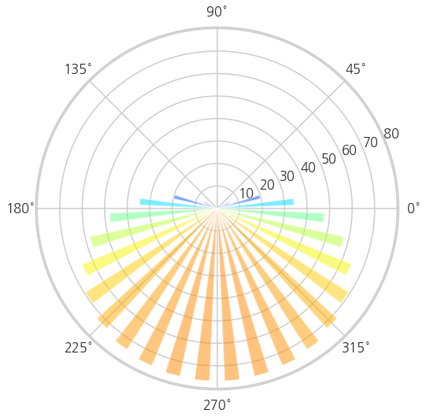


### 2.7.2 higherThanAlt

* 위의 aziperalt_df을 이용하여 기준 건물과 인접 건물 사이의 앙각이 그 방위각에서의 태양의 고도 보다 높은 건물들을 찾아냄 
    * dictionary로 반환 후 dataframe으로 합침


```python
# %%timeit

def angle_between(p1, p2 ):
    ang1 = np.arctan2(*p1[::-1])
    ang2 = np.arctan2(*p2[::-1])
    return np.rad2deg((ang1 - ang2) % (2 * np.pi))
    
def higherThanAlt(build_data, realnearest_ind_list, aziperalt_df , realnearest_dist_list) :
    
    xylocation = pd.DataFrame()
    xylocation['tm_x'] = build_data['tm_x']
    xylocation['tm_y'] = build_data['tm_y']

    xylocation_list = xylocation.values.tolist()
    xylocation_np = array(xylocation_list)
    
    start = time.time()
    
    at = {}
    for i in range(len(xylocation_np)) :

        if i%10000 == 0 :
            print(i)

        nowBuild = build_data.iloc[i]
        nearBuild = build_data.iloc[realnearest_ind_list[i]][['height','tm_x','tm_y']]
        
        re_height = (nearBuild['height'] - nowBuild['height']).apply(lambda x : max(x,0))
        re_angle = np.arctan2(re_height , np.array(realnearest_dist_list[i])) * 180 /  np.pi
#         print(re_angle.name)
        re_angle.name ='re_angle'
        
        
        nearx = nearBuild['tm_x'] - nowBuild['tm_x']
        neary = nearBuild['tm_y'] - nowBuild['tm_y']
        dist = pd.DataFrame(realnearest_dist_list[i] ,index =realnearest_ind_list[i], columns=['dist'])
        
        point = nearx.combine(neary , (lambda x1,x2 : (x1,x2)))
        
        azimuth = point.apply(lambda x : angle_between((0,150) , x)//10 * 10)
        azimuth.name = 'azimuth'
        
        nearBuild = pd.concat([nearx,neary,re_angle,dist,azimuth],axis=1)
        
        nearBuild = nearBuild.loc[nearBuild['re_angle'] > 0]
        
        nearBuild = pd.merge(nearBuild , aziperalt_df , left_on = 'azimuth' , right_on = 'aziMean')
        nearBuild['baseIndex'] = i

        rightBuild = nearBuild.loc[nearBuild['re_angle'] > nearBuild['altMean']]
                
        if not rightBuild.empty :
            at[i] = rightBuild

    
    print("time :", time.time() - start) 
    
    return at

x =higherThanAlt(build_data,realnearest_ind_list,aziperalt_df,realnearest_dist_list)
```

    0
    10000
    20000
    30000
    40000
    50000
    60000
    70000
    80000
    90000
    100000
    110000
    120000
    130000
    140000
    time : 1336.7084593772888


```python
upperAlt_list = []
for idx , near in x.items() :
    upperAlt_list.append(near)
    
af = pd.concat(upperAlt_list)

af.to_csv("./data/farthest/affectBuild/affectBuild_100.csv" , index=False ,encoding='utf-8')

af.head(20)
```


<div>
<style scoped>
    .dataframe tbody tr th:only-of-type {
        vertical-align: middle;
    }

    .dataframe tbody tr th {
        vertical-align: top;
    }

    .dataframe thead th {
        text-align: right;
    }
</style>
<table border="1" class="dataframe">
  <thead>
    <tr style="text-align: right;">
      <th></th>
      <th>tm_x</th>
      <th>tm_y</th>
      <th>re_angle</th>
      <th>dist</th>
      <th>azimuth</th>
      <th>aziMean</th>
      <th>altMean</th>
      <th>baseIndex</th>
    </tr>
  </thead>
  <tbody>
    <tr>
      <th>7</th>
      <td>-59.984307</td>
      <td>-2.680293</td>
      <td>53.666457</td>
      <td>60.044160</td>
      <td>260.0</td>
      <td>260</td>
      <td>47.560246</td>
      <td>5</td>
    </tr>
    <tr>
      <th>0</th>
      <td>-10.802731</td>
      <td>-0.306482</td>
      <td>51.445782</td>
      <td>10.807077</td>
      <td>260.0</td>
      <td>260</td>
      <td>47.560246</td>
      <td>1693</td>
    </tr>
    <tr>
      <th>4</th>
      <td>27.658782</td>
      <td>-0.902879</td>
      <td>48.609559</td>
      <td>27.673515</td>
      <td>90.0</td>
      <td>90</td>
      <td>47.757666</td>
      <td>1710</td>
    </tr>
    <tr>
      <th>11</th>
      <td>69.242183</td>
      <td>-9.959576</td>
      <td>60.856556</td>
      <td>69.954793</td>
      <td>90.0</td>
      <td>90</td>
      <td>47.757666</td>
      <td>5033</td>
    </tr>
    <tr>
      <th>0</th>
      <td>-14.451455</td>
      <td>-0.200170</td>
      <td>47.729667</td>
      <td>14.452842</td>
      <td>260.0</td>
      <td>260</td>
      <td>47.560246</td>
      <td>5282</td>
    </tr>
    <tr>
      <th>1</th>
      <td>-27.258084</td>
      <td>-10.620008</td>
      <td>67.629780</td>
      <td>29.253850</td>
      <td>240.0</td>
      <td>240</td>
      <td>64.673595</td>
      <td>5425</td>
    </tr>
    <tr>
      <th>0</th>
      <td>-18.992460</td>
      <td>-1.027153</td>
      <td>49.128992</td>
      <td>19.020215</td>
      <td>260.0</td>
      <td>260</td>
      <td>47.560246</td>
      <td>6355</td>
    </tr>
    <tr>
      <th>1</th>
      <td>40.250427</td>
      <td>-3.055818</td>
      <td>61.543437</td>
      <td>40.366259</td>
      <td>90.0</td>
      <td>90</td>
      <td>47.757666</td>
      <td>7666</td>
    </tr>
    <tr>
      <th>1</th>
      <td>53.940274</td>
      <td>-5.815637</td>
      <td>51.717818</td>
      <td>54.252878</td>
      <td>90.0</td>
      <td>90</td>
      <td>47.757666</td>
      <td>7801</td>
    </tr>
    <tr>
      <th>35</th>
      <td>-64.050833</td>
      <td>-7.904454</td>
      <td>52.720670</td>
      <td>64.536731</td>
      <td>260.0</td>
      <td>260</td>
      <td>47.560246</td>
      <td>8099</td>
    </tr>
    <tr>
      <th>0</th>
      <td>12.903015</td>
      <td>-0.931051</td>
      <td>77.107943</td>
      <td>12.936562</td>
      <td>90.0</td>
      <td>90</td>
      <td>47.757666</td>
      <td>8457</td>
    </tr>
    <tr>
      <th>0</th>
      <td>5.905838</td>
      <td>-4.298924</td>
      <td>82.697130</td>
      <td>7.304770</td>
      <td>120.0</td>
      <td>120</td>
      <td>69.489285</td>
      <td>9949</td>
    </tr>
    <tr>
      <th>1</th>
      <td>13.731631</td>
      <td>-9.359755</td>
      <td>73.746147</td>
      <td>16.618144</td>
      <td>120.0</td>
      <td>120</td>
      <td>69.489285</td>
      <td>9949</td>
    </tr>
    <tr>
      <th>0</th>
      <td>-32.501092</td>
      <td>-2.638344</td>
      <td>54.120418</td>
      <td>32.608003</td>
      <td>260.0</td>
      <td>260</td>
      <td>47.560246</td>
      <td>11136</td>
    </tr>
    <tr>
      <th>1</th>
      <td>45.427929</td>
      <td>-2.587526</td>
      <td>53.126136</td>
      <td>45.501561</td>
      <td>90.0</td>
      <td>90</td>
      <td>47.757666</td>
      <td>11160</td>
    </tr>
    <tr>
      <th>3</th>
      <td>32.455152</td>
      <td>-5.560714</td>
      <td>62.947908</td>
      <td>32.928080</td>
      <td>90.0</td>
      <td>90</td>
      <td>47.757666</td>
      <td>11228</td>
    </tr>
    <tr>
      <th>0</th>
      <td>-35.793549</td>
      <td>-0.548006</td>
      <td>62.701059</td>
      <td>35.797743</td>
      <td>260.0</td>
      <td>260</td>
      <td>47.560246</td>
      <td>11701</td>
    </tr>
    <tr>
      <th>22</th>
      <td>-98.320056</td>
      <td>-1.489735</td>
      <td>53.850196</td>
      <td>98.331342</td>
      <td>260.0</td>
      <td>260</td>
      <td>47.560246</td>
      <td>15263</td>
    </tr>
    <tr>
      <th>29</th>
      <td>80.790866</td>
      <td>-25.255720</td>
      <td>58.014711</td>
      <td>84.646414</td>
      <td>100.0</td>
      <td>100</td>
      <td>57.938121</td>
      <td>15268</td>
    </tr>
    <tr>
      <th>0</th>
      <td>-11.831627</td>
      <td>-2.023612</td>
      <td>52.600285</td>
      <td>12.003433</td>
      <td>260.0</td>
      <td>260</td>
      <td>47.560246</td>
      <td>16093</td>
    </tr>
  </tbody>
</table>
</div>


```python
af =  pd.read_csv("./data/farthest/affectBuild/affectBuild_100.csv")
af.head()
```


<div>
<style scoped>
    .dataframe tbody tr th:only-of-type {
        vertical-align: middle;
    }

    .dataframe tbody tr th {
        vertical-align: top;
    }

    .dataframe thead th {
        text-align: right;
    }
</style>
<table border="1" class="dataframe">
  <thead>
    <tr style="text-align: right;">
      <th></th>
      <th>tm_x</th>
      <th>tm_y</th>
      <th>re_angle</th>
      <th>dist</th>
      <th>azimuth</th>
      <th>aziMean</th>
      <th>altMean</th>
      <th>baseIndex</th>
    </tr>
  </thead>
  <tbody>
    <tr>
      <th>0</th>
      <td>-59.984307</td>
      <td>-2.680293</td>
      <td>53.666457</td>
      <td>60.044160</td>
      <td>260.0</td>
      <td>260</td>
      <td>47.560246</td>
      <td>5</td>
    </tr>
    <tr>
      <th>1</th>
      <td>-10.802731</td>
      <td>-0.306482</td>
      <td>51.445782</td>
      <td>10.807077</td>
      <td>260.0</td>
      <td>260</td>
      <td>47.560246</td>
      <td>1693</td>
    </tr>
    <tr>
      <th>2</th>
      <td>27.658782</td>
      <td>-0.902879</td>
      <td>48.609559</td>
      <td>27.673515</td>
      <td>90.0</td>
      <td>90</td>
      <td>47.757666</td>
      <td>1710</td>
    </tr>
    <tr>
      <th>3</th>
      <td>69.242183</td>
      <td>-9.959576</td>
      <td>60.856556</td>
      <td>69.954793</td>
      <td>90.0</td>
      <td>90</td>
      <td>47.757666</td>
      <td>5033</td>
    </tr>
    <tr>
      <th>4</th>
      <td>-14.451455</td>
      <td>-0.200170</td>
      <td>47.729667</td>
      <td>14.452842</td>
      <td>260.0</td>
      <td>260</td>
      <td>47.560246</td>
      <td>5282</td>
    </tr>
  </tbody>
</table>
</div>


## 2.7.3 방위각 10 당 빌딩 개수 데이터프레임화

* 모든 건물 인덱스에 각 방위각 영역에서 영향을 주는 건물의 개수를 계산


```python
count_df = af.groupby(['baseIndex','azimuth']).count()['tm_x'].rename("counts").reset_index()
count_df.azimuth = count_df.azimuth.astype(int)

cols = list(map( lambda x : "altCount"+str(x) , list(range(60,300,10)) ))
cols.append('altCount')
base_df = pd.DataFrame(0, index=np.arange(len(build_data)),columns = cols)

for i in range(len(count_df)) :
    tmp = count_df.iloc[i]
    base_df.iloc[int(tmp.baseIndex)]["altCount"+str(tmp.azimuth)] = tmp.counts

base_df['altCount'] = base_df.sum(axis=1)    
base_df.to_csv("./data/farthest/altCount/altCount_100.csv" , index=False ,encoding='utf-8')

base_df.head(20)
```


<div>
<style scoped>
    .dataframe tbody tr th:only-of-type {
        vertical-align: middle;
    }

    .dataframe tbody tr th {
        vertical-align: top;
    }

    .dataframe thead th {
        text-align: right;
    }
</style>
<table border="1" class="dataframe">
  <thead>
    <tr style="text-align: right;">
      <th></th>
      <th>altCount60</th>
      <th>altCount70</th>
      <th>altCount80</th>
      <th>altCount90</th>
      <th>altCount100</th>
      <th>altCount110</th>
      <th>altCount120</th>
      <th>altCount130</th>
      <th>altCount140</th>
      <th>altCount150</th>
      <th>altCount160</th>
      <th>altCount170</th>
      <th>altCount180</th>
      <th>altCount190</th>
      <th>altCount200</th>
      <th>altCount210</th>
      <th>altCount220</th>
      <th>altCount230</th>
      <th>altCount240</th>
      <th>altCount250</th>
      <th>altCount260</th>
      <th>altCount270</th>
      <th>altCount280</th>
      <th>altCount290</th>
      <th>altCount</th>
    </tr>
  </thead>
  <tbody>
    <tr>
      <th>0</th>
      <td>0</td>
      <td>0</td>
      <td>0</td>
      <td>0</td>
      <td>0</td>
      <td>0</td>
      <td>0</td>
      <td>0</td>
      <td>0</td>
      <td>0</td>
      <td>0</td>
      <td>0</td>
      <td>0</td>
      <td>0</td>
      <td>0</td>
      <td>0</td>
      <td>0</td>
      <td>0</td>
      <td>0</td>
      <td>0</td>
      <td>0</td>
      <td>0</td>
      <td>0</td>
      <td>0</td>
      <td>0</td>
    </tr>
    <tr>
      <th>1</th>
      <td>0</td>
      <td>0</td>
      <td>0</td>
      <td>0</td>
      <td>0</td>
      <td>0</td>
      <td>0</td>
      <td>0</td>
      <td>0</td>
      <td>0</td>
      <td>0</td>
      <td>0</td>
      <td>0</td>
      <td>0</td>
      <td>0</td>
      <td>0</td>
      <td>0</td>
      <td>0</td>
      <td>0</td>
      <td>0</td>
      <td>0</td>
      <td>0</td>
      <td>0</td>
      <td>0</td>
      <td>0</td>
    </tr>
    <tr>
      <th>2</th>
      <td>0</td>
      <td>0</td>
      <td>0</td>
      <td>0</td>
      <td>0</td>
      <td>0</td>
      <td>0</td>
      <td>0</td>
      <td>0</td>
      <td>0</td>
      <td>0</td>
      <td>0</td>
      <td>0</td>
      <td>0</td>
      <td>0</td>
      <td>0</td>
      <td>0</td>
      <td>0</td>
      <td>0</td>
      <td>0</td>
      <td>0</td>
      <td>0</td>
      <td>0</td>
      <td>0</td>
      <td>0</td>
    </tr>
    <tr>
      <th>3</th>
      <td>0</td>
      <td>0</td>
      <td>0</td>
      <td>0</td>
      <td>0</td>
      <td>0</td>
      <td>0</td>
      <td>0</td>
      <td>0</td>
      <td>0</td>
      <td>0</td>
      <td>0</td>
      <td>0</td>
      <td>0</td>
      <td>0</td>
      <td>0</td>
      <td>0</td>
      <td>0</td>
      <td>0</td>
      <td>0</td>
      <td>0</td>
      <td>0</td>
      <td>0</td>
      <td>0</td>
      <td>0</td>
    </tr>
    <tr>
      <th>4</th>
      <td>0</td>
      <td>0</td>
      <td>0</td>
      <td>0</td>
      <td>0</td>
      <td>0</td>
      <td>0</td>
      <td>0</td>
      <td>0</td>
      <td>0</td>
      <td>0</td>
      <td>0</td>
      <td>0</td>
      <td>0</td>
      <td>0</td>
      <td>0</td>
      <td>0</td>
      <td>0</td>
      <td>0</td>
      <td>0</td>
      <td>0</td>
      <td>0</td>
      <td>0</td>
      <td>0</td>
      <td>0</td>
    </tr>
    <tr>
      <th>5</th>
      <td>0</td>
      <td>0</td>
      <td>0</td>
      <td>0</td>
      <td>0</td>
      <td>0</td>
      <td>0</td>
      <td>0</td>
      <td>0</td>
      <td>0</td>
      <td>0</td>
      <td>0</td>
      <td>0</td>
      <td>0</td>
      <td>0</td>
      <td>0</td>
      <td>0</td>
      <td>0</td>
      <td>0</td>
      <td>0</td>
      <td>1</td>
      <td>0</td>
      <td>0</td>
      <td>0</td>
      <td>1</td>
    </tr>
    <tr>
      <th>6</th>
      <td>0</td>
      <td>0</td>
      <td>0</td>
      <td>0</td>
      <td>0</td>
      <td>0</td>
      <td>0</td>
      <td>0</td>
      <td>0</td>
      <td>0</td>
      <td>0</td>
      <td>0</td>
      <td>0</td>
      <td>0</td>
      <td>0</td>
      <td>0</td>
      <td>0</td>
      <td>0</td>
      <td>0</td>
      <td>0</td>
      <td>0</td>
      <td>0</td>
      <td>0</td>
      <td>0</td>
      <td>0</td>
    </tr>
    <tr>
      <th>7</th>
      <td>0</td>
      <td>0</td>
      <td>0</td>
      <td>0</td>
      <td>0</td>
      <td>0</td>
      <td>0</td>
      <td>0</td>
      <td>0</td>
      <td>0</td>
      <td>0</td>
      <td>0</td>
      <td>0</td>
      <td>0</td>
      <td>0</td>
      <td>0</td>
      <td>0</td>
      <td>0</td>
      <td>0</td>
      <td>0</td>
      <td>0</td>
      <td>0</td>
      <td>0</td>
      <td>0</td>
      <td>0</td>
    </tr>
    <tr>
      <th>8</th>
      <td>0</td>
      <td>0</td>
      <td>0</td>
      <td>0</td>
      <td>0</td>
      <td>0</td>
      <td>0</td>
      <td>0</td>
      <td>0</td>
      <td>0</td>
      <td>0</td>
      <td>0</td>
      <td>0</td>
      <td>0</td>
      <td>0</td>
      <td>0</td>
      <td>0</td>
      <td>0</td>
      <td>0</td>
      <td>0</td>
      <td>0</td>
      <td>0</td>
      <td>0</td>
      <td>0</td>
      <td>0</td>
    </tr>
    <tr>
      <th>9</th>
      <td>0</td>
      <td>0</td>
      <td>0</td>
      <td>0</td>
      <td>0</td>
      <td>0</td>
      <td>0</td>
      <td>0</td>
      <td>0</td>
      <td>0</td>
      <td>0</td>
      <td>0</td>
      <td>0</td>
      <td>0</td>
      <td>0</td>
      <td>0</td>
      <td>0</td>
      <td>0</td>
      <td>0</td>
      <td>0</td>
      <td>0</td>
      <td>0</td>
      <td>0</td>
      <td>0</td>
      <td>0</td>
    </tr>
    <tr>
      <th>10</th>
      <td>0</td>
      <td>0</td>
      <td>0</td>
      <td>0</td>
      <td>0</td>
      <td>0</td>
      <td>0</td>
      <td>0</td>
      <td>0</td>
      <td>0</td>
      <td>0</td>
      <td>0</td>
      <td>0</td>
      <td>0</td>
      <td>0</td>
      <td>0</td>
      <td>0</td>
      <td>0</td>
      <td>0</td>
      <td>0</td>
      <td>0</td>
      <td>0</td>
      <td>0</td>
      <td>0</td>
      <td>0</td>
    </tr>
    <tr>
      <th>11</th>
      <td>0</td>
      <td>0</td>
      <td>0</td>
      <td>0</td>
      <td>0</td>
      <td>0</td>
      <td>0</td>
      <td>0</td>
      <td>0</td>
      <td>0</td>
      <td>0</td>
      <td>0</td>
      <td>0</td>
      <td>0</td>
      <td>0</td>
      <td>0</td>
      <td>0</td>
      <td>0</td>
      <td>0</td>
      <td>0</td>
      <td>0</td>
      <td>0</td>
      <td>0</td>
      <td>0</td>
      <td>0</td>
    </tr>
    <tr>
      <th>12</th>
      <td>0</td>
      <td>0</td>
      <td>0</td>
      <td>0</td>
      <td>0</td>
      <td>0</td>
      <td>0</td>
      <td>0</td>
      <td>0</td>
      <td>0</td>
      <td>0</td>
      <td>0</td>
      <td>0</td>
      <td>0</td>
      <td>0</td>
      <td>0</td>
      <td>0</td>
      <td>0</td>
      <td>0</td>
      <td>0</td>
      <td>0</td>
      <td>0</td>
      <td>0</td>
      <td>0</td>
      <td>0</td>
    </tr>
    <tr>
      <th>13</th>
      <td>0</td>
      <td>0</td>
      <td>0</td>
      <td>0</td>
      <td>0</td>
      <td>0</td>
      <td>0</td>
      <td>0</td>
      <td>0</td>
      <td>0</td>
      <td>0</td>
      <td>0</td>
      <td>0</td>
      <td>0</td>
      <td>0</td>
      <td>0</td>
      <td>0</td>
      <td>0</td>
      <td>0</td>
      <td>0</td>
      <td>0</td>
      <td>0</td>
      <td>0</td>
      <td>0</td>
      <td>0</td>
    </tr>
    <tr>
      <th>14</th>
      <td>0</td>
      <td>0</td>
      <td>0</td>
      <td>0</td>
      <td>0</td>
      <td>0</td>
      <td>0</td>
      <td>0</td>
      <td>0</td>
      <td>0</td>
      <td>0</td>
      <td>0</td>
      <td>0</td>
      <td>0</td>
      <td>0</td>
      <td>0</td>
      <td>0</td>
      <td>0</td>
      <td>0</td>
      <td>0</td>
      <td>0</td>
      <td>0</td>
      <td>0</td>
      <td>0</td>
      <td>0</td>
    </tr>
    <tr>
      <th>15</th>
      <td>0</td>
      <td>0</td>
      <td>0</td>
      <td>0</td>
      <td>0</td>
      <td>0</td>
      <td>0</td>
      <td>0</td>
      <td>0</td>
      <td>0</td>
      <td>0</td>
      <td>0</td>
      <td>0</td>
      <td>0</td>
      <td>0</td>
      <td>0</td>
      <td>0</td>
      <td>0</td>
      <td>0</td>
      <td>0</td>
      <td>0</td>
      <td>0</td>
      <td>0</td>
      <td>0</td>
      <td>0</td>
    </tr>
    <tr>
      <th>16</th>
      <td>0</td>
      <td>0</td>
      <td>0</td>
      <td>0</td>
      <td>0</td>
      <td>0</td>
      <td>0</td>
      <td>0</td>
      <td>0</td>
      <td>0</td>
      <td>0</td>
      <td>0</td>
      <td>0</td>
      <td>0</td>
      <td>0</td>
      <td>0</td>
      <td>0</td>
      <td>0</td>
      <td>0</td>
      <td>0</td>
      <td>0</td>
      <td>0</td>
      <td>0</td>
      <td>0</td>
      <td>0</td>
    </tr>
    <tr>
      <th>17</th>
      <td>0</td>
      <td>0</td>
      <td>0</td>
      <td>0</td>
      <td>0</td>
      <td>0</td>
      <td>0</td>
      <td>0</td>
      <td>0</td>
      <td>0</td>
      <td>0</td>
      <td>0</td>
      <td>0</td>
      <td>0</td>
      <td>0</td>
      <td>0</td>
      <td>0</td>
      <td>0</td>
      <td>0</td>
      <td>0</td>
      <td>0</td>
      <td>0</td>
      <td>0</td>
      <td>0</td>
      <td>0</td>
    </tr>
    <tr>
      <th>18</th>
      <td>0</td>
      <td>0</td>
      <td>0</td>
      <td>0</td>
      <td>0</td>
      <td>0</td>
      <td>0</td>
      <td>0</td>
      <td>0</td>
      <td>0</td>
      <td>0</td>
      <td>0</td>
      <td>0</td>
      <td>0</td>
      <td>0</td>
      <td>0</td>
      <td>0</td>
      <td>0</td>
      <td>0</td>
      <td>0</td>
      <td>0</td>
      <td>0</td>
      <td>0</td>
      <td>0</td>
      <td>0</td>
    </tr>
    <tr>
      <th>19</th>
      <td>0</td>
      <td>0</td>
      <td>0</td>
      <td>0</td>
      <td>0</td>
      <td>0</td>
      <td>0</td>
      <td>0</td>
      <td>0</td>
      <td>0</td>
      <td>0</td>
      <td>0</td>
      <td>0</td>
      <td>0</td>
      <td>0</td>
      <td>0</td>
      <td>0</td>
      <td>0</td>
      <td>0</td>
      <td>0</td>
      <td>0</td>
      <td>0</td>
      <td>0</td>
      <td>0</td>
      <td>0</td>
    </tr>
  </tbody>
</table>
</div>


```python
base_df = pd.read_csv("./data/farthest/altCount/altCount_100.csv")
build_data = pd.concat([build_data,base_df] , axis=1)

build_data.head(15)
```


<div>
<style scoped>
    .dataframe tbody tr th:only-of-type {
        vertical-align: middle;
    }

    .dataframe tbody tr th {
        vertical-align: top;
    }

    .dataframe thead th {
        text-align: right;
    }
</style>
<table border="1" class="dataframe">
  <thead>
    <tr style="text-align: right;">
      <th></th>
      <th>gid</th>
      <th>buld_se_cd</th>
      <th>buld_se_nm</th>
      <th>bdtyp_cd</th>
      <th>apt_yn</th>
      <th>gro_flo_co</th>
      <th>sig_cd</th>
      <th>sig_nm</th>
      <th>emd_cd</th>
      <th>emd_nm</th>
      <th>tm_x</th>
      <th>tm_y</th>
      <th>lon</th>
      <th>lat</th>
      <th>buld_area</th>
      <th>buld_elev</th>
      <th>sL01</th>
      <th>sL02</th>
      <th>sL03</th>
      <th>sL04</th>
      <th>sL05</th>
      <th>sL06</th>
      <th>sL07</th>
      <th>sL08</th>
      <th>sL09</th>
      <th>sL10</th>
      <th>sL11</th>
      <th>sL12</th>
      <th>sL_y17</th>
      <th>buld_length</th>
      <th>buld_height</th>
      <th>height</th>
      <th>rad_angle_max</th>
      <th>rad_rel_fl</th>
      <th>rad_rel_height</th>
      <th>rad_angle_max_80</th>
      <th>rad_angle_max_160</th>
      <th>rad_angle_max_240</th>
      <th>count_80</th>
      <th>count_160</th>
      <th>count_240</th>
      <th>height_80</th>
      <th>height_160</th>
      <th>height_240</th>
      <th>nearShadow</th>
      <th>nearScaledShadow</th>
      <th>rel_nearShadow</th>
      <th>rel_nearScaledShadow</th>
      <th>altCount60</th>
      <th>altCount70</th>
      <th>altCount80</th>
      <th>altCount90</th>
      <th>altCount100</th>
      <th>altCount110</th>
      <th>altCount120</th>
      <th>altCount130</th>
      <th>altCount140</th>
      <th>altCount150</th>
      <th>altCount160</th>
      <th>altCount170</th>
      <th>altCount180</th>
      <th>altCount190</th>
      <th>altCount200</th>
      <th>altCount210</th>
      <th>altCount220</th>
      <th>altCount230</th>
      <th>altCount240</th>
      <th>altCount250</th>
      <th>altCount260</th>
      <th>altCount270</th>
      <th>altCount280</th>
      <th>altCount290</th>
      <th>altCount</th>
    </tr>
  </thead>
  <tbody>
    <tr>
      <th>0</th>
      <td>24300</td>
      <td>0</td>
      <td>지상</td>
      <td>4299</td>
      <td>N</td>
      <td>1</td>
      <td>30110</td>
      <td>동구</td>
      <td>30110137</td>
      <td>대별동</td>
      <td>241302.419829</td>
      <td>409864.414379</td>
      <td>127.459746</td>
      <td>36.285880</td>
      <td>199.109760</td>
      <td>80.000000</td>
      <td>0.204715</td>
      <td>0.217257</td>
      <td>0.205812</td>
      <td>0.184260</td>
      <td>0.153714</td>
      <td>0.139599</td>
      <td>0.138983</td>
      <td>0.163898</td>
      <td>0.196457</td>
      <td>0.204533</td>
      <td>0.213280</td>
      <td>0.208075</td>
      <td>0.180697</td>
      <td>15.922136</td>
      <td>3.14</td>
      <td>83.140000</td>
      <td>5.011625</td>
      <td>1.000000</td>
      <td>1.587692</td>
      <td>0.902407</td>
      <td>5.011625</td>
      <td>0.000000</td>
      <td>11</td>
      <td>9</td>
      <td>6</td>
      <td>83.874546</td>
      <td>84.186667</td>
      <td>82.306667</td>
      <td>514.339502</td>
      <td>514.339502</td>
      <td>10.375585</td>
      <td>10.375585</td>
      <td>0</td>
      <td>0</td>
      <td>0</td>
      <td>0</td>
      <td>0</td>
      <td>0</td>
      <td>0</td>
      <td>0</td>
      <td>0</td>
      <td>0</td>
      <td>0</td>
      <td>0</td>
      <td>0</td>
      <td>0</td>
      <td>0</td>
      <td>0</td>
      <td>0</td>
      <td>0</td>
      <td>0</td>
      <td>0</td>
      <td>0</td>
      <td>0</td>
      <td>0</td>
      <td>0</td>
      <td>0</td>
    </tr>
    <tr>
      <th>1</th>
      <td>16295</td>
      <td>0</td>
      <td>지상</td>
      <td>1001</td>
      <td>N</td>
      <td>1</td>
      <td>30110</td>
      <td>동구</td>
      <td>30110105</td>
      <td>가오동</td>
      <td>240815.012971</td>
      <td>412384.958080</td>
      <td>127.454453</td>
      <td>36.308615</td>
      <td>77.392318</td>
      <td>71.000000</td>
      <td>0.295631</td>
      <td>0.231582</td>
      <td>0.193751</td>
      <td>0.177985</td>
      <td>0.176701</td>
      <td>0.178177</td>
      <td>0.185056</td>
      <td>0.182143</td>
      <td>0.187676</td>
      <td>0.211802</td>
      <td>0.252642</td>
      <td>0.330147</td>
      <td>0.205046</td>
      <td>9.926679</td>
      <td>3.14</td>
      <td>74.140000</td>
      <td>35.570123</td>
      <td>2.473684</td>
      <td>6.327369</td>
      <td>1.182603</td>
      <td>35.570123</td>
      <td>15.608649</td>
      <td>14</td>
      <td>20</td>
      <td>5</td>
      <td>73.260000</td>
      <td>77.880000</td>
      <td>80.340001</td>
      <td>706.151655</td>
      <td>706.151655</td>
      <td>16.730038</td>
      <td>16.730038</td>
      <td>0</td>
      <td>0</td>
      <td>0</td>
      <td>0</td>
      <td>0</td>
      <td>0</td>
      <td>0</td>
      <td>0</td>
      <td>0</td>
      <td>0</td>
      <td>0</td>
      <td>0</td>
      <td>0</td>
      <td>0</td>
      <td>0</td>
      <td>0</td>
      <td>0</td>
      <td>0</td>
      <td>0</td>
      <td>0</td>
      <td>0</td>
      <td>0</td>
      <td>0</td>
      <td>0</td>
      <td>0</td>
    </tr>
    <tr>
      <th>2</th>
      <td>24341</td>
      <td>0</td>
      <td>지상</td>
      <td>1001</td>
      <td>N</td>
      <td>1</td>
      <td>30110</td>
      <td>동구</td>
      <td>30110137</td>
      <td>대별동</td>
      <td>241460.822384</td>
      <td>410090.945431</td>
      <td>127.461521</td>
      <td>36.287914</td>
      <td>91.076386</td>
      <td>77.000000</td>
      <td>0.195469</td>
      <td>0.200133</td>
      <td>0.191029</td>
      <td>0.185189</td>
      <td>0.171563</td>
      <td>0.164108</td>
      <td>0.155892</td>
      <td>0.172701</td>
      <td>0.185788</td>
      <td>0.188739</td>
      <td>0.196957</td>
      <td>0.201032</td>
      <td>0.181562</td>
      <td>10.768568</td>
      <td>3.14</td>
      <td>80.140000</td>
      <td>5.080622</td>
      <td>1.333333</td>
      <td>2.356000</td>
      <td>5.080622</td>
      <td>4.332678</td>
      <td>3.259005</td>
      <td>1</td>
      <td>4</td>
      <td>6</td>
      <td>84.280000</td>
      <td>82.710000</td>
      <td>81.663333</td>
      <td>214.120840</td>
      <td>214.120840</td>
      <td>3.661072</td>
      <td>3.661072</td>
      <td>0</td>
      <td>0</td>
      <td>0</td>
      <td>0</td>
      <td>0</td>
      <td>0</td>
      <td>0</td>
      <td>0</td>
      <td>0</td>
      <td>0</td>
      <td>0</td>
      <td>0</td>
      <td>0</td>
      <td>0</td>
      <td>0</td>
      <td>0</td>
      <td>0</td>
      <td>0</td>
      <td>0</td>
      <td>0</td>
      <td>0</td>
      <td>0</td>
      <td>0</td>
      <td>0</td>
      <td>0</td>
    </tr>
    <tr>
      <th>3</th>
      <td>24345</td>
      <td>0</td>
      <td>지상</td>
      <td>4402</td>
      <td>N</td>
      <td>1</td>
      <td>30110</td>
      <td>동구</td>
      <td>30110137</td>
      <td>대별동</td>
      <td>241530.222973</td>
      <td>410067.763075</td>
      <td>127.462293</td>
      <td>36.287703</td>
      <td>51.201706</td>
      <td>78.000000</td>
      <td>0.371389</td>
      <td>0.378444</td>
      <td>0.366326</td>
      <td>0.342754</td>
      <td>0.316217</td>
      <td>0.304955</td>
      <td>0.310306</td>
      <td>0.327509</td>
      <td>0.357109</td>
      <td>0.368799</td>
      <td>0.378022</td>
      <td>0.374364</td>
      <td>0.344058</td>
      <td>8.074159</td>
      <td>3.14</td>
      <td>81.140000</td>
      <td>1.555146</td>
      <td>0.000000</td>
      <td>1.000000</td>
      <td>0.000000</td>
      <td>1.555146</td>
      <td>0.000000</td>
      <td>3</td>
      <td>4</td>
      <td>0</td>
      <td>81.140000</td>
      <td>81.640000</td>
      <td>0.000000</td>
      <td>134.841008</td>
      <td>134.841008</td>
      <td>4.020769</td>
      <td>4.020769</td>
      <td>0</td>
      <td>0</td>
      <td>0</td>
      <td>0</td>
      <td>0</td>
      <td>0</td>
      <td>0</td>
      <td>0</td>
      <td>0</td>
      <td>0</td>
      <td>0</td>
      <td>0</td>
      <td>0</td>
      <td>0</td>
      <td>0</td>
      <td>0</td>
      <td>0</td>
      <td>0</td>
      <td>0</td>
      <td>0</td>
      <td>0</td>
      <td>0</td>
      <td>0</td>
      <td>0</td>
      <td>0</td>
    </tr>
    <tr>
      <th>4</th>
      <td>24374</td>
      <td>0</td>
      <td>지상</td>
      <td>18999</td>
      <td>N</td>
      <td>1</td>
      <td>30110</td>
      <td>동구</td>
      <td>30110137</td>
      <td>대별동</td>
      <td>241500.967911</td>
      <td>409605.204042</td>
      <td>127.461942</td>
      <td>36.283535</td>
      <td>455.844167</td>
      <td>80.000000</td>
      <td>0.131596</td>
      <td>0.138417</td>
      <td>0.124781</td>
      <td>0.116576</td>
      <td>0.102620</td>
      <td>0.095113</td>
      <td>0.086709</td>
      <td>0.104519</td>
      <td>0.118837</td>
      <td>0.127436</td>
      <td>0.138503</td>
      <td>0.138233</td>
      <td>0.115303</td>
      <td>24.091468</td>
      <td>3.14</td>
      <td>83.140000</td>
      <td>7.164204</td>
      <td>1.000000</td>
      <td>2.859999</td>
      <td>1.343876</td>
      <td>3.126923</td>
      <td>7.164204</td>
      <td>1</td>
      <td>1</td>
      <td>2</td>
      <td>84.140000</td>
      <td>85.099999</td>
      <td>87.379998</td>
      <td>81.380586</td>
      <td>81.380586</td>
      <td>1.843745</td>
      <td>1.843745</td>
      <td>0</td>
      <td>0</td>
      <td>0</td>
      <td>0</td>
      <td>0</td>
      <td>0</td>
      <td>0</td>
      <td>0</td>
      <td>0</td>
      <td>0</td>
      <td>0</td>
      <td>0</td>
      <td>0</td>
      <td>0</td>
      <td>0</td>
      <td>0</td>
      <td>0</td>
      <td>0</td>
      <td>0</td>
      <td>0</td>
      <td>0</td>
      <td>0</td>
      <td>0</td>
      <td>0</td>
      <td>0</td>
    </tr>
    <tr>
      <th>5</th>
      <td>24388</td>
      <td>0</td>
      <td>지상</td>
      <td>1001</td>
      <td>N</td>
      <td>1</td>
      <td>30110</td>
      <td>동구</td>
      <td>30110110</td>
      <td>대동</td>
      <td>240159.906540</td>
      <td>414421.117212</td>
      <td>127.447263</td>
      <td>36.326991</td>
      <td>77.409333</td>
      <td>60.000000</td>
      <td>0.342013</td>
      <td>0.264208</td>
      <td>0.265782</td>
      <td>0.300238</td>
      <td>0.345351</td>
      <td>0.367386</td>
      <td>0.357957</td>
      <td>0.327725</td>
      <td>0.279544</td>
      <td>0.262172</td>
      <td>0.271022</td>
      <td>0.377328</td>
      <td>0.315025</td>
      <td>9.927770</td>
      <td>3.14</td>
      <td>63.140000</td>
      <td>53.666457</td>
      <td>11.000000</td>
      <td>34.540000</td>
      <td>53.666457</td>
      <td>45.181649</td>
      <td>3.566459</td>
      <td>5</td>
      <td>11</td>
      <td>18</td>
      <td>128.252000</td>
      <td>82.550909</td>
      <td>63.837778</td>
      <td>638.364461</td>
      <td>638.364461</td>
      <td>9.422960</td>
      <td>9.422960</td>
      <td>0</td>
      <td>0</td>
      <td>0</td>
      <td>0</td>
      <td>0</td>
      <td>0</td>
      <td>0</td>
      <td>0</td>
      <td>0</td>
      <td>0</td>
      <td>0</td>
      <td>0</td>
      <td>0</td>
      <td>0</td>
      <td>0</td>
      <td>0</td>
      <td>0</td>
      <td>0</td>
      <td>0</td>
      <td>0</td>
      <td>1</td>
      <td>0</td>
      <td>0</td>
      <td>0</td>
      <td>1</td>
    </tr>
    <tr>
      <th>6</th>
      <td>24389</td>
      <td>0</td>
      <td>지상</td>
      <td>1001</td>
      <td>N</td>
      <td>1</td>
      <td>30110</td>
      <td>동구</td>
      <td>30110109</td>
      <td>용운동</td>
      <td>240194.089360</td>
      <td>414404.414184</td>
      <td>127.447643</td>
      <td>36.326839</td>
      <td>51.337342</td>
      <td>60.000000</td>
      <td>0.295785</td>
      <td>0.271745</td>
      <td>0.264553</td>
      <td>0.268319</td>
      <td>0.274780</td>
      <td>0.278538</td>
      <td>0.275594</td>
      <td>0.274400</td>
      <td>0.268402</td>
      <td>0.267608</td>
      <td>0.276751</td>
      <td>0.304762</td>
      <td>0.275033</td>
      <td>8.084846</td>
      <td>3.14</td>
      <td>63.140000</td>
      <td>46.858612</td>
      <td>5.769231</td>
      <td>12.153000</td>
      <td>46.858612</td>
      <td>40.396950</td>
      <td>4.909942</td>
      <td>3</td>
      <td>18</td>
      <td>17</td>
      <td>113.380000</td>
      <td>67.218889</td>
      <td>64.252941</td>
      <td>625.111727</td>
      <td>625.111727</td>
      <td>11.908530</td>
      <td>11.908530</td>
      <td>0</td>
      <td>0</td>
      <td>0</td>
      <td>0</td>
      <td>0</td>
      <td>0</td>
      <td>0</td>
      <td>0</td>
      <td>0</td>
      <td>0</td>
      <td>0</td>
      <td>0</td>
      <td>0</td>
      <td>0</td>
      <td>0</td>
      <td>0</td>
      <td>0</td>
      <td>0</td>
      <td>0</td>
      <td>0</td>
      <td>0</td>
      <td>0</td>
      <td>0</td>
      <td>0</td>
      <td>0</td>
    </tr>
    <tr>
      <th>7</th>
      <td>24390</td>
      <td>0</td>
      <td>지상</td>
      <td>1001</td>
      <td>N</td>
      <td>1</td>
      <td>30110</td>
      <td>동구</td>
      <td>30110109</td>
      <td>용운동</td>
      <td>240211.926874</td>
      <td>414384.035681</td>
      <td>127.447841</td>
      <td>36.326655</td>
      <td>75.987029</td>
      <td>60.000000</td>
      <td>0.420510</td>
      <td>0.392274</td>
      <td>0.366863</td>
      <td>0.342073</td>
      <td>0.327701</td>
      <td>0.323207</td>
      <td>0.334241</td>
      <td>0.337887</td>
      <td>0.358155</td>
      <td>0.383860</td>
      <td>0.415218</td>
      <td>0.457931</td>
      <td>0.361091</td>
      <td>9.836142</td>
      <td>3.14</td>
      <td>63.140000</td>
      <td>43.581035</td>
      <td>5.285714</td>
      <td>7.027027</td>
      <td>43.581035</td>
      <td>14.602362</td>
      <td>1.207512</td>
      <td>5</td>
      <td>28</td>
      <td>20</td>
      <td>103.960000</td>
      <td>64.472143</td>
      <td>64.070000</td>
      <td>853.176089</td>
      <td>853.176089</td>
      <td>16.043804</td>
      <td>16.043804</td>
      <td>0</td>
      <td>0</td>
      <td>0</td>
      <td>0</td>
      <td>0</td>
      <td>0</td>
      <td>0</td>
      <td>0</td>
      <td>0</td>
      <td>0</td>
      <td>0</td>
      <td>0</td>
      <td>0</td>
      <td>0</td>
      <td>0</td>
      <td>0</td>
      <td>0</td>
      <td>0</td>
      <td>0</td>
      <td>0</td>
      <td>0</td>
      <td>0</td>
      <td>0</td>
      <td>0</td>
      <td>0</td>
    </tr>
    <tr>
      <th>8</th>
      <td>16000</td>
      <td>0</td>
      <td>지상</td>
      <td>8300</td>
      <td>N</td>
      <td>1</td>
      <td>30110</td>
      <td>동구</td>
      <td>30110139</td>
      <td>대성동</td>
      <td>241427.753874</td>
      <td>411065.669655</td>
      <td>127.461205</td>
      <td>36.296700</td>
      <td>172.360837</td>
      <td>82.360001</td>
      <td>0.164547</td>
      <td>0.164071</td>
      <td>0.141630</td>
      <td>0.121494</td>
      <td>0.104828</td>
      <td>0.097969</td>
      <td>0.100996</td>
      <td>0.112888</td>
      <td>0.132973</td>
      <td>0.153809</td>
      <td>0.170812</td>
      <td>0.172143</td>
      <td>0.129870</td>
      <td>14.814069</td>
      <td>3.14</td>
      <td>85.500001</td>
      <td>8.806117</td>
      <td>1.583333</td>
      <td>4.360000</td>
      <td>8.806117</td>
      <td>5.828513</td>
      <td>5.969837</td>
      <td>5</td>
      <td>26</td>
      <td>12</td>
      <td>83.100000</td>
      <td>80.452308</td>
      <td>83.771667</td>
      <td>830.962030</td>
      <td>830.962030</td>
      <td>11.663990</td>
      <td>11.663990</td>
      <td>0</td>
      <td>0</td>
      <td>0</td>
      <td>0</td>
      <td>0</td>
      <td>0</td>
      <td>0</td>
      <td>0</td>
      <td>0</td>
      <td>0</td>
      <td>0</td>
      <td>0</td>
      <td>0</td>
      <td>0</td>
      <td>0</td>
      <td>0</td>
      <td>0</td>
      <td>0</td>
      <td>0</td>
      <td>0</td>
      <td>0</td>
      <td>0</td>
      <td>0</td>
      <td>0</td>
      <td>0</td>
    </tr>
    <tr>
      <th>9</th>
      <td>41029</td>
      <td>0</td>
      <td>지상</td>
      <td>1001</td>
      <td>N</td>
      <td>2</td>
      <td>30140</td>
      <td>중구</td>
      <td>30140104</td>
      <td>중촌동</td>
      <td>236967.617274</td>
      <td>416166.130328</td>
      <td>127.411794</td>
      <td>36.342844</td>
      <td>117.383692</td>
      <td>44.000000</td>
      <td>0.375975</td>
      <td>0.338155</td>
      <td>0.306407</td>
      <td>0.287346</td>
      <td>0.275248</td>
      <td>0.270337</td>
      <td>0.275306</td>
      <td>0.282068</td>
      <td>0.297882</td>
      <td>0.322272</td>
      <td>0.360949</td>
      <td>0.415965</td>
      <td>0.306308</td>
      <td>12.225284</td>
      <td>6.28</td>
      <td>50.280000</td>
      <td>22.331722</td>
      <td>1.454545</td>
      <td>2.720000</td>
      <td>1.991078</td>
      <td>22.331722</td>
      <td>0.000000</td>
      <td>15</td>
      <td>20</td>
      <td>0</td>
      <td>50.769333</td>
      <td>52.612000</td>
      <td>0.000000</td>
      <td>429.088606</td>
      <td>429.088606</td>
      <td>8.701323</td>
      <td>8.701323</td>
      <td>0</td>
      <td>0</td>
      <td>0</td>
      <td>0</td>
      <td>0</td>
      <td>0</td>
      <td>0</td>
      <td>0</td>
      <td>0</td>
      <td>0</td>
      <td>0</td>
      <td>0</td>
      <td>0</td>
      <td>0</td>
      <td>0</td>
      <td>0</td>
      <td>0</td>
      <td>0</td>
      <td>0</td>
      <td>0</td>
      <td>0</td>
      <td>0</td>
      <td>0</td>
      <td>0</td>
      <td>0</td>
    </tr>
    <tr>
      <th>10</th>
      <td>24431</td>
      <td>0</td>
      <td>지상</td>
      <td>1001</td>
      <td>N</td>
      <td>1</td>
      <td>30110</td>
      <td>동구</td>
      <td>30110118</td>
      <td>삼성동</td>
      <td>238717.498156</td>
      <td>415562.889447</td>
      <td>127.431256</td>
      <td>36.337339</td>
      <td>29.256159</td>
      <td>51.799999</td>
      <td>0.392870</td>
      <td>0.402961</td>
      <td>0.390841</td>
      <td>0.379955</td>
      <td>0.370022</td>
      <td>0.365304</td>
      <td>0.364915</td>
      <td>0.373746</td>
      <td>0.385420</td>
      <td>0.401321</td>
      <td>0.410461</td>
      <td>0.397168</td>
      <td>0.383042</td>
      <td>6.103286</td>
      <td>3.14</td>
      <td>54.939999</td>
      <td>27.035302</td>
      <td>2.600000</td>
      <td>2.498572</td>
      <td>27.035302</td>
      <td>5.429973</td>
      <td>0.000000</td>
      <td>7</td>
      <td>30</td>
      <td>0</td>
      <td>61.508571</td>
      <td>55.406000</td>
      <td>0.000000</td>
      <td>495.082583</td>
      <td>495.082583</td>
      <td>12.656909</td>
      <td>12.656909</td>
      <td>0</td>
      <td>0</td>
      <td>0</td>
      <td>0</td>
      <td>0</td>
      <td>0</td>
      <td>0</td>
      <td>0</td>
      <td>0</td>
      <td>0</td>
      <td>0</td>
      <td>0</td>
      <td>0</td>
      <td>0</td>
      <td>0</td>
      <td>0</td>
      <td>0</td>
      <td>0</td>
      <td>0</td>
      <td>0</td>
      <td>0</td>
      <td>0</td>
      <td>0</td>
      <td>0</td>
      <td>0</td>
    </tr>
    <tr>
      <th>11</th>
      <td>18212</td>
      <td>0</td>
      <td>지상</td>
      <td>1001</td>
      <td>N</td>
      <td>1</td>
      <td>30110</td>
      <td>동구</td>
      <td>30110110</td>
      <td>대동</td>
      <td>240080.438916</td>
      <td>415029.676385</td>
      <td>127.446410</td>
      <td>36.332479</td>
      <td>64.672200</td>
      <td>61.000000</td>
      <td>0.239652</td>
      <td>0.238992</td>
      <td>0.230112</td>
      <td>0.224417</td>
      <td>0.219639</td>
      <td>0.217231</td>
      <td>0.215642</td>
      <td>0.221651</td>
      <td>0.227416</td>
      <td>0.235824</td>
      <td>0.244567</td>
      <td>0.245704</td>
      <td>0.227622</td>
      <td>9.074316</td>
      <td>3.14</td>
      <td>64.140000</td>
      <td>9.014329</td>
      <td>1.440000</td>
      <td>3.886377</td>
      <td>8.799755</td>
      <td>7.068792</td>
      <td>9.014329</td>
      <td>17</td>
      <td>35</td>
      <td>27</td>
      <td>66.321176</td>
      <td>67.504572</td>
      <td>67.966667</td>
      <td>1259.795137</td>
      <td>1259.795137</td>
      <td>21.728709</td>
      <td>21.728709</td>
      <td>0</td>
      <td>0</td>
      <td>0</td>
      <td>0</td>
      <td>0</td>
      <td>0</td>
      <td>0</td>
      <td>0</td>
      <td>0</td>
      <td>0</td>
      <td>0</td>
      <td>0</td>
      <td>0</td>
      <td>0</td>
      <td>0</td>
      <td>0</td>
      <td>0</td>
      <td>0</td>
      <td>0</td>
      <td>0</td>
      <td>0</td>
      <td>0</td>
      <td>0</td>
      <td>0</td>
      <td>0</td>
    </tr>
    <tr>
      <th>12</th>
      <td>17960</td>
      <td>0</td>
      <td>지상</td>
      <td>1001</td>
      <td>N</td>
      <td>1</td>
      <td>30110</td>
      <td>동구</td>
      <td>30110110</td>
      <td>대동</td>
      <td>239974.834905</td>
      <td>414908.953735</td>
      <td>127.445227</td>
      <td>36.331395</td>
      <td>148.262691</td>
      <td>57.160000</td>
      <td>0.187741</td>
      <td>0.178004</td>
      <td>0.166223</td>
      <td>0.157832</td>
      <td>0.154972</td>
      <td>0.154676</td>
      <td>0.157960</td>
      <td>0.158144</td>
      <td>0.162988</td>
      <td>0.174718</td>
      <td>0.185232</td>
      <td>0.196633</td>
      <td>0.165960</td>
      <td>13.739502</td>
      <td>3.14</td>
      <td>60.300000</td>
      <td>16.224559</td>
      <td>1.777778</td>
      <td>4.894154</td>
      <td>12.207054</td>
      <td>16.224559</td>
      <td>10.139849</td>
      <td>16</td>
      <td>34</td>
      <td>21</td>
      <td>62.841250</td>
      <td>65.213529</td>
      <td>65.511428</td>
      <td>1087.864451</td>
      <td>1087.864451</td>
      <td>20.403185</td>
      <td>20.403185</td>
      <td>0</td>
      <td>0</td>
      <td>0</td>
      <td>0</td>
      <td>0</td>
      <td>0</td>
      <td>0</td>
      <td>0</td>
      <td>0</td>
      <td>0</td>
      <td>0</td>
      <td>0</td>
      <td>0</td>
      <td>0</td>
      <td>0</td>
      <td>0</td>
      <td>0</td>
      <td>0</td>
      <td>0</td>
      <td>0</td>
      <td>0</td>
      <td>0</td>
      <td>0</td>
      <td>0</td>
      <td>0</td>
    </tr>
    <tr>
      <th>13</th>
      <td>24446</td>
      <td>0</td>
      <td>지상</td>
      <td>1001</td>
      <td>N</td>
      <td>1</td>
      <td>30110</td>
      <td>동구</td>
      <td>30110118</td>
      <td>삼성동</td>
      <td>238698.420239</td>
      <td>415640.326535</td>
      <td>127.431048</td>
      <td>36.338038</td>
      <td>6.647636</td>
      <td>51.000000</td>
      <td>0.292454</td>
      <td>0.285909</td>
      <td>0.284889</td>
      <td>0.311123</td>
      <td>0.333483</td>
      <td>0.341933</td>
      <td>0.323765</td>
      <td>0.318200</td>
      <td>0.292488</td>
      <td>0.286490</td>
      <td>0.291136</td>
      <td>0.301428</td>
      <td>0.308975</td>
      <td>2.909301</td>
      <td>3.14</td>
      <td>54.140000</td>
      <td>3.589419</td>
      <td>1.000000</td>
      <td>1.240769</td>
      <td>1.840005</td>
      <td>3.589419</td>
      <td>0.000000</td>
      <td>9</td>
      <td>24</td>
      <td>6</td>
      <td>53.980000</td>
      <td>55.185833</td>
      <td>54.080000</td>
      <td>505.023317</td>
      <td>505.023317</td>
      <td>15.187370</td>
      <td>15.187370</td>
      <td>0</td>
      <td>0</td>
      <td>0</td>
      <td>0</td>
      <td>0</td>
      <td>0</td>
      <td>0</td>
      <td>0</td>
      <td>0</td>
      <td>0</td>
      <td>0</td>
      <td>0</td>
      <td>0</td>
      <td>0</td>
      <td>0</td>
      <td>0</td>
      <td>0</td>
      <td>0</td>
      <td>0</td>
      <td>0</td>
      <td>0</td>
      <td>0</td>
      <td>0</td>
      <td>0</td>
      <td>0</td>
    </tr>
    <tr>
      <th>14</th>
      <td>24449</td>
      <td>0</td>
      <td>지상</td>
      <td>13100</td>
      <td>N</td>
      <td>1</td>
      <td>30110</td>
      <td>동구</td>
      <td>30110118</td>
      <td>삼성동</td>
      <td>238680.851292</td>
      <td>415517.817895</td>
      <td>127.430846</td>
      <td>36.336935</td>
      <td>27.016232</td>
      <td>50.000000</td>
      <td>0.477458</td>
      <td>0.431736</td>
      <td>0.431827</td>
      <td>0.437249</td>
      <td>0.454863</td>
      <td>0.465364</td>
      <td>0.476868</td>
      <td>0.453991</td>
      <td>0.438508</td>
      <td>0.437592</td>
      <td>0.443918</td>
      <td>0.520801</td>
      <td>0.453267</td>
      <td>5.864992</td>
      <td>3.14</td>
      <td>53.140000</td>
      <td>15.926683</td>
      <td>1.555556</td>
      <td>3.364444</td>
      <td>0.000000</td>
      <td>15.926683</td>
      <td>5.823649</td>
      <td>1</td>
      <td>10</td>
      <td>10</td>
      <td>53.140000</td>
      <td>57.034000</td>
      <td>55.302000</td>
      <td>278.326337</td>
      <td>278.326337</td>
      <td>6.881329</td>
      <td>6.881329</td>
      <td>0</td>
      <td>0</td>
      <td>0</td>
      <td>0</td>
      <td>0</td>
      <td>0</td>
      <td>0</td>
      <td>0</td>
      <td>0</td>
      <td>0</td>
      <td>0</td>
      <td>0</td>
      <td>0</td>
      <td>0</td>
      <td>0</td>
      <td>0</td>
      <td>0</td>
      <td>0</td>
      <td>0</td>
      <td>0</td>
      <td>0</td>
      <td>0</td>
      <td>0</td>
      <td>0</td>
      <td>0</td>
    </tr>
  </tbody>
</table>
</div>


```python
build_data.to_csv('./data/2.7/build_data_3group_80100.csv',index=False ,encoding='utf-8')
```


```python
build_data = pd.read_csv("./data/2.7/build_data_3group_80100.csv")
```

# 3. 파생데이터 시각화


```python
%matplotlib inline

import matplotlib as mpl  # 기본 설정 만지는 용도
import matplotlib.pyplot as plt  # 그래프 그리는 용도
import matplotlib.font_manager as fm  # 폰트 관련 용도
```


```python
print ('버전: ', mpl.__version__)
print ('설치 위치: ', mpl.__file__)
print ('설정 위치: ', mpl.get_configdir())
print ('캐시 위치: ', mpl.get_cachedir())
print ('설정 파일 위치: ', mpl.matplotlib_fname())
```

    버전:  3.1.1
    설치 위치:  /usr/local/lib/python3.6/dist-packages/matplotlib/__init__.py
    설정 위치:  /home/junho/.config/matplotlib
    캐시 위치:  /home/junho/.cache/matplotlib
    설정 파일 위치:  /usr/local/lib/python3.6/dist-packages/matplotlib/mpl-data/matplotlibrc


```python
# 특정 데이터의 지도상 분포 시각화 함수
def vis_map(df: pd.DataFrame, df2 : pd.DataFrame,
            col: str,
            pal: sns.color_palette, 
            title: str, 
            bintup=None,   # bintup = (binmin: int, binmax: int, binnum: int)
            log=False
           ):
  
  datatype = str(df[col].dtype)
  print('Data type={}'.format(datatype))
  
  if datatype == 'object':
    colbin = df[col].unique()
    colbin_len = len(df[col].unique())
    colbin_name = col
  
  else:
    binmin, binmax, binnum = bintup
    
    if log==True:
      log_binmin = np.log10(binmin)
      log_binmax = np.log10(binmax)
      colbin = np.logspace(log_binmin, log_binmax, num=binnum)
    else:
      colbin = np.arange(binmin, binmax, binnum)
      
    colbin_len = len(colbin) - 1 
   
    colbin_name = col + '_bin'
    df[colbin_name] = pd.cut(df[col], colbin)

  fig , ax =  plt.subplots(figsize=(16,12))
  sns.relplot(kind='scatter', x='lon', y='lat', data=df, 
                  s=3, linewidth=0, hue=colbin_name, 
                  palette=sns.color_palette(pal, n_colors=colbin_len), 
                  legend='brief', ax = ax,
                  height=10)
  
  sns.relplot(kind='scatter', x='lon', y='lat' , data = df2 , ax = ax , color='black' ,
                     s=3, linewidth=0 ,palette=sns.color_palette(pal, n_colors=colbin_len))
#   plt.show()
  plt.close()
  plt.close()


```

## 3.1 대전 구 경계 데이터

* 대전시의 구를 경계지어줄 선이 필요
* https://github.com/vuski/admdongkor 에서 행정동 경계 데이터( HangJeongDong_ver20190403.geojson ) 수집
* 대전의 행정동 경계 데이터만 추려내고, 각 구 안에 중복되는 동 경계는 삭제 -> 구 경계 만 남음


* <font color='red'> 동 데이터가 빠진게 존재하는 듯 , 사이의 간격을 메꿀 수 있는 방법 필요 , 개선 필요</font>


```python
geojsonPath= './data/basemap/HangJeongDong_ver20171016.geojson'
with open(geojsonPath) as f :
    data = json.load(f)
print(data)    
```

    IOPub data rate exceeded.
    The notebook server will temporarily stop sending output
    to the client in order to avoid crashing it.
    To change this limit, set the config variable
    `--NotebookApp.iopub_data_rate_limit`.
    
    Current values:
    NotebookApp.iopub_data_rate_limit=1000000.0 (bytes/sec)
    NotebookApp.rate_limit_window=3.0 (secs)
    


```python
# json 데이터를 보니까 대전은 앞자리가 25이다.
geodata_daejeon = []
for feature in data['features'] :
    if feature['properties']['adm_cd'][:2]  == '25' :
        geodata_daejeon.append(feature)


```


```python
geodata_daejeon
latlon_daejeon = {}
all_location = []
all_latlon =[ ]
for geo in geodata_daejeon :
    all_latlon.extend(geo['geometry']['coordinates'][0])

latlon_daejeon['all'] = all_latlon
latlon_daejeon['동구'] = []
latlon_daejeon['중구'] = []
latlon_daejeon['유성구'] = []
latlon_daejeon['서구'] = []
latlon_daejeon['대덕구'] = []


```


```python
num = 0
for geo in geodata_daejeon :
    latlon_daejeon[geo['properties']['adm_nm'].split()[1]].extend(geo['geometry']['coordinates'][0])
    num = num+1
    
print(num)
```

    79


```python
def extractBoundaries(latlon_daejeon , gu_name):
    
    gu_latlon = []
    
    ll_series = pd.Series(latlon_daejeon[gu_name])
    ll_series = ll_series.apply(lambda x : tuple(x))
    a = ll_series.value_counts()
    a = dict(a)

    for idx , val in a.items() :
        if val == 1 :
            gu_latlon.append(idx)
    
    return gu_latlon
            
a = extractBoundaries(latlon_daejeon,"서구")            
all_edge = []
for gu in ['서구','동구','유성구','대덕구','중구'] :
    all_edge.extend(extractBoundaries(latlon_daejeon,gu))
    
all_edge[:10]
```


    [(127.32705645993794, 36.20377609757011),
     (127.31969956039778, 36.21544906099954),
     (127.35965600423556, 36.262669934995024),
     (127.3012214336801, 36.22118769101955),
     (127.2880589283616, 36.26170857859202),
     (127.28108305352245, 36.246253082333595),
     (127.38579483566049, 36.320286981024),
     (127.3360097133193, 36.33017738963814),
     (127.32141312406488, 36.213830151815074),
     (127.33510072343262, 36.18361894770331)]


## 3.1.1 구 경계 데이터 시각화


```python
boundaries_data = pd.DataFrame(all_edge , columns=['lon','lat'])

print(boundaries_data.head())

print("> 대전 구 경계 데이터")
sns.relplot(x="lon", y="lat", data = boundaries_data , s=10 , height = 10)
```

              lon        lat
    0  127.327056  36.203776
    1  127.319700  36.215449
    2  127.359656  36.262670
    3  127.301221  36.221188
    4  127.288059  36.261709
    > 대전 구 경계 데이터


    <seaborn.axisgrid.FacetGrid at 0x7f5974d41780>


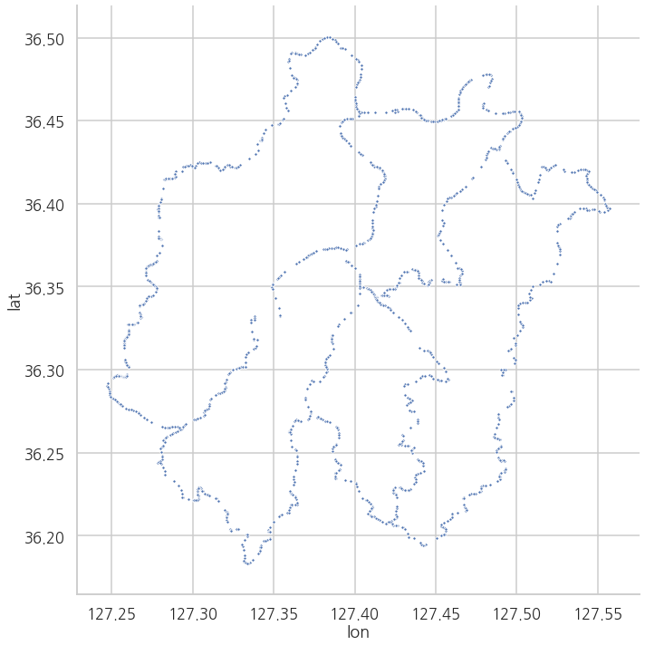


```python
build_data['buld_se_cd'] = build_data['buld_se_cd'].astype(object)
build_data['bdtyp_cd'] = build_data['bdtyp_cd'].astype(object)
build_data['sig_cd'] = build_data['sig_cd'].astype(object)
build_data['emd_cd'] = build_data['emd_cd'].astype(object)

data_vis = copy.deepcopy(build_data)
data_vis['lat'] = data_vis['lat'].astype(float)
data_vis['lon'] = data_vis['lon'].astype(float)

data_vis.head()
```


<div>
<style scoped>
    .dataframe tbody tr th:only-of-type {
        vertical-align: middle;
    }

    .dataframe tbody tr th {
        vertical-align: top;
    }

    .dataframe thead th {
        text-align: right;
    }
</style>
<table border="1" class="dataframe">
  <thead>
    <tr style="text-align: right;">
      <th></th>
      <th>gid</th>
      <th>buld_se_cd</th>
      <th>buld_se_nm</th>
      <th>bdtyp_cd</th>
      <th>apt_yn</th>
      <th>gro_flo_co</th>
      <th>sig_cd</th>
      <th>sig_nm</th>
      <th>emd_cd</th>
      <th>emd_nm</th>
      <th>tm_x</th>
      <th>tm_y</th>
      <th>lon</th>
      <th>lat</th>
      <th>buld_area</th>
      <th>buld_elev</th>
      <th>sL01</th>
      <th>sL02</th>
      <th>sL03</th>
      <th>sL04</th>
      <th>sL05</th>
      <th>sL06</th>
      <th>sL07</th>
      <th>sL08</th>
      <th>sL09</th>
      <th>sL10</th>
      <th>sL11</th>
      <th>sL12</th>
      <th>sL_y17</th>
      <th>buld_length</th>
      <th>buld_height</th>
      <th>height</th>
      <th>rad_angle_max</th>
      <th>rad_rel_fl</th>
      <th>rad_rel_height</th>
      <th>rad_angle_max_80</th>
      <th>rad_angle_max_160</th>
      <th>rad_angle_max_240</th>
      <th>count_80</th>
      <th>count_160</th>
      <th>count_240</th>
      <th>height_80</th>
      <th>height_160</th>
      <th>height_240</th>
      <th>nearShadow</th>
      <th>nearScaledShadow</th>
      <th>rel_nearShadow</th>
      <th>rel_nearScaledShadow</th>
      <th>altCount60</th>
      <th>altCount70</th>
      <th>altCount80</th>
      <th>altCount90</th>
      <th>altCount100</th>
      <th>altCount110</th>
      <th>altCount120</th>
      <th>altCount130</th>
      <th>altCount140</th>
      <th>altCount150</th>
      <th>altCount160</th>
      <th>altCount170</th>
      <th>altCount180</th>
      <th>altCount190</th>
      <th>altCount200</th>
      <th>altCount210</th>
      <th>altCount220</th>
      <th>altCount230</th>
      <th>altCount240</th>
      <th>altCount250</th>
      <th>altCount260</th>
      <th>altCount270</th>
      <th>altCount280</th>
      <th>altCount290</th>
      <th>altCount</th>
    </tr>
  </thead>
  <tbody>
    <tr>
      <th>0</th>
      <td>24300</td>
      <td>0</td>
      <td>지상</td>
      <td>4299</td>
      <td>N</td>
      <td>1</td>
      <td>30110</td>
      <td>동구</td>
      <td>30110137</td>
      <td>대별동</td>
      <td>241302.419829</td>
      <td>409864.414379</td>
      <td>127.459746</td>
      <td>36.285880</td>
      <td>199.109760</td>
      <td>80.0</td>
      <td>0.204715</td>
      <td>0.217257</td>
      <td>0.205812</td>
      <td>0.184260</td>
      <td>0.153714</td>
      <td>0.139599</td>
      <td>0.138983</td>
      <td>0.163898</td>
      <td>0.196457</td>
      <td>0.204533</td>
      <td>0.213280</td>
      <td>0.208075</td>
      <td>0.180697</td>
      <td>15.922136</td>
      <td>3.14</td>
      <td>83.14</td>
      <td>5.011625</td>
      <td>1.000000</td>
      <td>1.587692</td>
      <td>0.902407</td>
      <td>5.011625</td>
      <td>0.000000</td>
      <td>11</td>
      <td>9</td>
      <td>6</td>
      <td>83.874546</td>
      <td>84.186667</td>
      <td>82.306667</td>
      <td>514.339502</td>
      <td>514.339502</td>
      <td>10.375585</td>
      <td>10.375585</td>
      <td>0</td>
      <td>0</td>
      <td>0</td>
      <td>0</td>
      <td>0</td>
      <td>0</td>
      <td>0</td>
      <td>0</td>
      <td>0</td>
      <td>0</td>
      <td>0</td>
      <td>0</td>
      <td>0</td>
      <td>0</td>
      <td>0</td>
      <td>0</td>
      <td>0</td>
      <td>0</td>
      <td>0</td>
      <td>0</td>
      <td>0</td>
      <td>0</td>
      <td>0</td>
      <td>0</td>
      <td>0</td>
    </tr>
    <tr>
      <th>1</th>
      <td>16295</td>
      <td>0</td>
      <td>지상</td>
      <td>1001</td>
      <td>N</td>
      <td>1</td>
      <td>30110</td>
      <td>동구</td>
      <td>30110105</td>
      <td>가오동</td>
      <td>240815.012971</td>
      <td>412384.958080</td>
      <td>127.454453</td>
      <td>36.308615</td>
      <td>77.392318</td>
      <td>71.0</td>
      <td>0.295631</td>
      <td>0.231582</td>
      <td>0.193751</td>
      <td>0.177985</td>
      <td>0.176701</td>
      <td>0.178177</td>
      <td>0.185056</td>
      <td>0.182143</td>
      <td>0.187676</td>
      <td>0.211802</td>
      <td>0.252642</td>
      <td>0.330147</td>
      <td>0.205046</td>
      <td>9.926679</td>
      <td>3.14</td>
      <td>74.14</td>
      <td>35.570123</td>
      <td>2.473684</td>
      <td>6.327369</td>
      <td>1.182603</td>
      <td>35.570123</td>
      <td>15.608649</td>
      <td>14</td>
      <td>20</td>
      <td>5</td>
      <td>73.260000</td>
      <td>77.880000</td>
      <td>80.340001</td>
      <td>706.151655</td>
      <td>706.151655</td>
      <td>16.730038</td>
      <td>16.730038</td>
      <td>0</td>
      <td>0</td>
      <td>0</td>
      <td>0</td>
      <td>0</td>
      <td>0</td>
      <td>0</td>
      <td>0</td>
      <td>0</td>
      <td>0</td>
      <td>0</td>
      <td>0</td>
      <td>0</td>
      <td>0</td>
      <td>0</td>
      <td>0</td>
      <td>0</td>
      <td>0</td>
      <td>0</td>
      <td>0</td>
      <td>0</td>
      <td>0</td>
      <td>0</td>
      <td>0</td>
      <td>0</td>
    </tr>
    <tr>
      <th>2</th>
      <td>24341</td>
      <td>0</td>
      <td>지상</td>
      <td>1001</td>
      <td>N</td>
      <td>1</td>
      <td>30110</td>
      <td>동구</td>
      <td>30110137</td>
      <td>대별동</td>
      <td>241460.822384</td>
      <td>410090.945431</td>
      <td>127.461521</td>
      <td>36.287914</td>
      <td>91.076386</td>
      <td>77.0</td>
      <td>0.195469</td>
      <td>0.200133</td>
      <td>0.191029</td>
      <td>0.185189</td>
      <td>0.171563</td>
      <td>0.164108</td>
      <td>0.155892</td>
      <td>0.172701</td>
      <td>0.185788</td>
      <td>0.188739</td>
      <td>0.196957</td>
      <td>0.201032</td>
      <td>0.181562</td>
      <td>10.768568</td>
      <td>3.14</td>
      <td>80.14</td>
      <td>5.080622</td>
      <td>1.333333</td>
      <td>2.356000</td>
      <td>5.080622</td>
      <td>4.332678</td>
      <td>3.259005</td>
      <td>1</td>
      <td>4</td>
      <td>6</td>
      <td>84.280000</td>
      <td>82.710000</td>
      <td>81.663333</td>
      <td>214.120840</td>
      <td>214.120840</td>
      <td>3.661072</td>
      <td>3.661072</td>
      <td>0</td>
      <td>0</td>
      <td>0</td>
      <td>0</td>
      <td>0</td>
      <td>0</td>
      <td>0</td>
      <td>0</td>
      <td>0</td>
      <td>0</td>
      <td>0</td>
      <td>0</td>
      <td>0</td>
      <td>0</td>
      <td>0</td>
      <td>0</td>
      <td>0</td>
      <td>0</td>
      <td>0</td>
      <td>0</td>
      <td>0</td>
      <td>0</td>
      <td>0</td>
      <td>0</td>
      <td>0</td>
    </tr>
    <tr>
      <th>3</th>
      <td>24345</td>
      <td>0</td>
      <td>지상</td>
      <td>4402</td>
      <td>N</td>
      <td>1</td>
      <td>30110</td>
      <td>동구</td>
      <td>30110137</td>
      <td>대별동</td>
      <td>241530.222973</td>
      <td>410067.763075</td>
      <td>127.462293</td>
      <td>36.287703</td>
      <td>51.201706</td>
      <td>78.0</td>
      <td>0.371389</td>
      <td>0.378444</td>
      <td>0.366326</td>
      <td>0.342754</td>
      <td>0.316217</td>
      <td>0.304955</td>
      <td>0.310306</td>
      <td>0.327509</td>
      <td>0.357109</td>
      <td>0.368799</td>
      <td>0.378022</td>
      <td>0.374364</td>
      <td>0.344058</td>
      <td>8.074159</td>
      <td>3.14</td>
      <td>81.14</td>
      <td>1.555146</td>
      <td>0.000000</td>
      <td>1.000000</td>
      <td>0.000000</td>
      <td>1.555146</td>
      <td>0.000000</td>
      <td>3</td>
      <td>4</td>
      <td>0</td>
      <td>81.140000</td>
      <td>81.640000</td>
      <td>0.000000</td>
      <td>134.841008</td>
      <td>134.841008</td>
      <td>4.020769</td>
      <td>4.020769</td>
      <td>0</td>
      <td>0</td>
      <td>0</td>
      <td>0</td>
      <td>0</td>
      <td>0</td>
      <td>0</td>
      <td>0</td>
      <td>0</td>
      <td>0</td>
      <td>0</td>
      <td>0</td>
      <td>0</td>
      <td>0</td>
      <td>0</td>
      <td>0</td>
      <td>0</td>
      <td>0</td>
      <td>0</td>
      <td>0</td>
      <td>0</td>
      <td>0</td>
      <td>0</td>
      <td>0</td>
      <td>0</td>
    </tr>
    <tr>
      <th>4</th>
      <td>24374</td>
      <td>0</td>
      <td>지상</td>
      <td>18999</td>
      <td>N</td>
      <td>1</td>
      <td>30110</td>
      <td>동구</td>
      <td>30110137</td>
      <td>대별동</td>
      <td>241500.967911</td>
      <td>409605.204042</td>
      <td>127.461942</td>
      <td>36.283535</td>
      <td>455.844167</td>
      <td>80.0</td>
      <td>0.131596</td>
      <td>0.138417</td>
      <td>0.124781</td>
      <td>0.116576</td>
      <td>0.102620</td>
      <td>0.095113</td>
      <td>0.086709</td>
      <td>0.104519</td>
      <td>0.118837</td>
      <td>0.127436</td>
      <td>0.138503</td>
      <td>0.138233</td>
      <td>0.115303</td>
      <td>24.091468</td>
      <td>3.14</td>
      <td>83.14</td>
      <td>7.164204</td>
      <td>1.000000</td>
      <td>2.859999</td>
      <td>1.343876</td>
      <td>3.126923</td>
      <td>7.164204</td>
      <td>1</td>
      <td>1</td>
      <td>2</td>
      <td>84.140000</td>
      <td>85.099999</td>
      <td>87.379998</td>
      <td>81.380586</td>
      <td>81.380586</td>
      <td>1.843745</td>
      <td>1.843745</td>
      <td>0</td>
      <td>0</td>
      <td>0</td>
      <td>0</td>
      <td>0</td>
      <td>0</td>
      <td>0</td>
      <td>0</td>
      <td>0</td>
      <td>0</td>
      <td>0</td>
      <td>0</td>
      <td>0</td>
      <td>0</td>
      <td>0</td>
      <td>0</td>
      <td>0</td>
      <td>0</td>
      <td>0</td>
      <td>0</td>
      <td>0</td>
      <td>0</td>
      <td>0</td>
      <td>0</td>
      <td>0</td>
    </tr>
  </tbody>
</table>
</div>


## 3.2 파생 데이터(2.5에서 구한) 시각화


```python
vis_map(df=data_vis, df2=boundaries_data, col='rad_angle_max', pal='OrRd', title='최대 앙각',  bintup=(0, 90, 10))
```

    Data type=float64


```python
vis_map(df=data_vis, df2=boundaries_data, col='sL_y17', pal='OrRd', title='일사량 손실률',  bintup=(0, 0.8, 0.1))
```

    Data type=float64


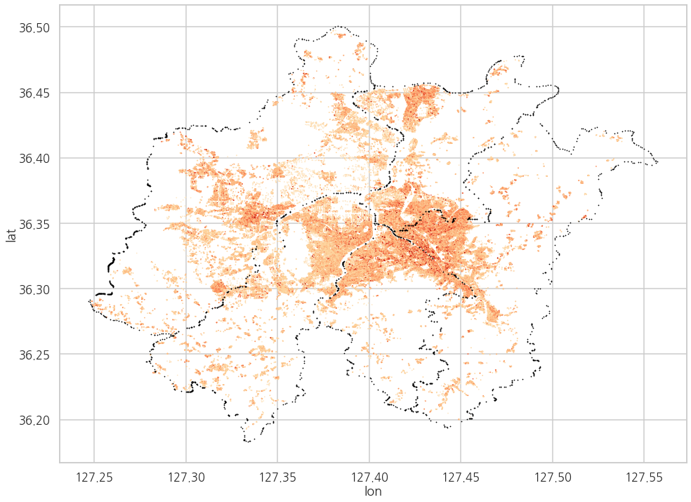


## 3.3 인접 건물의 최대 최소 앙각 (2.7에서 구한)

* x축을 최대, 최소 앙각으로 하고, y축은 개수인 히스토그램을 그림


```python
min_df = af.groupby(['baseIndex'])['re_angle'].min().reset_index()
max_df = af.groupby(['baseIndex'])['re_angle'].max().reset_index()

minmaxAngle_df = pd.merge(min_df, max_df , on ="baseIndex")


print("빨강 : max")
print("파강 : min")
fig = plt.figure(figsize=(16,12))
plt.hist(minmaxAngle_df['re_angle_y'], bins=90, histtype='stepfilled', normed=True, color='r', label='max')
plt.hist(minmaxAngle_df['re_angle_x'], bins=90, histtype='stepfilled', normed=True, color='b',alpha=0.5, label='min')
plt.show()

minmaxAngle_df.head()
```

    빨강 : max
    파강 : min


    /usr/lib/python3/dist-packages/ipykernel_launcher.py:10: MatplotlibDeprecationWarning: 
    The 'normed' kwarg was deprecated in Matplotlib 2.1 and will be removed in 3.1. Use 'density' instead.
      # Remove the CWD from sys.path while we load stuff.
    /usr/lib/python3/dist-packages/ipykernel_launcher.py:11: MatplotlibDeprecationWarning: 
    The 'normed' kwarg was deprecated in Matplotlib 2.1 and will be removed in 3.1. Use 'density' instead.
      # This is added back by InteractiveShellApp.init_path()


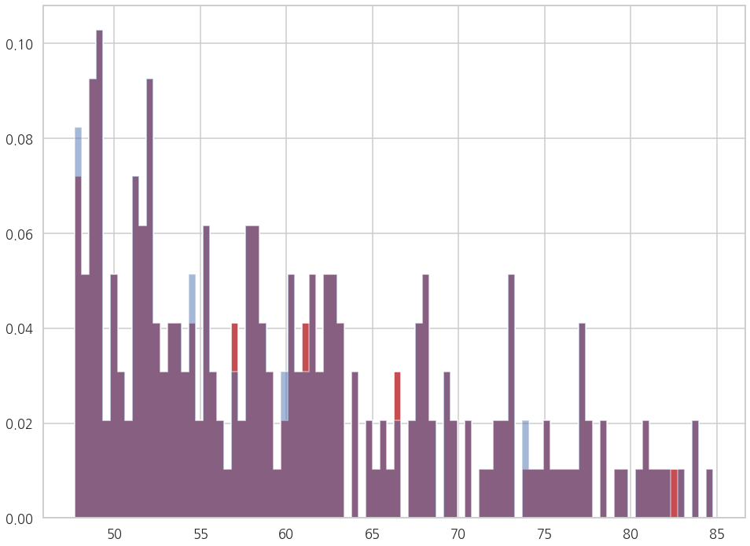


<div>
<style scoped>
    .dataframe tbody tr th:only-of-type {
        vertical-align: middle;
    }

    .dataframe tbody tr th {
        vertical-align: top;
    }

    .dataframe thead th {
        text-align: right;
    }
</style>
<table border="1" class="dataframe">
  <thead>
    <tr style="text-align: right;">
      <th></th>
      <th>baseIndex</th>
      <th>re_angle_x</th>
      <th>re_angle_y</th>
    </tr>
  </thead>
  <tbody>
    <tr>
      <th>0</th>
      <td>5</td>
      <td>53.666457</td>
      <td>53.666457</td>
    </tr>
    <tr>
      <th>1</th>
      <td>1693</td>
      <td>51.445782</td>
      <td>51.445782</td>
    </tr>
    <tr>
      <th>2</th>
      <td>1710</td>
      <td>48.609559</td>
      <td>48.609559</td>
    </tr>
    <tr>
      <th>3</th>
      <td>5033</td>
      <td>60.856556</td>
      <td>60.856556</td>
    </tr>
    <tr>
      <th>4</th>
      <td>5282</td>
      <td>47.729667</td>
      <td>47.729667</td>
    </tr>
  </tbody>
</table>
</div>


* x축을 최대 앙각 - 최소 앙각로 하고 히스토그램을 그림


```python
fig = plt.figure(figsize=(16,12))
plt.hist(minmaxAngle_df['re_angle_y']-minmaxAngle_df['re_angle_x'], bins=90, histtype='stepfilled', normed=True, color='r', label='minmax_dif')

plt.legend()

print( "> 최대앙각-최소앙각 평균 " , (minmaxAngle_df['re_angle_y']-minmaxAngle_df['re_angle_x']).mean() )
plt.show()
```

    /usr/lib/python3/dist-packages/ipykernel_launcher.py:2: MatplotlibDeprecationWarning: 
    The 'normed' kwarg was deprecated in Matplotlib 2.1 and will be removed in 3.1. Use 'density' instead.
      


    > 최대앙각-최소앙각 평균  0.1323911709073209


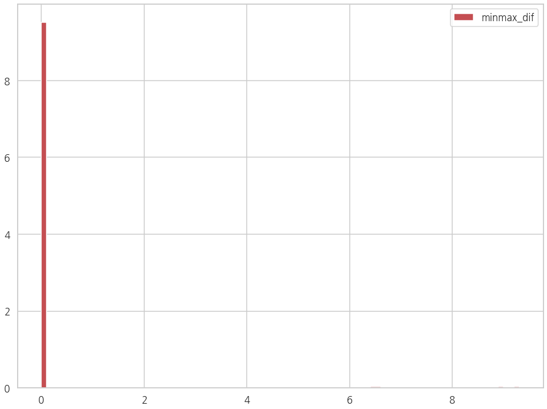


## 3.4 방위각 10도 당 최대 거리 시각화


```python
af[af.groupby(['azimuth'])['re_angle'].transform(max) == af['re_angle']].sort_values(['azimuth'])
maxDist_df = af[af.groupby(['azimuth'])['dist'].transform(max) == af['dist']].sort_values('azimuth') 

maxDist_df
```


<div>
<style scoped>
    .dataframe tbody tr th:only-of-type {
        vertical-align: middle;
    }

    .dataframe tbody tr th {
        vertical-align: top;
    }

    .dataframe thead th {
        text-align: right;
    }
</style>
<table border="1" class="dataframe">
  <thead>
    <tr style="text-align: right;">
      <th></th>
      <th>tm_x</th>
      <th>tm_y</th>
      <th>re_angle</th>
      <th>dist</th>
      <th>azimuth</th>
      <th>aziMean</th>
      <th>altMean</th>
      <th>baseIndex</th>
    </tr>
  </thead>
  <tbody>
    <tr>
      <th>215</th>
      <td>99.553138</td>
      <td>-6.747024</td>
      <td>55.936663</td>
      <td>99.781509</td>
      <td>90.0</td>
      <td>90</td>
      <td>47.757666</td>
      <td>137556</td>
    </tr>
    <tr>
      <th>18</th>
      <td>80.790866</td>
      <td>-25.255720</td>
      <td>58.014711</td>
      <td>84.646414</td>
      <td>100.0</td>
      <td>100</td>
      <td>57.938121</td>
      <td>15268</td>
    </tr>
    <tr>
      <th>96</th>
      <td>54.874277</td>
      <td>-21.050800</td>
      <td>66.392625</td>
      <td>58.773485</td>
      <td>110.0</td>
      <td>110</td>
      <td>64.945184</td>
      <td>61862</td>
    </tr>
    <tr>
      <th>32</th>
      <td>42.835780</td>
      <td>-26.043324</td>
      <td>69.936310</td>
      <td>50.131415</td>
      <td>120.0</td>
      <td>120</td>
      <td>69.489285</td>
      <td>22941</td>
    </tr>
    <tr>
      <th>65</th>
      <td>20.659438</td>
      <td>-22.124340</td>
      <td>77.332807</td>
      <td>30.270428</td>
      <td>130.0</td>
      <td>130</td>
      <td>72.503030</td>
      <td>40347</td>
    </tr>
    <tr>
      <th>239</th>
      <td>14.921971</td>
      <td>-20.115395</td>
      <td>79.155245</td>
      <td>25.045845</td>
      <td>140.0</td>
      <td>140</td>
      <td>74.450469</td>
      <td>147378</td>
    </tr>
    <tr>
      <th>70</th>
      <td>11.918051</td>
      <td>-31.669896</td>
      <td>77.086040</td>
      <td>33.838177</td>
      <td>150.0</td>
      <td>150</td>
      <td>75.698172</td>
      <td>43459</td>
    </tr>
    <tr>
      <th>109</th>
      <td>5.920734</td>
      <td>-21.483763</td>
      <td>80.880153</td>
      <td>22.284685</td>
      <td>160.0</td>
      <td>160</td>
      <td>76.455223</td>
      <td>71188</td>
    </tr>
    <tr>
      <th>154</th>
      <td>2.130708</td>
      <td>-21.404407</td>
      <td>81.707374</td>
      <td>21.510196</td>
      <td>170.0</td>
      <td>170</td>
      <td>76.792825</td>
      <td>98994</td>
    </tr>
    <tr>
      <th>88</th>
      <td>-0.554402</td>
      <td>-20.958854</td>
      <td>81.006997</td>
      <td>20.966185</td>
      <td>180.0</td>
      <td>180</td>
      <td>76.784099</td>
      <td>54923</td>
    </tr>
    <tr>
      <th>161</th>
      <td>-2.230632</td>
      <td>-11.574372</td>
      <td>78.219705</td>
      <td>11.787358</td>
      <td>190.0</td>
      <td>190</td>
      <td>76.394843</td>
      <td>101378</td>
    </tr>
    <tr>
      <th>52</th>
      <td>-23.221498</td>
      <td>-28.294103</td>
      <td>75.253177</td>
      <td>36.603200</td>
      <td>210.0</td>
      <td>210</td>
      <td>74.328750</td>
      <td>34000</td>
    </tr>
    <tr>
      <th>184</th>
      <td>-24.955054</td>
      <td>-28.734741</td>
      <td>75.539456</td>
      <td>38.058377</td>
      <td>220.0</td>
      <td>220</td>
      <td>72.290815</td>
      <td>121150</td>
    </tr>
    <tr>
      <th>193</th>
      <td>-32.436194</td>
      <td>-22.532877</td>
      <td>72.124885</td>
      <td>39.494774</td>
      <td>230.0</td>
      <td>230</td>
      <td>69.243356</td>
      <td>126092</td>
    </tr>
    <tr>
      <th>58</th>
      <td>-54.632969</td>
      <td>-23.569905</td>
      <td>65.575659</td>
      <td>59.500435</td>
      <td>240.0</td>
      <td>240</td>
      <td>64.673595</td>
      <td>37071</td>
    </tr>
    <tr>
      <th>196</th>
      <td>-89.336366</td>
      <td>-28.796046</td>
      <td>58.086927</td>
      <td>93.862658</td>
      <td>250.0</td>
      <td>250</td>
      <td>57.748476</td>
      <td>126740</td>
    </tr>
    <tr>
      <th>141</th>
      <td>-98.593090</td>
      <td>-6.665856</td>
      <td>57.813069</td>
      <td>98.818171</td>
      <td>260.0</td>
      <td>260</td>
      <td>47.560246</td>
      <td>89851</td>
    </tr>
  </tbody>
</table>
</div>


```python
import numpy as np
import matplotlib.cm as cm
from matplotlib.pyplot import figure, show, rc

print("> 방위각당 가장 멀리있는 건물과의 거리 시각화")

allAngle = pd.DataFrame({"azimuth" :list(range(0,360,10))})

allAngle_df = pd.merge(allAngle, maxDist_df , on ="azimuth" , how='left')
allAngle_df = allAngle_df.fillna(0)


fig = figure(figsize=(8,8))
ax = fig.add_axes([0.1, 0.1, 0.8, 0.8], polar=True)

N = 36
theta = np.arange(0.0, 2*np.pi, 2*np.pi/N) + 0.087 + 1.5708
# print(theta)
# print(len(theta))
radii = list(allAngle_df['dist'])
width = 2*np.pi/72
bars = ax.bar(theta, radii, width=width, bottom=0.0)
for r,bar in zip(radii, bars):
    bar.set_facecolor( cm.jet(r/100))
    bar.set_alpha(0.5)

plt.xticks() 
show()

maxDist_df
```

    > 방위각당 가장 멀리있는 건물과의 거리 시각화


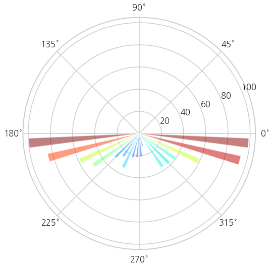


<div>
<style scoped>
    .dataframe tbody tr th:only-of-type {
        vertical-align: middle;
    }

    .dataframe tbody tr th {
        vertical-align: top;
    }

    .dataframe thead th {
        text-align: right;
    }
</style>
<table border="1" class="dataframe">
  <thead>
    <tr style="text-align: right;">
      <th></th>
      <th>tm_x</th>
      <th>tm_y</th>
      <th>re_angle</th>
      <th>dist</th>
      <th>azimuth</th>
      <th>aziMean</th>
      <th>altMean</th>
      <th>baseIndex</th>
    </tr>
  </thead>
  <tbody>
    <tr>
      <th>215</th>
      <td>99.553138</td>
      <td>-6.747024</td>
      <td>55.936663</td>
      <td>99.781509</td>
      <td>90.0</td>
      <td>90</td>
      <td>47.757666</td>
      <td>137556</td>
    </tr>
    <tr>
      <th>18</th>
      <td>80.790866</td>
      <td>-25.255720</td>
      <td>58.014711</td>
      <td>84.646414</td>
      <td>100.0</td>
      <td>100</td>
      <td>57.938121</td>
      <td>15268</td>
    </tr>
    <tr>
      <th>96</th>
      <td>54.874277</td>
      <td>-21.050800</td>
      <td>66.392625</td>
      <td>58.773485</td>
      <td>110.0</td>
      <td>110</td>
      <td>64.945184</td>
      <td>61862</td>
    </tr>
    <tr>
      <th>32</th>
      <td>42.835780</td>
      <td>-26.043324</td>
      <td>69.936310</td>
      <td>50.131415</td>
      <td>120.0</td>
      <td>120</td>
      <td>69.489285</td>
      <td>22941</td>
    </tr>
    <tr>
      <th>65</th>
      <td>20.659438</td>
      <td>-22.124340</td>
      <td>77.332807</td>
      <td>30.270428</td>
      <td>130.0</td>
      <td>130</td>
      <td>72.503030</td>
      <td>40347</td>
    </tr>
    <tr>
      <th>239</th>
      <td>14.921971</td>
      <td>-20.115395</td>
      <td>79.155245</td>
      <td>25.045845</td>
      <td>140.0</td>
      <td>140</td>
      <td>74.450469</td>
      <td>147378</td>
    </tr>
    <tr>
      <th>70</th>
      <td>11.918051</td>
      <td>-31.669896</td>
      <td>77.086040</td>
      <td>33.838177</td>
      <td>150.0</td>
      <td>150</td>
      <td>75.698172</td>
      <td>43459</td>
    </tr>
    <tr>
      <th>109</th>
      <td>5.920734</td>
      <td>-21.483763</td>
      <td>80.880153</td>
      <td>22.284685</td>
      <td>160.0</td>
      <td>160</td>
      <td>76.455223</td>
      <td>71188</td>
    </tr>
    <tr>
      <th>154</th>
      <td>2.130708</td>
      <td>-21.404407</td>
      <td>81.707374</td>
      <td>21.510196</td>
      <td>170.0</td>
      <td>170</td>
      <td>76.792825</td>
      <td>98994</td>
    </tr>
    <tr>
      <th>88</th>
      <td>-0.554402</td>
      <td>-20.958854</td>
      <td>81.006997</td>
      <td>20.966185</td>
      <td>180.0</td>
      <td>180</td>
      <td>76.784099</td>
      <td>54923</td>
    </tr>
    <tr>
      <th>161</th>
      <td>-2.230632</td>
      <td>-11.574372</td>
      <td>78.219705</td>
      <td>11.787358</td>
      <td>190.0</td>
      <td>190</td>
      <td>76.394843</td>
      <td>101378</td>
    </tr>
    <tr>
      <th>52</th>
      <td>-23.221498</td>
      <td>-28.294103</td>
      <td>75.253177</td>
      <td>36.603200</td>
      <td>210.0</td>
      <td>210</td>
      <td>74.328750</td>
      <td>34000</td>
    </tr>
    <tr>
      <th>184</th>
      <td>-24.955054</td>
      <td>-28.734741</td>
      <td>75.539456</td>
      <td>38.058377</td>
      <td>220.0</td>
      <td>220</td>
      <td>72.290815</td>
      <td>121150</td>
    </tr>
    <tr>
      <th>193</th>
      <td>-32.436194</td>
      <td>-22.532877</td>
      <td>72.124885</td>
      <td>39.494774</td>
      <td>230.0</td>
      <td>230</td>
      <td>69.243356</td>
      <td>126092</td>
    </tr>
    <tr>
      <th>58</th>
      <td>-54.632969</td>
      <td>-23.569905</td>
      <td>65.575659</td>
      <td>59.500435</td>
      <td>240.0</td>
      <td>240</td>
      <td>64.673595</td>
      <td>37071</td>
    </tr>
    <tr>
      <th>196</th>
      <td>-89.336366</td>
      <td>-28.796046</td>
      <td>58.086927</td>
      <td>93.862658</td>
      <td>250.0</td>
      <td>250</td>
      <td>57.748476</td>
      <td>126740</td>
    </tr>
    <tr>
      <th>141</th>
      <td>-98.593090</td>
      <td>-6.665856</td>
      <td>57.813069</td>
      <td>98.818171</td>
      <td>260.0</td>
      <td>260</td>
      <td>47.560246</td>
      <td>89851</td>
    </tr>
  </tbody>
</table>
</div>


# 4. 상관관계 분석

## 4.1 파생 변수 상관관계


```python
def calCorrs(build_data) :
    corr_angle = pd.DataFrame()

    corr_angle['rad_angle_max'] = build_data['rad_angle_max']
    corr_angle['rad_rel_fl'] = build_data['rad_rel_fl'] 
    corr_angle['rad_rel_height'] = build_data['rad_rel_height'] 

    corr_angle['rad_angle_max_80'] = build_data['rad_angle_max_80']
    corr_angle['rad_angle_max_160'] = build_data['rad_angle_max_160']
    corr_angle['rad_angle_max_240'] = build_data['rad_angle_max_240']

    corr_angle['count_80'] = build_data['count_80']
    corr_angle['count_160'] = build_data['count_160']
    corr_angle['count_240'] = build_data['count_240']
    
    
    corr_angle['nearShadow'] = build_data['nearShadow']
    corr_angle['nearScaledShadow'] = build_data['nearScaledShadow']
    corr_angle['rel_nearScaledShadow'] = build_data['rel_nearScaledShadow']
    corr_angle['rel_nearShadow'] = build_data['rel_nearShadow']
    corr_angle['altCount'] = build_data['altCount']


#     corr_angle['sL_y17'] = build_data['sL_y17']
    corr_angle['sL06'] = build_data['sL06']

    corrs = corr_angle.corr(method='pearson')
    
    return corrs
```


```python
# Ycorrs = corrs.sort_values('sL_y17', ascending = False)

# print("> 년간 차폐율과의 상관계수 내림차순")
# print(Ycorrs['sL_y17'])

corrs = calCorrs(build_data)
Ycorrs = corrs.sort_values('sL06', ascending = False)
df_cor = pd.DataFrame(Ycorrs, columns=Ycorrs.index)

print("> 6월 차폐율과의 상관계수 내림차순")
df_cor
```

    > 6월 차폐율과의 상관계수 내림차순


<div>
<style scoped>
    .dataframe tbody tr th:only-of-type {
        vertical-align: middle;
    }

    .dataframe tbody tr th {
        vertical-align: top;
    }

    .dataframe thead th {
        text-align: right;
    }
</style>
<table border="1" class="dataframe">
  <thead>
    <tr style="text-align: right;">
      <th></th>
      <th>sL06</th>
      <th>rad_angle_max</th>
      <th>rad_angle_max_80</th>
      <th>rad_angle_max_160</th>
      <th>rad_angle_max_240</th>
      <th>count_160</th>
      <th>rel_nearScaledShadow</th>
      <th>rel_nearShadow</th>
      <th>count_80</th>
      <th>nearShadow</th>
      <th>nearScaledShadow</th>
      <th>count_240</th>
      <th>rad_rel_fl</th>
      <th>rad_rel_height</th>
      <th>altCount</th>
    </tr>
  </thead>
  <tbody>
    <tr>
      <th>sL06</th>
      <td>1.000000</td>
      <td>0.366158</td>
      <td>0.308102</td>
      <td>0.288340</td>
      <td>0.271490</td>
      <td>0.258846</td>
      <td>0.257333</td>
      <td>0.257333</td>
      <td>0.239372</td>
      <td>0.232197</td>
      <td>0.232197</td>
      <td>0.232028</td>
      <td>0.167943</td>
      <td>0.142433</td>
      <td>0.070645</td>
    </tr>
    <tr>
      <th>rad_angle_max</th>
      <td>0.366158</td>
      <td>1.000000</td>
      <td>0.662456</td>
      <td>0.794225</td>
      <td>0.674012</td>
      <td>0.144169</td>
      <td>0.160116</td>
      <td>0.160116</td>
      <td>0.153180</td>
      <td>0.157077</td>
      <td>0.157077</td>
      <td>0.152442</td>
      <td>0.625624</td>
      <td>0.611245</td>
      <td>0.185233</td>
    </tr>
    <tr>
      <th>rad_angle_max_80</th>
      <td>0.308102</td>
      <td>0.662456</td>
      <td>1.000000</td>
      <td>0.412314</td>
      <td>0.278090</td>
      <td>0.163869</td>
      <td>0.160717</td>
      <td>0.160717</td>
      <td>0.142644</td>
      <td>0.163173</td>
      <td>0.163173</td>
      <td>0.166932</td>
      <td>0.362588</td>
      <td>0.356955</td>
      <td>0.142668</td>
    </tr>
    <tr>
      <th>rad_angle_max_160</th>
      <td>0.288340</td>
      <td>0.794225</td>
      <td>0.412314</td>
      <td>1.000000</td>
      <td>0.430403</td>
      <td>0.144355</td>
      <td>0.161547</td>
      <td>0.161547</td>
      <td>0.162101</td>
      <td>0.160839</td>
      <td>0.160839</td>
      <td>0.157635</td>
      <td>0.483420</td>
      <td>0.488677</td>
      <td>0.066574</td>
    </tr>
    <tr>
      <th>rad_angle_max_240</th>
      <td>0.271490</td>
      <td>0.674012</td>
      <td>0.278090</td>
      <td>0.430403</td>
      <td>1.000000</td>
      <td>0.164675</td>
      <td>0.179068</td>
      <td>0.179068</td>
      <td>0.176956</td>
      <td>0.178507</td>
      <td>0.178507</td>
      <td>0.155770</td>
      <td>0.380784</td>
      <td>0.397957</td>
      <td>0.129475</td>
    </tr>
    <tr>
      <th>count_160</th>
      <td>0.258846</td>
      <td>0.144169</td>
      <td>0.163869</td>
      <td>0.144355</td>
      <td>0.164675</td>
      <td>1.000000</td>
      <td>0.821101</td>
      <td>0.821101</td>
      <td>0.673663</td>
      <td>0.868867</td>
      <td>0.868867</td>
      <td>0.657048</td>
      <td>-0.034564</td>
      <td>-0.078510</td>
      <td>-0.006810</td>
    </tr>
    <tr>
      <th>rel_nearScaledShadow</th>
      <td>0.257333</td>
      <td>0.160116</td>
      <td>0.160717</td>
      <td>0.161547</td>
      <td>0.179068</td>
      <td>0.821101</td>
      <td>1.000000</td>
      <td>1.000000</td>
      <td>0.714172</td>
      <td>0.962552</td>
      <td>0.962552</td>
      <td>0.696224</td>
      <td>-0.040143</td>
      <td>-0.063302</td>
      <td>-0.006814</td>
    </tr>
    <tr>
      <th>rel_nearShadow</th>
      <td>0.257333</td>
      <td>0.160116</td>
      <td>0.160717</td>
      <td>0.161547</td>
      <td>0.179068</td>
      <td>0.821101</td>
      <td>1.000000</td>
      <td>1.000000</td>
      <td>0.714172</td>
      <td>0.962552</td>
      <td>0.962552</td>
      <td>0.696224</td>
      <td>-0.040143</td>
      <td>-0.063302</td>
      <td>-0.006814</td>
    </tr>
    <tr>
      <th>count_80</th>
      <td>0.239372</td>
      <td>0.153180</td>
      <td>0.142644</td>
      <td>0.162101</td>
      <td>0.176956</td>
      <td>0.673663</td>
      <td>0.714172</td>
      <td>0.714172</td>
      <td>1.000000</td>
      <td>0.752627</td>
      <td>0.752627</td>
      <td>0.455619</td>
      <td>-0.010109</td>
      <td>-0.048689</td>
      <td>-0.011687</td>
    </tr>
    <tr>
      <th>nearShadow</th>
      <td>0.232197</td>
      <td>0.157077</td>
      <td>0.163173</td>
      <td>0.160839</td>
      <td>0.178507</td>
      <td>0.868867</td>
      <td>0.962552</td>
      <td>0.962552</td>
      <td>0.752627</td>
      <td>1.000000</td>
      <td>1.000000</td>
      <td>0.740049</td>
      <td>-0.028649</td>
      <td>-0.056014</td>
      <td>-0.007062</td>
    </tr>
    <tr>
      <th>nearScaledShadow</th>
      <td>0.232197</td>
      <td>0.157077</td>
      <td>0.163173</td>
      <td>0.160839</td>
      <td>0.178507</td>
      <td>0.868867</td>
      <td>0.962552</td>
      <td>0.962552</td>
      <td>0.752627</td>
      <td>1.000000</td>
      <td>1.000000</td>
      <td>0.740049</td>
      <td>-0.028649</td>
      <td>-0.056014</td>
      <td>-0.007062</td>
    </tr>
    <tr>
      <th>count_240</th>
      <td>0.232028</td>
      <td>0.152442</td>
      <td>0.166932</td>
      <td>0.157635</td>
      <td>0.155770</td>
      <td>0.657048</td>
      <td>0.696224</td>
      <td>0.696224</td>
      <td>0.455619</td>
      <td>0.740049</td>
      <td>0.740049</td>
      <td>1.000000</td>
      <td>-0.002881</td>
      <td>-0.048222</td>
      <td>-0.006805</td>
    </tr>
    <tr>
      <th>rad_rel_fl</th>
      <td>0.167943</td>
      <td>0.625624</td>
      <td>0.362588</td>
      <td>0.483420</td>
      <td>0.380784</td>
      <td>-0.034564</td>
      <td>-0.040143</td>
      <td>-0.040143</td>
      <td>-0.010109</td>
      <td>-0.028649</td>
      <td>-0.028649</td>
      <td>-0.002881</td>
      <td>1.000000</td>
      <td>0.870859</td>
      <td>0.147920</td>
    </tr>
    <tr>
      <th>rad_rel_height</th>
      <td>0.142433</td>
      <td>0.611245</td>
      <td>0.356955</td>
      <td>0.488677</td>
      <td>0.397957</td>
      <td>-0.078510</td>
      <td>-0.063302</td>
      <td>-0.063302</td>
      <td>-0.048689</td>
      <td>-0.056014</td>
      <td>-0.056014</td>
      <td>-0.048222</td>
      <td>0.870859</td>
      <td>1.000000</td>
      <td>0.152056</td>
    </tr>
    <tr>
      <th>altCount</th>
      <td>0.070645</td>
      <td>0.185233</td>
      <td>0.142668</td>
      <td>0.066574</td>
      <td>0.129475</td>
      <td>-0.006810</td>
      <td>-0.006814</td>
      <td>-0.006814</td>
      <td>-0.011687</td>
      <td>-0.007062</td>
      <td>-0.007062</td>
      <td>-0.006805</td>
      <td>0.147920</td>
      <td>0.152056</td>
      <td>1.000000</td>
    </tr>
  </tbody>
</table>
</div>


```python
plt.figure(figsize=(16, 16))

sns.heatmap(Ycorrs, annot=True, cmap="PuOr", center=0)

plt.tight_layout()
```


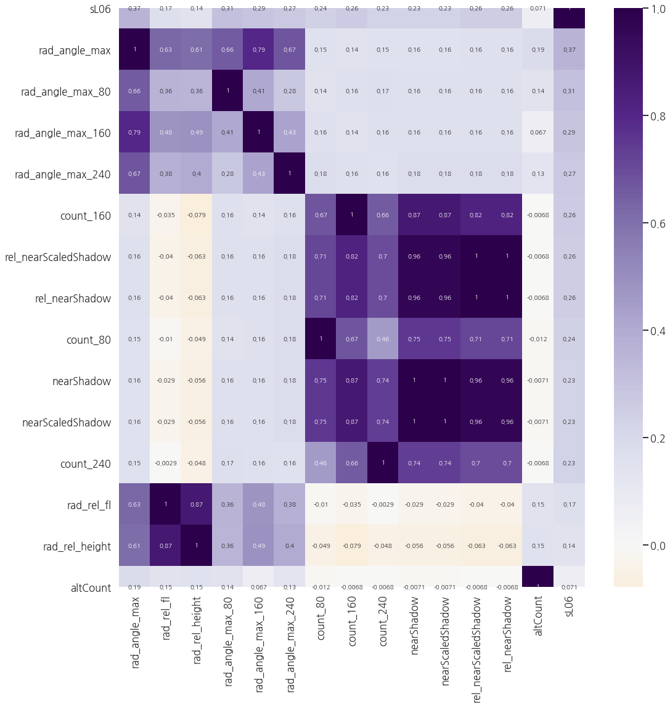


# 5. Feature Extraction

## 5.1 Feature Extraction 전에 scaling


```python
from sklearn.decomposition import PCA
from sklearn.preprocessing import StandardScaler

fe_data = copy.deepcopy(build_data)
fe_y  = fe_data['sL06']
for i in range(1,13) :
    del fe_data['sL'+str(i).zfill(2)]
del fe_data['sL_y17']
del fe_data['gid']
del fe_data['buld_se_nm']
del fe_data['sig_nm']
del fe_data['emd_nm']
del fe_data['apt_yn']
del fe_data['sig_cd']
del fe_data['emd_cd']

del fe_data['buld_se_cd']
del fe_data['gro_flo_co']
del fe_data['bdtyp_cd']


fe_columns = list(fe_data.columns)
fe_data = StandardScaler().fit_transform(fe_data)

fe_data = pd.DataFrame(fe_data , columns = fe_columns )

fe_data.head()
```


<div>
<style scoped>
    .dataframe tbody tr th:only-of-type {
        vertical-align: middle;
    }

    .dataframe tbody tr th {
        vertical-align: top;
    }

    .dataframe thead th {
        text-align: right;
    }
</style>
<table border="1" class="dataframe">
  <thead>
    <tr style="text-align: right;">
      <th></th>
      <th>tm_x</th>
      <th>tm_y</th>
      <th>lon</th>
      <th>lat</th>
      <th>buld_area</th>
      <th>buld_elev</th>
      <th>buld_length</th>
      <th>buld_height</th>
      <th>height</th>
      <th>rad_angle_max</th>
      <th>rad_rel_fl</th>
      <th>rad_rel_height</th>
      <th>rad_angle_max_80</th>
      <th>rad_angle_max_160</th>
      <th>rad_angle_max_240</th>
      <th>count_80</th>
      <th>count_160</th>
      <th>count_240</th>
      <th>height_80</th>
      <th>height_160</th>
      <th>height_240</th>
      <th>nearShadow</th>
      <th>nearScaledShadow</th>
      <th>rel_nearShadow</th>
      <th>rel_nearScaledShadow</th>
      <th>altCount60</th>
      <th>altCount70</th>
      <th>altCount80</th>
      <th>altCount90</th>
      <th>altCount100</th>
      <th>altCount110</th>
      <th>altCount120</th>
      <th>altCount130</th>
      <th>altCount140</th>
      <th>altCount150</th>
      <th>altCount160</th>
      <th>altCount170</th>
      <th>altCount180</th>
      <th>altCount190</th>
      <th>altCount200</th>
      <th>altCount210</th>
      <th>altCount220</th>
      <th>altCount230</th>
      <th>altCount240</th>
      <th>altCount250</th>
      <th>altCount260</th>
      <th>altCount270</th>
      <th>altCount280</th>
      <th>altCount290</th>
      <th>altCount</th>
    </tr>
  </thead>
  <tbody>
    <tr>
      <th>0</th>
      <td>1.331414</td>
      <td>-1.276131</td>
      <td>1.323589</td>
      <td>-1.281236</td>
      <td>0.016237</td>
      <td>0.635718</td>
      <td>0.347283</td>
      <td>-0.463924</td>
      <td>0.462260</td>
      <td>-0.608248</td>
      <td>-0.280010</td>
      <td>-0.492724</td>
      <td>-0.663145</td>
      <td>-0.318478</td>
      <td>-0.775022</td>
      <td>0.214167</td>
      <td>-0.546654</td>
      <td>-0.450627</td>
      <td>0.688398</td>
      <td>0.621307</td>
      <td>0.633795</td>
      <td>-0.068656</td>
      <td>-0.068656</td>
      <td>-0.074229</td>
      <td>-0.074229</td>
      <td>0.0</td>
      <td>0.0</td>
      <td>0.0</td>
      <td>-0.021615</td>
      <td>-0.011341</td>
      <td>-0.006373</td>
      <td>-0.00607</td>
      <td>-0.003679</td>
      <td>-0.004506</td>
      <td>-0.004506</td>
      <td>-0.003679</td>
      <td>-0.002602</td>
      <td>-0.002602</td>
      <td>-0.002602</td>
      <td>0.0</td>
      <td>-0.005817</td>
      <td>-0.002602</td>
      <td>-0.005203</td>
      <td>-0.007805</td>
      <td>-0.012203</td>
      <td>-0.023714</td>
      <td>0.0</td>
      <td>0.0</td>
      <td>0.0</td>
      <td>-0.039679</td>
    </tr>
    <tr>
      <th>1</th>
      <td>1.208297</td>
      <td>-0.745838</td>
      <td>1.203591</td>
      <td>-0.750308</td>
      <td>-0.141158</td>
      <td>0.261221</td>
      <td>-0.392032</td>
      <td>-0.463924</td>
      <td>0.098295</td>
      <td>2.270057</td>
      <td>0.435548</td>
      <td>0.370345</td>
      <td>-0.628188</td>
      <td>3.067303</td>
      <td>1.167581</td>
      <td>0.617112</td>
      <td>0.430688</td>
      <td>-0.585148</td>
      <td>0.334767</td>
      <td>0.394271</td>
      <td>0.568111</td>
      <td>0.454400</td>
      <td>0.454400</td>
      <td>0.793548</td>
      <td>0.793548</td>
      <td>0.0</td>
      <td>0.0</td>
      <td>0.0</td>
      <td>-0.021615</td>
      <td>-0.011341</td>
      <td>-0.006373</td>
      <td>-0.00607</td>
      <td>-0.003679</td>
      <td>-0.004506</td>
      <td>-0.004506</td>
      <td>-0.003679</td>
      <td>-0.002602</td>
      <td>-0.002602</td>
      <td>-0.002602</td>
      <td>0.0</td>
      <td>-0.005817</td>
      <td>-0.002602</td>
      <td>-0.005203</td>
      <td>-0.007805</td>
      <td>-0.012203</td>
      <td>-0.023714</td>
      <td>0.0</td>
      <td>0.0</td>
      <td>0.0</td>
      <td>-0.039679</td>
    </tr>
    <tr>
      <th>2</th>
      <td>1.371425</td>
      <td>-1.228471</td>
      <td>1.363830</td>
      <td>-1.233721</td>
      <td>-0.123463</td>
      <td>0.510886</td>
      <td>-0.288216</td>
      <td>-0.463924</td>
      <td>0.340939</td>
      <td>-0.601749</td>
      <td>-0.118157</td>
      <td>-0.352820</td>
      <td>-0.141875</td>
      <td>-0.393703</td>
      <td>-0.369416</td>
      <td>-1.128981</td>
      <td>-0.990900</td>
      <td>-0.450627</td>
      <td>0.701906</td>
      <td>0.568148</td>
      <td>0.612308</td>
      <td>-0.887327</td>
      <td>-0.887327</td>
      <td>-0.991177</td>
      <td>-0.991177</td>
      <td>0.0</td>
      <td>0.0</td>
      <td>0.0</td>
      <td>-0.021615</td>
      <td>-0.011341</td>
      <td>-0.006373</td>
      <td>-0.00607</td>
      <td>-0.003679</td>
      <td>-0.004506</td>
      <td>-0.004506</td>
      <td>-0.003679</td>
      <td>-0.002602</td>
      <td>-0.002602</td>
      <td>-0.002602</td>
      <td>0.0</td>
      <td>-0.005817</td>
      <td>-0.002602</td>
      <td>-0.005203</td>
      <td>-0.007805</td>
      <td>-0.012203</td>
      <td>-0.023714</td>
      <td>0.0</td>
      <td>0.0</td>
      <td>0.0</td>
      <td>-0.039679</td>
    </tr>
    <tr>
      <th>3</th>
      <td>1.388956</td>
      <td>-1.233349</td>
      <td>1.381314</td>
      <td>-1.238670</td>
      <td>-0.175026</td>
      <td>0.552496</td>
      <td>-0.620470</td>
      <td>-0.463924</td>
      <td>0.381379</td>
      <td>-0.933814</td>
      <td>-0.765567</td>
      <td>-0.599740</td>
      <td>-0.775728</td>
      <td>-0.701444</td>
      <td>-0.775022</td>
      <td>-0.860352</td>
      <td>-0.990900</td>
      <td>-1.257752</td>
      <td>0.597295</td>
      <td>0.529629</td>
      <td>-2.115144</td>
      <td>-1.103517</td>
      <td>-1.103517</td>
      <td>-0.942056</td>
      <td>-0.942056</td>
      <td>0.0</td>
      <td>0.0</td>
      <td>0.0</td>
      <td>-0.021615</td>
      <td>-0.011341</td>
      <td>-0.006373</td>
      <td>-0.00607</td>
      <td>-0.003679</td>
      <td>-0.004506</td>
      <td>-0.004506</td>
      <td>-0.003679</td>
      <td>-0.002602</td>
      <td>-0.002602</td>
      <td>-0.002602</td>
      <td>0.0</td>
      <td>-0.005817</td>
      <td>-0.002602</td>
      <td>-0.005203</td>
      <td>-0.007805</td>
      <td>-0.012203</td>
      <td>-0.023714</td>
      <td>0.0</td>
      <td>0.0</td>
      <td>0.0</td>
      <td>-0.039679</td>
    </tr>
    <tr>
      <th>4</th>
      <td>1.381566</td>
      <td>-1.330666</td>
      <td>1.373376</td>
      <td>-1.335985</td>
      <td>0.348226</td>
      <td>0.635718</td>
      <td>1.354664</td>
      <td>-0.463924</td>
      <td>0.462260</td>
      <td>-0.405497</td>
      <td>-0.280010</td>
      <td>-0.261044</td>
      <td>-0.608068</td>
      <td>-0.527296</td>
      <td>0.116612</td>
      <td>-1.128981</td>
      <td>-1.257447</td>
      <td>-0.988710</td>
      <td>0.697242</td>
      <td>0.654187</td>
      <td>0.803238</td>
      <td>-1.249299</td>
      <td>-1.249299</td>
      <td>-1.239355</td>
      <td>-1.239355</td>
      <td>0.0</td>
      <td>0.0</td>
      <td>0.0</td>
      <td>-0.021615</td>
      <td>-0.011341</td>
      <td>-0.006373</td>
      <td>-0.00607</td>
      <td>-0.003679</td>
      <td>-0.004506</td>
      <td>-0.004506</td>
      <td>-0.003679</td>
      <td>-0.002602</td>
      <td>-0.002602</td>
      <td>-0.002602</td>
      <td>0.0</td>
      <td>-0.005817</td>
      <td>-0.002602</td>
      <td>-0.005203</td>
      <td>-0.007805</td>
      <td>-0.012203</td>
      <td>-0.023714</td>
      <td>0.0</td>
      <td>0.0</td>
      <td>0.0</td>
      <td>-0.039679</td>
    </tr>
  </tbody>
</table>
</div>


## 5.2 Principle Component Analysis (PCA)


* 데이터의 분산을 최대한 보존하면서 서로 직교하는 새 기저(축)을 찾아 , 고차원 공간의 표본들을 선형 연관성이 없는 저차원 공간으로 변환하는 기법 ( 그러니까 서로 직교인 e1,e2,e3를 순서대로 찾았다면 가장 적은 공분산성이 적으면서 선형 연관성이 없는 e3를 정사영 하는듯)

* 즉 첫번째 주성분으로 전체 변동을 가장 많이 설명할 수 있도록 하고, 두번째 주성분으로는 첫번째 주성분과는 상관성이 없어서(낮아서) 첫번째 주성분이 설명하지 못하는 나머지 변동을 정보의 손실없이 가장 많이 설명할 수 있도록 변수들의 선형조합을 만드는 과정

* 즉 PCA 알고리즘은 variability가 큰 방향의 벡터에 데이터를 정사영하려고 한다. 이렇게 하면 데이터 구조는 크게 바뀌지 않으면서 차원은 감소됨


**기본 변수들을 활용하여 PCA1, PCA2, PCA3을 만들어 냈다.
pca_result 는 14만개의 데이터에 대한 PCA1, PCA2, PCA3 값들과 그 데이터에 일사량 차폐율 값이다.**


## 5.2.1 계산


```python
def pca (data , n_components) :
    
    pcaFunc = PCA(n_components = n_components)
    
    columnsName = []
    for i in range(1,n_components+1) :
        columnsName.append('PC'+str(i))
        
    principalComponents = pcaFunc.fit_transform(data)
    
    print(pcaFunc.explained_variance_ratio_ )
    
    pca_importances = pd.DataFrame(pcaFunc.components_, columns=list(data.columns))
    

    principalDf = pd.DataFrame(data = principalComponents
                 , columns = columnsName)
    return principalDf , pca_importances

pca_result , pca_importances = pca(fe_data , 3)
pca_result = pd.concat([pca_result , fe_y] , axis =1 )
pca_result.head()
```

    [0.16187195 0.09163354 0.08049829]


<div>
<style scoped>
    .dataframe tbody tr th:only-of-type {
        vertical-align: middle;
    }

    .dataframe tbody tr th {
        vertical-align: top;
    }

    .dataframe thead th {
        text-align: right;
    }
</style>
<table border="1" class="dataframe">
  <thead>
    <tr style="text-align: right;">
      <th></th>
      <th>PC1</th>
      <th>PC2</th>
      <th>PC3</th>
      <th>sL06</th>
    </tr>
  </thead>
  <tbody>
    <tr>
      <th>0</th>
      <td>-0.272457</td>
      <td>-1.970118</td>
      <td>0.814092</td>
      <td>0.139599</td>
    </tr>
    <tr>
      <th>1</th>
      <td>-2.680074</td>
      <td>1.390762</td>
      <td>1.910762</td>
      <td>0.178177</td>
    </tr>
    <tr>
      <th>2</th>
      <td>1.262639</td>
      <td>-1.329675</td>
      <td>1.506268</td>
      <td>0.164108</td>
    </tr>
    <tr>
      <th>3</th>
      <td>2.108377</td>
      <td>-1.713507</td>
      <td>0.408870</td>
      <td>0.304955</td>
    </tr>
    <tr>
      <th>4</th>
      <td>2.164670</td>
      <td>-1.398946</td>
      <td>1.914871</td>
      <td>0.095113</td>
    </tr>
  </tbody>
</table>
</div>


## 5.2.2 PCA들과 차폐율 correlation 시각화


```python
plt.figure(figsize=(12,9))
sns.heatmap(pca_result.corr(method='pearson'), annot=True, cmap="PuOr", center = 0)
del pca_result['sL06']
```


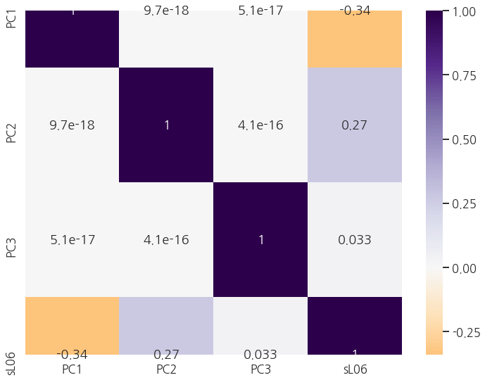


## 5.2.3 PCA1 구성요소 시각화


```python
print("> higher the value in absolute value, the higher the influence on the principal component.")
# https://stackoverflow.com/questions/47370795/pca-on-sklearn-how-to-interpret-pca-components 를보고 
print("")
PCA1 = pca_importances.loc[0].sort_values(ascending=False)
PCA1_abs = pca_importances.loc[0].abs().sort_values(ascending=False)
PCA1_abs = PCA1_abs[:20]
PC1_idx = PCA1_abs.index
PC1_val = PCA1_abs.values
fig, ax = plt.subplots(figsize=(16, 16))
ax = sns.barplot(x=PC1_val, y = PC1_idx)
plt.title("PC1 구성요소 상위 20개" , fontsize = 30) 
plt.tight_layout()
```

    > higher the value in absolute value, the higher the influence on the principal component.
    


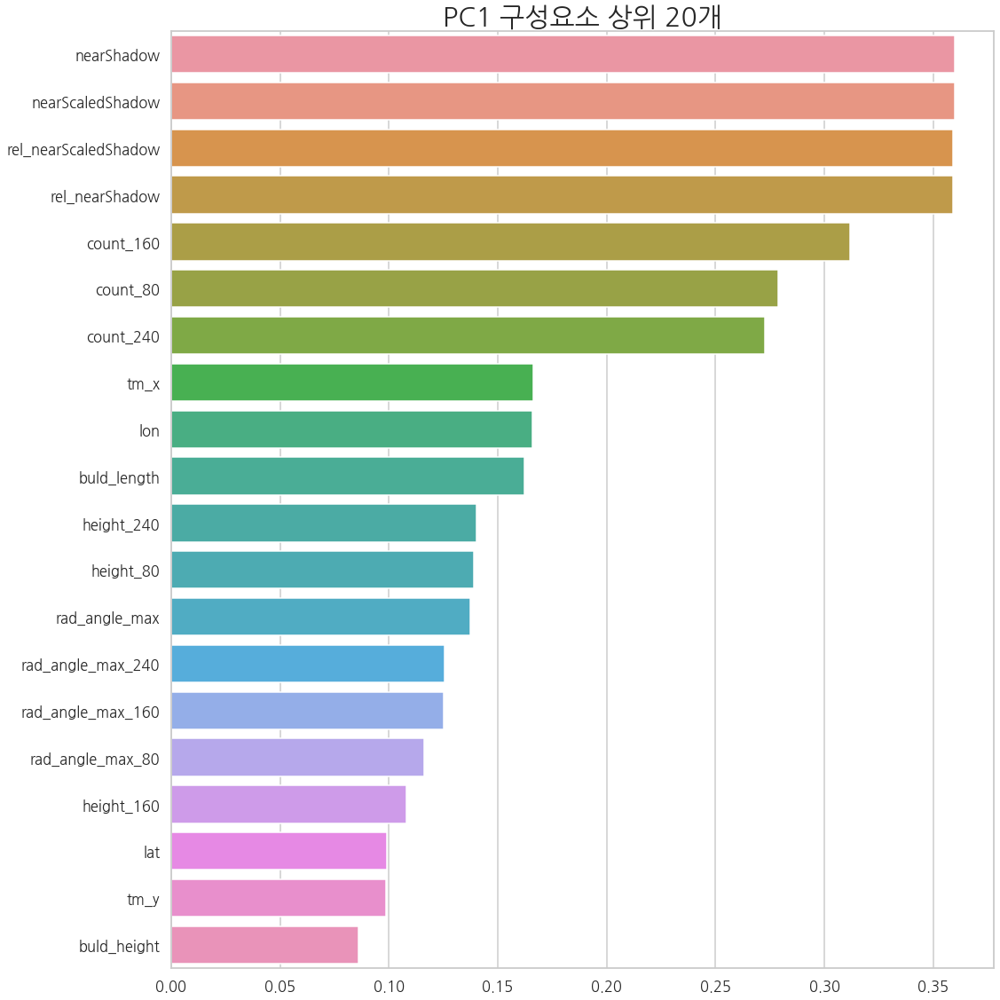


## 5.3 Factor analysis (FA)

데이터가 주어지면 변수들을 비슷한 성격들로 묶어서 새로운 **잠재변수**들을 만들어 낸다

Factor Analysis (FA) is an exploratory data analysis method used to search influential underlying factors or latent variables from a set of observed variables.

It is used to explain the variance among the observed variable and condense a set of the observed variable into the unobserved variable called factors.
Factor or latent variable is associated with multiple observed variables, who have common patterns of responses
Each factor explains a particular amount of variance in the observed variables


## 5.3.1 계산


```python
from sklearn.decomposition import FactorAnalysis

def factor (data , n_components) :
    
    factFunc = FactorAnalysis(n_components = n_components)
    
    columnsName = []
    for i in range(1,n_components+1) :
        columnsName.append('FACTOR'+str(i))
        
    factors = factFunc.fit_transform(data)
    
    factors_importances = pd.DataFrame(factFunc.components_, columns=list(data.columns))

    factors_df = pd.DataFrame(data = factors
                 , columns = columnsName)
    return factors_df , factors_importances

factors_result , factors_importances = factor(fe_data , 3)
factors_result = pd.concat([factors_result , fe_y] , axis =1 )
factors_result.head()
```


<div>
<style scoped>
    .dataframe tbody tr th:only-of-type {
        vertical-align: middle;
    }

    .dataframe tbody tr th {
        vertical-align: top;
    }

    .dataframe thead th {
        text-align: right;
    }
</style>
<table border="1" class="dataframe">
  <thead>
    <tr style="text-align: right;">
      <th></th>
      <th>FACTOR1</th>
      <th>FACTOR2</th>
      <th>FACTOR3</th>
      <th>sL06</th>
    </tr>
  </thead>
  <tbody>
    <tr>
      <th>0</th>
      <td>-0.068656</td>
      <td>0.751213</td>
      <td>-0.033711</td>
      <td>0.139599</td>
    </tr>
    <tr>
      <th>1</th>
      <td>0.454400</td>
      <td>-1.156412</td>
      <td>1.892590</td>
      <td>0.178177</td>
    </tr>
    <tr>
      <th>2</th>
      <td>-0.887327</td>
      <td>0.571631</td>
      <td>0.026121</td>
      <td>0.164108</td>
    </tr>
    <tr>
      <th>3</th>
      <td>-1.103517</td>
      <td>0.783682</td>
      <td>-0.249232</td>
      <td>0.304955</td>
    </tr>
    <tr>
      <th>4</th>
      <td>-1.249299</td>
      <td>0.533220</td>
      <td>0.304595</td>
      <td>0.095113</td>
    </tr>
  </tbody>
</table>
</div>


## 5.3.2 FACTOR들과 차폐율 correlation 시각화


```python
plt.figure(figsize=(12, 9))
sns.heatmap(factors_result.corr(method='pearson'), annot=True, cmap="PuOr", center=0)
del factors_result['sL06']
```


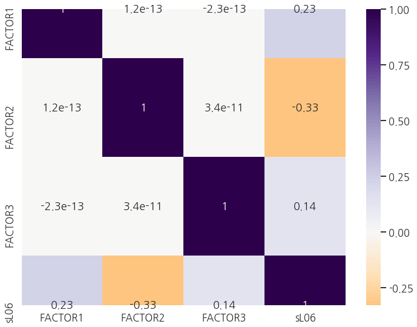


## 5.3.3 FACTOR2 구성요소 시각화


```python
print("> higher the value in absolute value, the higher the influence on the principal component.")
# https://stackoverflow.com/questions/47370795/pca-on-sklearn-how-to-interpret-pca-components 를보고 
print("")
FA1 = factors_importances.loc[1].sort_values(ascending=False)
FA1_abs = factors_importances.loc[1].abs().sort_values(ascending=False)
FA1_abs = FA1_abs[:20]
FA1_idx = FA1_abs.index
FA1_val = FA1_abs.values
fig, ax = plt.subplots(figsize=(16, 16))
ax = sns.barplot(x=FA1_val, y = FA1_idx)
plt.title("FA1 구성요소 상위 20개" , fontsize = 30) 
plt.tight_layout()
```

    > higher the value in absolute value, the higher the influence on the principal component.
    


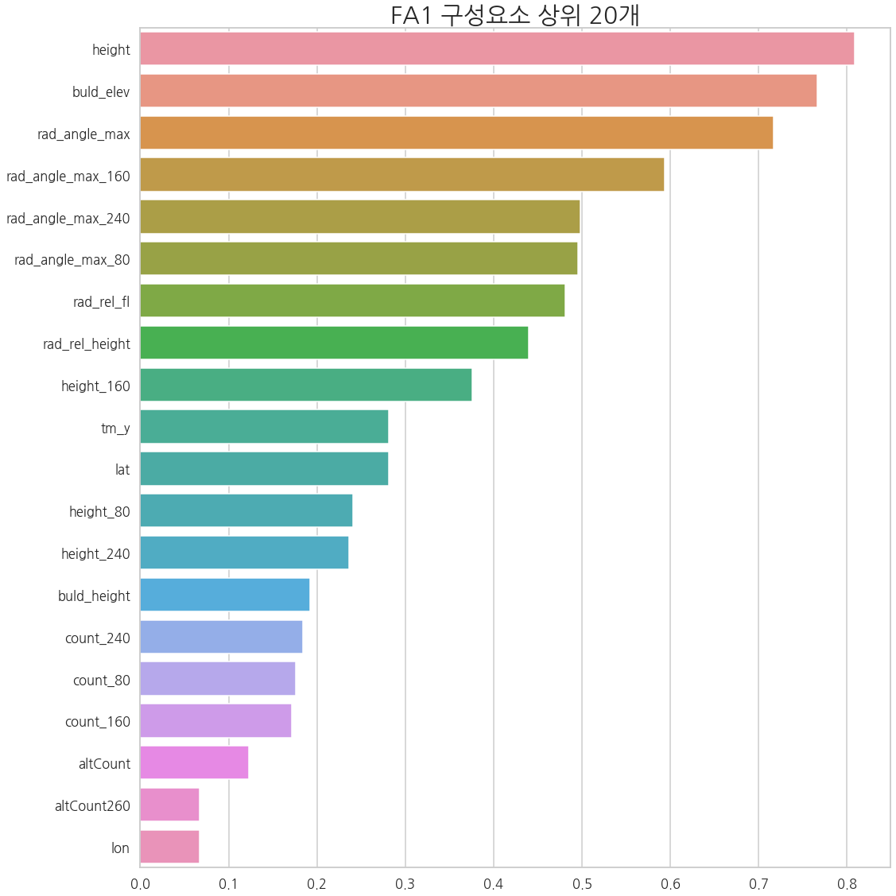


# 6. 모델링


```python
from sklearn.model_selection import train_test_split
from sklearn.ensemble import RandomForestRegressor
from sklearn.ensemble import GradientBoostingRegressor
from sklearn.model_selection import GridSearchCV
from sklearn.svm import SVC
from sklearn.metrics import explained_variance_score, mean_squared_error, mean_absolute_error, r2_score
from sklearn import linear_model

```

## 6.1 데이터셋 준비

* 태양광 차폐율과 상관계수가 낮은 변수 삭제
* PCA1, PCA2, FACTOR1, FACTOR2 추가
* PCA만 사용하거나 FACTOR 사용하면 낮은 성능이 나와서 기본 변수에 추가하였다.


```python
from sklearn.model_selection import train_test_split

build_data = pd.read_csv("./data/2.7/build_data_3group_80100.csv")

model_data = copy.deepcopy(build_data)
y  = model_data['sL_y17']

y_df = pd.DataFrame()
y_df['sL_y17'] = model_data['sL_y17']
for i in range(1,13) :
    y_df['sL'+str(i).zfill(2)] = model_data['sL'+str(i).zfill(2)]
    del model_data['sL'+str(i).zfill(2)]
del model_data['sL_y17']
del model_data['gid']
del model_data['buld_se_nm']
del model_data['sig_nm']
del model_data['emd_nm']

del model_data['apt_yn']
del model_data['sig_cd']
del model_data['emd_cd']

del model_data['buld_se_cd']
del model_data['gro_flo_co']
del model_data['bdtyp_cd']

del model_data['tm_x']
del model_data['tm_y']
del model_data['lon']
del model_data['lat']

model_data['PC1'] = pca_result['PC1']
model_data['PC2'] = pca_result['PC2']
model_data['FACTOR1'] = factors_result['FACTOR1']
model_data['FACTOR2'] = factors_result['FACTOR2']

print("> X data")
model_data.head()
```

    > X data


<div>
<style scoped>
    .dataframe tbody tr th:only-of-type {
        vertical-align: middle;
    }

    .dataframe tbody tr th {
        vertical-align: top;
    }

    .dataframe thead th {
        text-align: right;
    }
</style>
<table border="1" class="dataframe">
  <thead>
    <tr style="text-align: right;">
      <th></th>
      <th>buld_area</th>
      <th>buld_elev</th>
      <th>buld_length</th>
      <th>buld_height</th>
      <th>height</th>
      <th>rad_angle_max</th>
      <th>rad_rel_fl</th>
      <th>rad_rel_height</th>
      <th>rad_angle_max_80</th>
      <th>rad_angle_max_160</th>
      <th>rad_angle_max_240</th>
      <th>count_80</th>
      <th>count_160</th>
      <th>count_240</th>
      <th>height_80</th>
      <th>height_160</th>
      <th>height_240</th>
      <th>nearShadow</th>
      <th>nearScaledShadow</th>
      <th>rel_nearShadow</th>
      <th>rel_nearScaledShadow</th>
      <th>altCount60</th>
      <th>altCount70</th>
      <th>altCount80</th>
      <th>altCount90</th>
      <th>altCount100</th>
      <th>altCount110</th>
      <th>altCount120</th>
      <th>altCount130</th>
      <th>altCount140</th>
      <th>altCount150</th>
      <th>altCount160</th>
      <th>altCount170</th>
      <th>altCount180</th>
      <th>altCount190</th>
      <th>altCount200</th>
      <th>altCount210</th>
      <th>altCount220</th>
      <th>altCount230</th>
      <th>altCount240</th>
      <th>altCount250</th>
      <th>altCount260</th>
      <th>altCount270</th>
      <th>altCount280</th>
      <th>altCount290</th>
      <th>altCount</th>
      <th>PC1</th>
      <th>PC2</th>
      <th>FACTOR1</th>
      <th>FACTOR2</th>
    </tr>
  </thead>
  <tbody>
    <tr>
      <th>0</th>
      <td>199.109760</td>
      <td>80.0</td>
      <td>15.922136</td>
      <td>3.14</td>
      <td>83.14</td>
      <td>5.011625</td>
      <td>1.000000</td>
      <td>1.587692</td>
      <td>0.902407</td>
      <td>5.011625</td>
      <td>0.000000</td>
      <td>11</td>
      <td>9</td>
      <td>6</td>
      <td>83.874546</td>
      <td>84.186667</td>
      <td>82.306667</td>
      <td>514.339502</td>
      <td>514.339502</td>
      <td>10.375585</td>
      <td>10.375585</td>
      <td>0</td>
      <td>0</td>
      <td>0</td>
      <td>0</td>
      <td>0</td>
      <td>0</td>
      <td>0</td>
      <td>0</td>
      <td>0</td>
      <td>0</td>
      <td>0</td>
      <td>0</td>
      <td>0</td>
      <td>0</td>
      <td>0</td>
      <td>0</td>
      <td>0</td>
      <td>0</td>
      <td>0</td>
      <td>0</td>
      <td>0</td>
      <td>0</td>
      <td>0</td>
      <td>0</td>
      <td>0</td>
      <td>-0.272457</td>
      <td>-1.970118</td>
      <td>-0.068656</td>
      <td>0.751213</td>
    </tr>
    <tr>
      <th>1</th>
      <td>77.392318</td>
      <td>71.0</td>
      <td>9.926679</td>
      <td>3.14</td>
      <td>74.14</td>
      <td>35.570123</td>
      <td>2.473684</td>
      <td>6.327369</td>
      <td>1.182603</td>
      <td>35.570123</td>
      <td>15.608649</td>
      <td>14</td>
      <td>20</td>
      <td>5</td>
      <td>73.260000</td>
      <td>77.880000</td>
      <td>80.340001</td>
      <td>706.151655</td>
      <td>706.151655</td>
      <td>16.730038</td>
      <td>16.730038</td>
      <td>0</td>
      <td>0</td>
      <td>0</td>
      <td>0</td>
      <td>0</td>
      <td>0</td>
      <td>0</td>
      <td>0</td>
      <td>0</td>
      <td>0</td>
      <td>0</td>
      <td>0</td>
      <td>0</td>
      <td>0</td>
      <td>0</td>
      <td>0</td>
      <td>0</td>
      <td>0</td>
      <td>0</td>
      <td>0</td>
      <td>0</td>
      <td>0</td>
      <td>0</td>
      <td>0</td>
      <td>0</td>
      <td>-2.680074</td>
      <td>1.390762</td>
      <td>0.454400</td>
      <td>-1.156412</td>
    </tr>
    <tr>
      <th>2</th>
      <td>91.076386</td>
      <td>77.0</td>
      <td>10.768568</td>
      <td>3.14</td>
      <td>80.14</td>
      <td>5.080622</td>
      <td>1.333333</td>
      <td>2.356000</td>
      <td>5.080622</td>
      <td>4.332678</td>
      <td>3.259005</td>
      <td>1</td>
      <td>4</td>
      <td>6</td>
      <td>84.280000</td>
      <td>82.710000</td>
      <td>81.663333</td>
      <td>214.120840</td>
      <td>214.120840</td>
      <td>3.661072</td>
      <td>3.661072</td>
      <td>0</td>
      <td>0</td>
      <td>0</td>
      <td>0</td>
      <td>0</td>
      <td>0</td>
      <td>0</td>
      <td>0</td>
      <td>0</td>
      <td>0</td>
      <td>0</td>
      <td>0</td>
      <td>0</td>
      <td>0</td>
      <td>0</td>
      <td>0</td>
      <td>0</td>
      <td>0</td>
      <td>0</td>
      <td>0</td>
      <td>0</td>
      <td>0</td>
      <td>0</td>
      <td>0</td>
      <td>0</td>
      <td>1.262639</td>
      <td>-1.329675</td>
      <td>-0.887327</td>
      <td>0.571631</td>
    </tr>
    <tr>
      <th>3</th>
      <td>51.201706</td>
      <td>78.0</td>
      <td>8.074159</td>
      <td>3.14</td>
      <td>81.14</td>
      <td>1.555146</td>
      <td>0.000000</td>
      <td>1.000000</td>
      <td>0.000000</td>
      <td>1.555146</td>
      <td>0.000000</td>
      <td>3</td>
      <td>4</td>
      <td>0</td>
      <td>81.140000</td>
      <td>81.640000</td>
      <td>0.000000</td>
      <td>134.841008</td>
      <td>134.841008</td>
      <td>4.020769</td>
      <td>4.020769</td>
      <td>0</td>
      <td>0</td>
      <td>0</td>
      <td>0</td>
      <td>0</td>
      <td>0</td>
      <td>0</td>
      <td>0</td>
      <td>0</td>
      <td>0</td>
      <td>0</td>
      <td>0</td>
      <td>0</td>
      <td>0</td>
      <td>0</td>
      <td>0</td>
      <td>0</td>
      <td>0</td>
      <td>0</td>
      <td>0</td>
      <td>0</td>
      <td>0</td>
      <td>0</td>
      <td>0</td>
      <td>0</td>
      <td>2.108377</td>
      <td>-1.713507</td>
      <td>-1.103517</td>
      <td>0.783682</td>
    </tr>
    <tr>
      <th>4</th>
      <td>455.844167</td>
      <td>80.0</td>
      <td>24.091468</td>
      <td>3.14</td>
      <td>83.14</td>
      <td>7.164204</td>
      <td>1.000000</td>
      <td>2.859999</td>
      <td>1.343876</td>
      <td>3.126923</td>
      <td>7.164204</td>
      <td>1</td>
      <td>1</td>
      <td>2</td>
      <td>84.140000</td>
      <td>85.099999</td>
      <td>87.379998</td>
      <td>81.380586</td>
      <td>81.380586</td>
      <td>1.843745</td>
      <td>1.843745</td>
      <td>0</td>
      <td>0</td>
      <td>0</td>
      <td>0</td>
      <td>0</td>
      <td>0</td>
      <td>0</td>
      <td>0</td>
      <td>0</td>
      <td>0</td>
      <td>0</td>
      <td>0</td>
      <td>0</td>
      <td>0</td>
      <td>0</td>
      <td>0</td>
      <td>0</td>
      <td>0</td>
      <td>0</td>
      <td>0</td>
      <td>0</td>
      <td>0</td>
      <td>0</td>
      <td>0</td>
      <td>0</td>
      <td>2.164670</td>
      <td>-1.398946</td>
      <td>-1.249299</td>
      <td>0.533220</td>
    </tr>
  </tbody>
</table>
</div>


```python
print("> Y data")
y_df.head()
```

    > Y data


<div>
<style scoped>
    .dataframe tbody tr th:only-of-type {
        vertical-align: middle;
    }

    .dataframe tbody tr th {
        vertical-align: top;
    }

    .dataframe thead th {
        text-align: right;
    }
</style>
<table border="1" class="dataframe">
  <thead>
    <tr style="text-align: right;">
      <th></th>
      <th>sL_y17</th>
      <th>sL01</th>
      <th>sL02</th>
      <th>sL03</th>
      <th>sL04</th>
      <th>sL05</th>
      <th>sL06</th>
      <th>sL07</th>
      <th>sL08</th>
      <th>sL09</th>
      <th>sL10</th>
      <th>sL11</th>
      <th>sL12</th>
    </tr>
  </thead>
  <tbody>
    <tr>
      <th>0</th>
      <td>0.180697</td>
      <td>0.204715</td>
      <td>0.217257</td>
      <td>0.205812</td>
      <td>0.184260</td>
      <td>0.153714</td>
      <td>0.139599</td>
      <td>0.138983</td>
      <td>0.163898</td>
      <td>0.196457</td>
      <td>0.204533</td>
      <td>0.213280</td>
      <td>0.208075</td>
    </tr>
    <tr>
      <th>1</th>
      <td>0.205046</td>
      <td>0.295631</td>
      <td>0.231582</td>
      <td>0.193751</td>
      <td>0.177985</td>
      <td>0.176701</td>
      <td>0.178177</td>
      <td>0.185056</td>
      <td>0.182143</td>
      <td>0.187676</td>
      <td>0.211802</td>
      <td>0.252642</td>
      <td>0.330147</td>
    </tr>
    <tr>
      <th>2</th>
      <td>0.181562</td>
      <td>0.195469</td>
      <td>0.200133</td>
      <td>0.191029</td>
      <td>0.185189</td>
      <td>0.171563</td>
      <td>0.164108</td>
      <td>0.155892</td>
      <td>0.172701</td>
      <td>0.185788</td>
      <td>0.188739</td>
      <td>0.196957</td>
      <td>0.201032</td>
    </tr>
    <tr>
      <th>3</th>
      <td>0.344058</td>
      <td>0.371389</td>
      <td>0.378444</td>
      <td>0.366326</td>
      <td>0.342754</td>
      <td>0.316217</td>
      <td>0.304955</td>
      <td>0.310306</td>
      <td>0.327509</td>
      <td>0.357109</td>
      <td>0.368799</td>
      <td>0.378022</td>
      <td>0.374364</td>
    </tr>
    <tr>
      <th>4</th>
      <td>0.115303</td>
      <td>0.131596</td>
      <td>0.138417</td>
      <td>0.124781</td>
      <td>0.116576</td>
      <td>0.102620</td>
      <td>0.095113</td>
      <td>0.086709</td>
      <td>0.104519</td>
      <td>0.118837</td>
      <td>0.127436</td>
      <td>0.138503</td>
      <td>0.138233</td>
    </tr>
  </tbody>
</table>
</div>


## 5.2 모델 튜닝

* GridSearch를 이용해 최적의 파라미터를 탐색

### 5.2.1 RandomForest


```python
dataset = { 'Basic Data' : model_data}

param = {
#     'bootstrap': [True],
#     'max_depth': [80, 90, 100, 110],
#     'max_features': [2, 3],
#     'min_samples_leaf': [3, 4, 5],
#     'min_samples_split': [8, 10, 12],
    'n_estimators': [100]#, 200, 300, 1000]
}

model_data.columns
for name , data in dataset.items() :
    print(name)
    for col in y_df.columns :          # 모든 월 학습
        if col == 'sL06' :
            print(col)
            trnx, tstx, trny, tsty = train_test_split(data , y_df[col], test_size=0.3, random_state=510)
            CV_rfc = GridSearchCV(estimator=RandomForestRegressor(random_state = 42), param_grid=param, cv= 5)
            CV_rfc.fit(trnx,trny)
            print(col)
            print(CV_rfc.best_params_ , CV_rfc.best_score_)
```

## 5.3 모델 학습

* 기본 build dataset , pca dataset , factors datset을 가지고 LassoRegressor , RandomForestRegressor 를 만들고 평가

### 5.3.1 RandomForest


```python
feature_importances_list = {}

dataset = { 'data' : model_data}

for name , data in dataset.items() : 
    
    print('datset : ' , name)
    
    for col in y_df.columns :          # 모든 월 학습
        if col == 'sL06' :
            print(col)
            trnx, tstx, trny, tsty = train_test_split(data , y_df[col], test_size=0.3, random_state=510)
            forest = RandomForestRegressor(n_estimators = 400, random_state = 42 , max_depth=8, max_features='auto')
            forest.fit(trnx,trny)

            y_pred = forest.predict(tstx)
            y_true = tsty

            rmse = mean_squared_error(y_true, y_pred)**0.5
            print('RMSE: {}'.format(rmse))

            r2 = r2_score(y_true, y_pred)
            print('r2_score: {}'.format(r2))


            feature_importances = pd.DataFrame(forest.feature_importances_,
                                       index = trnx.columns,
                                        columns=['importance']).sort_values('importance',ascending=False)

            feature_importances_list[name] = feature_importances
        
    
     
```

    datset :  data
    sL06
    RMSE: 0.056636214515295664
    r2_score: 0.6209726995282109


```python
print("> 랜덤포레스트 특성 중요도")

bestFeature = feature_importances_list['data'].head(8).index

feature_importances_list['data'].head(10)
```

    > 랜덤포레스트 특성 중요도


<div>
<style scoped>
    .dataframe tbody tr th:only-of-type {
        vertical-align: middle;
    }

    .dataframe tbody tr th {
        vertical-align: top;
    }

    .dataframe thead th {
        text-align: right;
    }
</style>
<table border="1" class="dataframe">
  <thead>
    <tr style="text-align: right;">
      <th></th>
      <th>importance</th>
    </tr>
  </thead>
  <tbody>
    <tr>
      <th>buld_length</th>
      <td>0.268292</td>
    </tr>
    <tr>
      <th>buld_area</th>
      <td>0.264366</td>
    </tr>
    <tr>
      <th>buld_height</th>
      <td>0.198619</td>
    </tr>
    <tr>
      <th>rad_angle_max</th>
      <td>0.112996</td>
    </tr>
    <tr>
      <th>FACTOR2</th>
      <td>0.081588</td>
    </tr>
    <tr>
      <th>rad_angle_max_80</th>
      <td>0.019950</td>
    </tr>
    <tr>
      <th>rad_rel_fl</th>
      <td>0.017510</td>
    </tr>
    <tr>
      <th>PC2</th>
      <td>0.010683</td>
    </tr>
    <tr>
      <th>rad_angle_max_240</th>
      <td>0.003843</td>
    </tr>
    <tr>
      <th>PC1</th>
      <td>0.002958</td>
    </tr>
  </tbody>
</table>
</div>


### 5.2.3 MLP

* 랜덤포레스트의 특성중요도에서 0.1을 넘는 것들로만 피쳐로 MLP에 넣는다.


```python
from keras.models import Sequential
from keras.layers import Dense
from keras import optimizers
from matplotlib import pyplot
from sklearn.model_selection import train_test_split
from sklearn.metrics import explained_variance_score, mean_squared_error, mean_absolute_error, r2_score
from sklearn.preprocessing import StandardScaler
```


```python
MLP_data = model_data[bestFeature]
MLP_data.head()
```


<div>
<style scoped>
    .dataframe tbody tr th:only-of-type {
        vertical-align: middle;
    }

    .dataframe tbody tr th {
        vertical-align: top;
    }

    .dataframe thead th {
        text-align: right;
    }
</style>
<table border="1" class="dataframe">
  <thead>
    <tr style="text-align: right;">
      <th></th>
      <th>buld_length</th>
      <th>buld_area</th>
      <th>buld_height</th>
      <th>rad_angle_max</th>
      <th>FACTOR2</th>
      <th>rad_angle_max_80</th>
      <th>rad_rel_fl</th>
      <th>PC2</th>
    </tr>
  </thead>
  <tbody>
    <tr>
      <th>0</th>
      <td>15.922136</td>
      <td>199.109760</td>
      <td>3.14</td>
      <td>5.011625</td>
      <td>0.751213</td>
      <td>0.902407</td>
      <td>1.000000</td>
      <td>-1.970118</td>
    </tr>
    <tr>
      <th>1</th>
      <td>9.926679</td>
      <td>77.392318</td>
      <td>3.14</td>
      <td>35.570123</td>
      <td>-1.156412</td>
      <td>1.182603</td>
      <td>2.473684</td>
      <td>1.390762</td>
    </tr>
    <tr>
      <th>2</th>
      <td>10.768568</td>
      <td>91.076386</td>
      <td>3.14</td>
      <td>5.080622</td>
      <td>0.571631</td>
      <td>5.080622</td>
      <td>1.333333</td>
      <td>-1.329675</td>
    </tr>
    <tr>
      <th>3</th>
      <td>8.074159</td>
      <td>51.201706</td>
      <td>3.14</td>
      <td>1.555146</td>
      <td>0.783682</td>
      <td>0.000000</td>
      <td>0.000000</td>
      <td>-1.713507</td>
    </tr>
    <tr>
      <th>4</th>
      <td>24.091468</td>
      <td>455.844167</td>
      <td>3.14</td>
      <td>7.164204</td>
      <td>0.533220</td>
      <td>1.343876</td>
      <td>1.000000</td>
      <td>-1.398946</td>
    </tr>
  </tbody>
</table>
</div>


```python
meter_list = [100]


inputScaler = StandardScaler()
outputScaler = StandardScaler()

dataset = { 'data' : MLP_data}

for name , data in dataset.items() : 
    print(name)
    
    for col in y_df.columns :          # 모든 월 학습
        if col == 'sL06' :
            
            values = model_data.values
            yvalues = y_df[col].values

            trnx, tstx, trny, tsty = train_test_split(values, yvalues, test_size = 0.3, random_state = 7) 


            print(trnx.shape)

            model = Sequential()
            model.add(Dense(256, input_shape = (trnx.shape[1],), activation = 'relu'))
            model.add(Dense(256, input_shape = (trnx.shape[1],), activation = 'relu'))
            model.add(Dense(128, input_shape = (trnx.shape[1],), activation = 'relu'))
            model.add(Dense(1, activation='linear'))
            model.compile(loss='mean_squared_error', optimizer='adam',metrics = ['mse'])

            history = model.fit(trnx, trny, validation_data=(tstx, tsty), batch_size = 50, epochs = 30, verbose = 1)

            yhat = model.predict(tstx)

            results = model.evaluate(tstx, tsty)

            print(model.metrics_names)     # 모델의 평가 지표 이름
            print(results)                 # 모델 평가 지표의 결과값


            pyplot.title('Loss / Mean Squared Error')
            pyplot.plot(history.history['loss'], label='train')
            pyplot.plot(history.history['val_loss'], label='test')
            pyplot.legend()
            pyplot.show()


            print('loss: ', results[0])
            print('mse: ', results[1])
            print('mae: ', results[1])
            print('r2_score: {}'.format( r2_score(tsty,yhat) ))
```

    data
    (103427, 50)
    Train on 103427 samples, validate on 44327 samples
    Epoch 1/30
    103427/103427 [==============================] - 6s 61us/step - loss: 196.8192 - mean_squared_error: 196.8192 - val_loss: 1.2393 - val_mean_squared_error: 1.2393
    Epoch 2/30
    103427/103427 [==============================] - 6s 60us/step - loss: 2.8421 - mean_squared_error: 2.8421 - val_loss: 0.0089 - val_mean_squared_error: 0.0089
    Epoch 3/30
    103427/103427 [==============================] - 6s 59us/step - loss: 0.4339 - mean_squared_error: 0.4339 - val_loss: 0.0072 - val_mean_squared_error: 0.0072
    Epoch 4/30
    103427/103427 [==============================] - 6s 59us/step - loss: 0.0065 - mean_squared_error: 0.0065 - val_loss: 0.0096 - val_mean_squared_error: 0.0096
    Epoch 5/30
    103427/103427 [==============================] - 6s 59us/step - loss: 0.0059 - mean_squared_error: 0.0059 - val_loss: 0.0050 - val_mean_squared_error: 0.0050
    Epoch 6/30
    103427/103427 [==============================] - 6s 58us/step - loss: 0.0069 - mean_squared_error: 0.0069 - val_loss: 0.0082 - val_mean_squared_error: 0.0082
    Epoch 7/30
    103427/103427 [==============================] - 6s 60us/step - loss: 0.0054 - mean_squared_error: 0.0054 - val_loss: 0.0041 - val_mean_squared_error: 0.0041
    Epoch 8/30
    103427/103427 [==============================] - 7s 63us/step - loss: 0.0045 - mean_squared_error: 0.0045 - val_loss: 0.0039 - val_mean_squared_error: 0.0039
    Epoch 9/30
    103427/103427 [==============================] - 6s 61us/step - loss: 0.0044 - mean_squared_error: 0.0044 - val_loss: 0.0038 - val_mean_squared_error: 0.0038
    Epoch 10/30
    103427/103427 [==============================] - 6s 60us/step - loss: 0.0041 - mean_squared_error: 0.0041 - val_loss: 0.0053 - val_mean_squared_error: 0.0053
    Epoch 11/30
    103427/103427 [==============================] - 6s 61us/step - loss: 0.0041 - mean_squared_error: 0.0041 - val_loss: 0.0036 - val_mean_squared_error: 0.0036
    Epoch 12/30
    103427/103427 [==============================] - 6s 61us/step - loss: 0.0041 - mean_squared_error: 0.0041 - val_loss: 0.0036 - val_mean_squared_error: 0.0036
    Epoch 13/30
    103427/103427 [==============================] - 6s 60us/step - loss: 0.0037 - mean_squared_error: 0.0037 - val_loss: 0.0040 - val_mean_squared_error: 0.0040
    Epoch 14/30
    103427/103427 [==============================] - 6s 60us/step - loss: 0.0037 - mean_squared_error: 0.0037 - val_loss: 0.0036 - val_mean_squared_error: 0.0036
    Epoch 15/30
    103427/103427 [==============================] - 6s 62us/step - loss: 0.0036 - mean_squared_error: 0.0036 - val_loss: 0.0035 - val_mean_squared_error: 0.0035
    Epoch 16/30
    103427/103427 [==============================] - 6s 61us/step - loss: 0.0036 - mean_squared_error: 0.0036 - val_loss: 0.0034 - val_mean_squared_error: 0.0034
    Epoch 17/30
    103427/103427 [==============================] - 6s 62us/step - loss: 0.0036 - mean_squared_error: 0.0036 - val_loss: 0.0043 - val_mean_squared_error: 0.0043
    Epoch 18/30
    103427/103427 [==============================] - 6s 61us/step - loss: 0.0035 - mean_squared_error: 0.0035 - val_loss: 0.0047 - val_mean_squared_error: 0.0047
    Epoch 19/30
    103427/103427 [==============================] - 6s 60us/step - loss: 0.0035 - mean_squared_error: 0.0035 - val_loss: 0.0035 - val_mean_squared_error: 0.0035
    Epoch 20/30
    103427/103427 [==============================] - 6s 62us/step - loss: 0.0035 - mean_squared_error: 0.0035 - val_loss: 0.0034 - val_mean_squared_error: 0.0034
    Epoch 21/30
    103427/103427 [==============================] - 6s 62us/step - loss: 0.0034 - mean_squared_error: 0.0034 - val_loss: 0.0034 - val_mean_squared_error: 0.0034
    Epoch 22/30
    103427/103427 [==============================] - 6s 61us/step - loss: 0.0055 - mean_squared_error: 0.0055 - val_loss: 0.0034 - val_mean_squared_error: 0.0034
    Epoch 23/30
    103427/103427 [==============================] - 6s 61us/step - loss: 0.0034 - mean_squared_error: 0.0034 - val_loss: 0.0035 - val_mean_squared_error: 0.0035
    Epoch 24/30
    103427/103427 [==============================] - 6s 61us/step - loss: 0.0034 - mean_squared_error: 0.0034 - val_loss: 0.0034 - val_mean_squared_error: 0.0034
    Epoch 25/30
    103427/103427 [==============================] - 6s 61us/step - loss: 0.0034 - mean_squared_error: 0.0034 - val_loss: 0.0033 - val_mean_squared_error: 0.0033
    Epoch 26/30
    103427/103427 [==============================] - 6s 62us/step - loss: 0.0033 - mean_squared_error: 0.0033 - val_loss: 0.0033 - val_mean_squared_error: 0.0033
    Epoch 27/30
    103427/103427 [==============================] - 6s 60us/step - loss: 0.0033 - mean_squared_error: 0.0033 - val_loss: 0.0034 - val_mean_squared_error: 0.0034
    Epoch 28/30
    103427/103427 [==============================] - 6s 61us/step - loss: 0.0033 - mean_squared_error: 0.0033 - val_loss: 0.0034 - val_mean_squared_error: 0.0034
    Epoch 29/30
    103427/103427 [==============================] - 6s 61us/step - loss: 0.0033 - mean_squared_error: 0.0033 - val_loss: 0.0034 - val_mean_squared_error: 0.0034
    Epoch 30/30
    103427/103427 [==============================] - 6s 61us/step - loss: 0.0033 - mean_squared_error: 0.0033 - val_loss: 0.0033 - val_mean_squared_error: 0.0033
    44327/44327 [==============================] - 1s 29us/step
    ['loss', 'mean_squared_error']
    [0.0033299288463328313, 0.0033299288463328313]


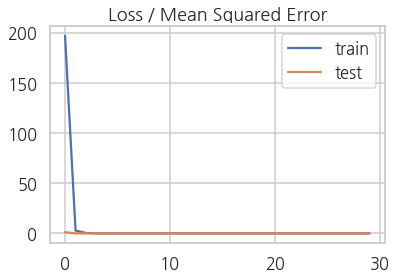


    loss:  0.0033299288463328313
    mse:  0.0033299288463328313
    mae:  0.0033299288463328313
    r2_score: 0.6034505480918515


# 7. 오류 데이터 탐색

## 7.1 기본 데이터 통계량으로 


```python
print("> build_elev 가 0인 지역이 있다. ")
print("> build_area 가 0.085?? ")
build_data.describe()
```

    > build_elev 가 0인 지역이 있다. 
    > build_area 가 0.085?? 


<div>
<style scoped>
    .dataframe tbody tr th:only-of-type {
        vertical-align: middle;
    }

    .dataframe tbody tr th {
        vertical-align: top;
    }

    .dataframe thead th {
        text-align: right;
    }
</style>
<table border="1" class="dataframe">
  <thead>
    <tr style="text-align: right;">
      <th></th>
      <th>gid</th>
      <th>buld_se_cd</th>
      <th>bdtyp_cd</th>
      <th>gro_flo_co</th>
      <th>sig_cd</th>
      <th>emd_cd</th>
      <th>tm_x</th>
      <th>tm_y</th>
      <th>lon</th>
      <th>lat</th>
      <th>buld_area</th>
      <th>buld_elev</th>
      <th>sL01</th>
      <th>sL02</th>
      <th>sL03</th>
      <th>sL04</th>
      <th>sL05</th>
      <th>sL06</th>
      <th>sL07</th>
      <th>sL08</th>
      <th>sL09</th>
      <th>sL10</th>
      <th>sL11</th>
      <th>sL12</th>
      <th>sL_y17</th>
      <th>buld_length</th>
      <th>buld_height</th>
      <th>height</th>
      <th>rad_angle_max</th>
      <th>rad_rel_fl</th>
      <th>rad_rel_height</th>
      <th>rad_angle_max_80</th>
      <th>rad_angle_max_160</th>
      <th>rad_angle_max_240</th>
      <th>count_80</th>
      <th>count_160</th>
      <th>count_240</th>
      <th>height_80</th>
      <th>height_160</th>
      <th>height_240</th>
      <th>nearShadow</th>
      <th>nearScaledShadow</th>
      <th>rel_nearShadow</th>
      <th>rel_nearScaledShadow</th>
      <th>altCount60</th>
      <th>altCount70</th>
      <th>altCount80</th>
      <th>altCount90</th>
      <th>altCount100</th>
      <th>altCount110</th>
      <th>altCount120</th>
      <th>altCount130</th>
      <th>altCount140</th>
      <th>altCount150</th>
      <th>altCount160</th>
      <th>altCount170</th>
      <th>altCount180</th>
      <th>altCount190</th>
      <th>altCount200</th>
      <th>altCount210</th>
      <th>altCount220</th>
      <th>altCount230</th>
      <th>altCount240</th>
      <th>altCount250</th>
      <th>altCount260</th>
      <th>altCount270</th>
      <th>altCount280</th>
      <th>altCount290</th>
      <th>altCount</th>
    </tr>
  </thead>
  <tbody>
    <tr>
      <th>count</th>
      <td>147754.000000</td>
      <td>147754.000000</td>
      <td>147754.000000</td>
      <td>147754.000000</td>
      <td>147754.000000</td>
      <td>1.477540e+05</td>
      <td>147754.000000</td>
      <td>147754.000000</td>
      <td>147754.000000</td>
      <td>147754.000000</td>
      <td>147754.000000</td>
      <td>147754.000000</td>
      <td>147754.000000</td>
      <td>1.477540e+05</td>
      <td>1.477540e+05</td>
      <td>147754.000000</td>
      <td>1.477540e+05</td>
      <td>1.477540e+05</td>
      <td>1.477540e+05</td>
      <td>147754.000000</td>
      <td>1.477540e+05</td>
      <td>1.477540e+05</td>
      <td>1.477540e+05</td>
      <td>1.477540e+05</td>
      <td>1.477540e+05</td>
      <td>147754.000000</td>
      <td>147754.000000</td>
      <td>147754.000000</td>
      <td>147754.000000</td>
      <td>147754.000000</td>
      <td>147754.000000</td>
      <td>147754.000000</td>
      <td>147754.000000</td>
      <td>147754.000000</td>
      <td>147754.000000</td>
      <td>147754.000000</td>
      <td>147754.000000</td>
      <td>147754.000000</td>
      <td>147754.000000</td>
      <td>147754.000000</td>
      <td>147754.000000</td>
      <td>147754.000000</td>
      <td>147754.000000</td>
      <td>147754.000000</td>
      <td>147754.0</td>
      <td>147754.0</td>
      <td>147754.0</td>
      <td>147754.000000</td>
      <td>147754.000000</td>
      <td>147754.000000</td>
      <td>147754.000000</td>
      <td>147754.000000</td>
      <td>147754.000000</td>
      <td>147754.000000</td>
      <td>147754.000000</td>
      <td>147754.000000</td>
      <td>147754.000000</td>
      <td>147754.000000</td>
      <td>147754.0</td>
      <td>147754.000000</td>
      <td>147754.000000</td>
      <td>147754.000000</td>
      <td>147754.000000</td>
      <td>147754.000000</td>
      <td>147754.000000</td>
      <td>147754.0</td>
      <td>147754.0</td>
      <td>147754.0</td>
      <td>147754.000000</td>
    </tr>
    <tr>
      <th>mean</th>
      <td>73879.886230</td>
      <td>0.000129</td>
      <td>2743.962999</td>
      <td>2.225192</td>
      <td>30163.558144</td>
      <td>3.016367e+07</td>
      <td>236031.476313</td>
      <td>415930.007843</td>
      <td>127.401358</td>
      <td>36.340744</td>
      <td>186.553186</td>
      <td>64.722290</td>
      <td>0.274277</td>
      <td>2.685908e-01</td>
      <td>2.550624e-01</td>
      <td>0.247065</td>
      <td>2.400351e-01</td>
      <td>2.367617e-01</td>
      <td>2.339712e-01</td>
      <td>0.242184</td>
      <td>2.510784e-01</td>
      <td>2.617524e-01</td>
      <td>2.758601e-01</td>
      <td>2.868252e-01</td>
      <td>2.521642e-01</td>
      <td>13.105849</td>
      <td>6.987102</td>
      <td>71.709392</td>
      <td>11.469295</td>
      <td>1.576678</td>
      <td>4.293563</td>
      <td>6.217813</td>
      <td>7.886058</td>
      <td>6.227234</td>
      <td>9.405485</td>
      <td>15.152598</td>
      <td>9.349872</td>
      <td>63.211685</td>
      <td>66.927844</td>
      <td>63.330057</td>
      <td>539.516574</td>
      <td>539.516574</td>
      <td>10.919143</td>
      <td>10.919143</td>
      <td>0.0</td>
      <td>0.0</td>
      <td>0.0</td>
      <td>0.000467</td>
      <td>0.000129</td>
      <td>0.000041</td>
      <td>0.000047</td>
      <td>0.000014</td>
      <td>0.000020</td>
      <td>0.000020</td>
      <td>0.000014</td>
      <td>0.000007</td>
      <td>0.000007</td>
      <td>0.000007</td>
      <td>0.0</td>
      <td>0.000034</td>
      <td>0.000007</td>
      <td>0.000027</td>
      <td>0.000061</td>
      <td>0.000149</td>
      <td>0.000575</td>
      <td>0.0</td>
      <td>0.0</td>
      <td>0.0</td>
      <td>0.001624</td>
    </tr>
    <tr>
      <th>std</th>
      <td>42653.850793</td>
      <td>0.011339</td>
      <td>3563.400798</td>
      <td>2.640942</td>
      <td>41.590794</td>
      <td>4.159049e+04</td>
      <td>3958.920583</td>
      <td>4753.128154</td>
      <td>0.044114</td>
      <td>0.042821</td>
      <td>773.325543</td>
      <td>24.032289</td>
      <td>0.121401</td>
      <td>1.161354e-01</td>
      <td>1.068918e-01</td>
      <td>0.097255</td>
      <td>9.254429e-02</td>
      <td>9.183400e-02</td>
      <td>9.425481e-02</td>
      <td>0.094981</td>
      <td>1.027978e-01</td>
      <td>1.116784e-01</td>
      <td>1.207685e-01</td>
      <td>1.303093e-01</td>
      <td>1.006024e-01</td>
      <td>8.109504</td>
      <td>8.292557</td>
      <td>24.727723</td>
      <td>10.616874</td>
      <td>2.059498</td>
      <td>5.491671</td>
      <td>8.015478</td>
      <td>9.025569</td>
      <td>8.034942</td>
      <td>7.445219</td>
      <td>11.255061</td>
      <td>7.433822</td>
      <td>30.015946</td>
      <td>27.778327</td>
      <td>29.941358</td>
      <td>366.715639</td>
      <td>366.715639</td>
      <td>7.322701</td>
      <td>7.322701</td>
      <td>0.0</td>
      <td>0.0</td>
      <td>0.0</td>
      <td>0.021605</td>
      <td>0.011339</td>
      <td>0.006372</td>
      <td>0.007805</td>
      <td>0.003679</td>
      <td>0.004506</td>
      <td>0.004506</td>
      <td>0.003679</td>
      <td>0.002602</td>
      <td>0.002602</td>
      <td>0.002602</td>
      <td>0.0</td>
      <td>0.005817</td>
      <td>0.002602</td>
      <td>0.005203</td>
      <td>0.007804</td>
      <td>0.012201</td>
      <td>0.024259</td>
      <td>0.0</td>
      <td>0.0</td>
      <td>0.0</td>
      <td>0.040937</td>
    </tr>
    <tr>
      <th>min</th>
      <td>1.000000</td>
      <td>0.000000</td>
      <td>1001.000000</td>
      <td>0.000000</td>
      <td>30110.000000</td>
      <td>3.011010e+07</td>
      <td>222297.650879</td>
      <td>399497.269602</td>
      <td>127.248215</td>
      <td>36.192872</td>
      <td>0.085259</td>
      <td>0.000000</td>
      <td>0.000000</td>
      <td>-8.037372e-08</td>
      <td>-1.126334e-07</td>
      <td>0.000000</td>
      <td>-8.496465e-08</td>
      <td>-9.394481e-08</td>
      <td>-1.367877e-07</td>
      <td>-0.001216</td>
      <td>-1.128162e-07</td>
      <td>-7.829614e-08</td>
      <td>-9.711478e-08</td>
      <td>-1.040759e-07</td>
      <td>-8.473776e-08</td>
      <td>0.329477</td>
      <td>0.000000</td>
      <td>3.140000</td>
      <td>0.000000</td>
      <td>0.000000</td>
      <td>0.000000</td>
      <td>0.000000</td>
      <td>0.000000</td>
      <td>0.000000</td>
      <td>0.000000</td>
      <td>0.000000</td>
      <td>0.000000</td>
      <td>0.000000</td>
      <td>0.000000</td>
      <td>0.000000</td>
      <td>0.000000</td>
      <td>0.000000</td>
      <td>0.000000</td>
      <td>0.000000</td>
      <td>0.0</td>
      <td>0.0</td>
      <td>0.0</td>
      <td>0.000000</td>
      <td>0.000000</td>
      <td>0.000000</td>
      <td>0.000000</td>
      <td>0.000000</td>
      <td>0.000000</td>
      <td>0.000000</td>
      <td>0.000000</td>
      <td>0.000000</td>
      <td>0.000000</td>
      <td>0.000000</td>
      <td>0.0</td>
      <td>0.000000</td>
      <td>0.000000</td>
      <td>0.000000</td>
      <td>0.000000</td>
      <td>0.000000</td>
      <td>0.000000</td>
      <td>0.0</td>
      <td>0.0</td>
      <td>0.0</td>
      <td>0.000000</td>
    </tr>
    <tr>
      <th>25%</th>
      <td>36940.250000</td>
      <td>0.000000</td>
      <td>1001.000000</td>
      <td>1.000000</td>
      <td>30140.000000</td>
      <td>3.014010e+07</td>
      <td>233752.454974</td>
      <td>413250.281785</td>
      <td>127.375950</td>
      <td>36.316569</td>
      <td>72.208554</td>
      <td>50.000000</td>
      <td>0.191926</td>
      <td>1.906091e-01</td>
      <td>1.839556e-01</td>
      <td>0.183548</td>
      <td>1.800585e-01</td>
      <td>1.773150e-01</td>
      <td>1.720979e-01</td>
      <td>0.180206</td>
      <td>1.830862e-01</td>
      <td>1.869779e-01</td>
      <td>1.941835e-01</td>
      <td>1.977643e-01</td>
      <td>1.854689e-01</td>
      <td>9.588472</td>
      <td>3.140000</td>
      <td>56.140000</td>
      <td>3.697476</td>
      <td>1.000000</td>
      <td>1.890000</td>
      <td>0.000000</td>
      <td>0.788022</td>
      <td>0.000000</td>
      <td>3.000000</td>
      <td>5.000000</td>
      <td>3.000000</td>
      <td>52.934750</td>
      <td>54.676206</td>
      <td>53.038220</td>
      <td>243.286554</td>
      <td>243.286554</td>
      <td>5.278739</td>
      <td>5.278739</td>
      <td>0.0</td>
      <td>0.0</td>
      <td>0.0</td>
      <td>0.000000</td>
      <td>0.000000</td>
      <td>0.000000</td>
      <td>0.000000</td>
      <td>0.000000</td>
      <td>0.000000</td>
      <td>0.000000</td>
      <td>0.000000</td>
      <td>0.000000</td>
      <td>0.000000</td>
      <td>0.000000</td>
      <td>0.0</td>
      <td>0.000000</td>
      <td>0.000000</td>
      <td>0.000000</td>
      <td>0.000000</td>
      <td>0.000000</td>
      <td>0.000000</td>
      <td>0.0</td>
      <td>0.0</td>
      <td>0.0</td>
      <td>0.000000</td>
    </tr>
    <tr>
      <th>50%</th>
      <td>73880.500000</td>
      <td>0.000000</td>
      <td>1001.000000</td>
      <td>1.000000</td>
      <td>30170.000000</td>
      <td>3.017010e+07</td>
      <td>236796.589572</td>
      <td>415336.547005</td>
      <td>127.409934</td>
      <td>36.335367</td>
      <td>105.244051</td>
      <td>59.000000</td>
      <td>0.253134</td>
      <td>2.501446e-01</td>
      <td>2.399787e-01</td>
      <td>0.236630</td>
      <td>2.331349e-01</td>
      <td>2.311752e-01</td>
      <td>2.267862e-01</td>
      <td>0.233463</td>
      <td>2.377713e-01</td>
      <td>2.447668e-01</td>
      <td>2.558799e-01</td>
      <td>2.620942e-01</td>
      <td>2.402841e-01</td>
      <td>11.575875</td>
      <td>3.140000</td>
      <td>66.140000</td>
      <td>8.836112</td>
      <td>1.310345</td>
      <td>3.380000</td>
      <td>3.733368</td>
      <td>5.423980</td>
      <td>3.793603</td>
      <td>9.000000</td>
      <td>14.000000</td>
      <td>9.000000</td>
      <td>62.930000</td>
      <td>64.479706</td>
      <td>63.071111</td>
      <td>508.037237</td>
      <td>508.037237</td>
      <td>10.355349</td>
      <td>10.355349</td>
      <td>0.0</td>
      <td>0.0</td>
      <td>0.0</td>
      <td>0.000000</td>
      <td>0.000000</td>
      <td>0.000000</td>
      <td>0.000000</td>
      <td>0.000000</td>
      <td>0.000000</td>
      <td>0.000000</td>
      <td>0.000000</td>
      <td>0.000000</td>
      <td>0.000000</td>
      <td>0.000000</td>
      <td>0.0</td>
      <td>0.000000</td>
      <td>0.000000</td>
      <td>0.000000</td>
      <td>0.000000</td>
      <td>0.000000</td>
      <td>0.000000</td>
      <td>0.0</td>
      <td>0.0</td>
      <td>0.0</td>
      <td>0.000000</td>
    </tr>
    <tr>
      <th>75%</th>
      <td>110818.750000</td>
      <td>0.000000</td>
      <td>3001.000000</td>
      <td>3.000000</td>
      <td>30200.000000</td>
      <td>3.020012e+07</td>
      <td>239036.101693</td>
      <td>417658.383435</td>
      <td>127.434913</td>
      <td>36.356298</td>
      <td>153.676529</td>
      <td>73.360001</td>
      <td>0.331815</td>
      <td>3.237634e-01</td>
      <td>3.072338e-01</td>
      <td>0.296675</td>
      <td>2.888749e-01</td>
      <td>2.855046e-01</td>
      <td>2.838453e-01</td>
      <td>0.291708</td>
      <td>3.023004e-01</td>
      <td>3.154933e-01</td>
      <td>3.331805e-01</td>
      <td>3.471215e-01</td>
      <td>3.035972e-01</td>
      <td>13.988103</td>
      <td>9.420000</td>
      <td>81.239999</td>
      <td>16.161773</td>
      <td>1.863636</td>
      <td>5.043602</td>
      <td>9.035078</td>
      <td>11.358272</td>
      <td>9.071812</td>
      <td>15.000000</td>
      <td>23.000000</td>
      <td>15.000000</td>
      <td>77.400000</td>
      <td>79.117443</td>
      <td>77.140000</td>
      <td>777.526446</td>
      <td>777.526446</td>
      <td>15.384809</td>
      <td>15.384809</td>
      <td>0.0</td>
      <td>0.0</td>
      <td>0.0</td>
      <td>0.000000</td>
      <td>0.000000</td>
      <td>0.000000</td>
      <td>0.000000</td>
      <td>0.000000</td>
      <td>0.000000</td>
      <td>0.000000</td>
      <td>0.000000</td>
      <td>0.000000</td>
      <td>0.000000</td>
      <td>0.000000</td>
      <td>0.0</td>
      <td>0.000000</td>
      <td>0.000000</td>
      <td>0.000000</td>
      <td>0.000000</td>
      <td>0.000000</td>
      <td>0.000000</td>
      <td>0.0</td>
      <td>0.0</td>
      <td>0.0</td>
      <td>0.000000</td>
    </tr>
    <tr>
      <th>max</th>
      <td>147757.000000</td>
      <td>1.000000</td>
      <td>27999.000000</td>
      <td>51.000000</td>
      <td>30230.000000</td>
      <td>3.023013e+07</td>
      <td>248248.670094</td>
      <td>433289.760746</td>
      <td>127.537952</td>
      <td>36.497256</td>
      <td>130409.550646</td>
      <td>575.000000</td>
      <td>1.000000</td>
      <td>1.000000e+00</td>
      <td>1.000000e+00</td>
      <td>1.000000</td>
      <td>1.000000e+00</td>
      <td>1.000000e+00</td>
      <td>1.000000e+00</td>
      <td>1.000000</td>
      <td>1.000000e+00</td>
      <td>1.000000e+00</td>
      <td>1.000000e+00</td>
      <td>1.000000e+00</td>
      <td>1.000000e+00</td>
      <td>407.483247</td>
      <td>160.140000</td>
      <td>581.280000</td>
      <td>84.786007</td>
      <td>46.000000</td>
      <td>144.440000</td>
      <td>81.378149</td>
      <td>84.786007</td>
      <td>83.578919</td>
      <td>74.000000</td>
      <td>88.000000</td>
      <td>74.000000</td>
      <td>323.939988</td>
      <td>345.140000</td>
      <td>338.539994</td>
      <td>3096.947679</td>
      <td>3096.947679</td>
      <td>68.714057</td>
      <td>68.714057</td>
      <td>0.0</td>
      <td>0.0</td>
      <td>0.0</td>
      <td>1.000000</td>
      <td>1.000000</td>
      <td>1.000000</td>
      <td>2.000000</td>
      <td>1.000000</td>
      <td>1.000000</td>
      <td>1.000000</td>
      <td>1.000000</td>
      <td>1.000000</td>
      <td>1.000000</td>
      <td>1.000000</td>
      <td>0.0</td>
      <td>1.000000</td>
      <td>1.000000</td>
      <td>1.000000</td>
      <td>1.000000</td>
      <td>1.000000</td>
      <td>2.000000</td>
      <td>0.0</td>
      <td>0.0</td>
      <td>0.0</td>
      <td>2.000000</td>
    </tr>
  </tbody>
</table>
</div>


## 7.2 기준 빌딩과 인접 빌딩간의 앙각이 최대인 지역들 조사 ( 층수 데이터 오류 )

* 두 빌딩 간의 앙각이 70~80도 정도가 될 수 있다.
* 오류 데이터 판별을 위해 앙각이 높은 몇개의 데이터를 시각화 해보았다.


* <u>데이터 검증을 위해 앙각이 높은 데이터 시각화 도중 최대 앙강이 84도인 index 145129에 buildNear_3d와 네이버API를 사용하여 시각화 해본 결과 오류 데이터로 판별</u> 
    * 데이터 상에는 층수가 51로 되어 있었지만 사실상 1층 건물이었다.
* 이와 비슷한 데이터들 다수 발견


```python
af =  pd.read_csv("./data/farthest/affectBuild/affectBuild_100.csv")
af[af.groupby(['azimuth'])['re_angle'].transform(max) == af['re_angle']].sort_values(['azimuth'])
```


<div>
<style scoped>
    .dataframe tbody tr th:only-of-type {
        vertical-align: middle;
    }

    .dataframe tbody tr th {
        vertical-align: top;
    }

    .dataframe thead th {
        text-align: right;
    }
</style>
<table border="1" class="dataframe">
  <thead>
    <tr style="text-align: right;">
      <th></th>
      <th>tm_x</th>
      <th>tm_y</th>
      <th>re_angle</th>
      <th>dist</th>
      <th>azimuth</th>
      <th>aziMean</th>
      <th>altMean</th>
      <th>baseIndex</th>
    </tr>
  </thead>
  <tbody>
    <tr>
      <th>10</th>
      <td>12.903015</td>
      <td>-0.931051</td>
      <td>77.107943</td>
      <td>12.936562</td>
      <td>90.0</td>
      <td>90</td>
      <td>47.757666</td>
      <td>8457</td>
    </tr>
    <tr>
      <th>82</th>
      <td>33.029490</td>
      <td>-7.280506</td>
      <td>75.019627</td>
      <td>33.822374</td>
      <td>100.0</td>
      <td>100</td>
      <td>57.938121</td>
      <td>49413</td>
    </tr>
    <tr>
      <th>166</th>
      <td>25.430100</td>
      <td>-14.333201</td>
      <td>79.467174</td>
      <td>29.191277</td>
      <td>110.0</td>
      <td>110</td>
      <td>64.945184</td>
      <td>109718</td>
    </tr>
    <tr>
      <th>11</th>
      <td>5.905838</td>
      <td>-4.298924</td>
      <td>82.697130</td>
      <td>7.304770</td>
      <td>120.0</td>
      <td>120</td>
      <td>69.489285</td>
      <td>9949</td>
    </tr>
    <tr>
      <th>133</th>
      <td>10.824333</td>
      <td>-10.454849</td>
      <td>83.578919</td>
      <td>15.048922</td>
      <td>130.0</td>
      <td>130</td>
      <td>72.503030</td>
      <td>86610</td>
    </tr>
    <tr>
      <th>180</th>
      <td>10.714849</td>
      <td>-13.099283</td>
      <td>83.847732</td>
      <td>16.923333</td>
      <td>140.0</td>
      <td>140</td>
      <td>74.450469</td>
      <td>118992</td>
    </tr>
    <tr>
      <th>37</th>
      <td>6.652448</td>
      <td>-15.540192</td>
      <td>82.140633</td>
      <td>16.904219</td>
      <td>150.0</td>
      <td>150</td>
      <td>75.698172</td>
      <td>25041</td>
    </tr>
    <tr>
      <th>109</th>
      <td>5.920734</td>
      <td>-21.483763</td>
      <td>80.880153</td>
      <td>22.284685</td>
      <td>160.0</td>
      <td>160</td>
      <td>76.455223</td>
      <td>71188</td>
    </tr>
    <tr>
      <th>154</th>
      <td>2.130708</td>
      <td>-21.404407</td>
      <td>81.707374</td>
      <td>21.510196</td>
      <td>170.0</td>
      <td>170</td>
      <td>76.792825</td>
      <td>98994</td>
    </tr>
    <tr>
      <th>88</th>
      <td>-0.554402</td>
      <td>-20.958854</td>
      <td>81.006997</td>
      <td>20.966185</td>
      <td>180.0</td>
      <td>180</td>
      <td>76.784099</td>
      <td>54923</td>
    </tr>
    <tr>
      <th>161</th>
      <td>-2.230632</td>
      <td>-11.574372</td>
      <td>78.219705</td>
      <td>11.787358</td>
      <td>190.0</td>
      <td>190</td>
      <td>76.394843</td>
      <td>101378</td>
    </tr>
    <tr>
      <th>232</th>
      <td>-8.456400</td>
      <td>-10.110318</td>
      <td>84.786007</td>
      <td>13.180639</td>
      <td>210.0</td>
      <td>210</td>
      <td>74.328750</td>
      <td>145129</td>
    </tr>
    <tr>
      <th>184</th>
      <td>-24.955054</td>
      <td>-28.734741</td>
      <td>75.539456</td>
      <td>38.058377</td>
      <td>220.0</td>
      <td>220</td>
      <td>72.290815</td>
      <td>121150</td>
    </tr>
    <tr>
      <th>77</th>
      <td>-6.472057</td>
      <td>-4.930616</td>
      <td>81.378149</td>
      <td>8.136246</td>
      <td>230.0</td>
      <td>230</td>
      <td>69.243356</td>
      <td>47499</td>
    </tr>
    <tr>
      <th>189</th>
      <td>-12.228075</td>
      <td>-7.036181</td>
      <td>78.335863</td>
      <td>14.107929</td>
      <td>240.0</td>
      <td>240</td>
      <td>64.673595</td>
      <td>122314</td>
    </tr>
    <tr>
      <th>203</th>
      <td>-42.617635</td>
      <td>-15.271414</td>
      <td>73.915009</td>
      <td>45.271171</td>
      <td>250.0</td>
      <td>250</td>
      <td>57.748476</td>
      <td>130472</td>
    </tr>
    <tr>
      <th>195</th>
      <td>-33.479817</td>
      <td>-3.351510</td>
      <td>75.986898</td>
      <td>33.647151</td>
      <td>260.0</td>
      <td>260</td>
      <td>47.560246</td>
      <td>126677</td>
    </tr>
  </tbody>
</table>
</div>


```python
%matplotlib inline

print(build_data.iloc[[112000 , 145129]][['gro_flo_co','tm_x','tm_y','lat','lon','buld_elev','buld_area','sL_y17']])
buildNear_3d(build_data ,realnearest_dist_list , realnearest_ind_list , 112000 ,100)
```

            gro_flo_co          tm_x           tm_y        lat         lon  \
    112000          51  236230.05229  414770.350103  36.330294  127.403514   
    145129           5  236238.50869  414780.460421  36.330385  127.403608   
    
            buld_elev   buld_area    sL_y17  
    112000       46.0   76.715696  0.357289  
    145129       46.0  134.380898  0.434428  
    Base Building gid :  0    46347
    Name: gid, dtype: object


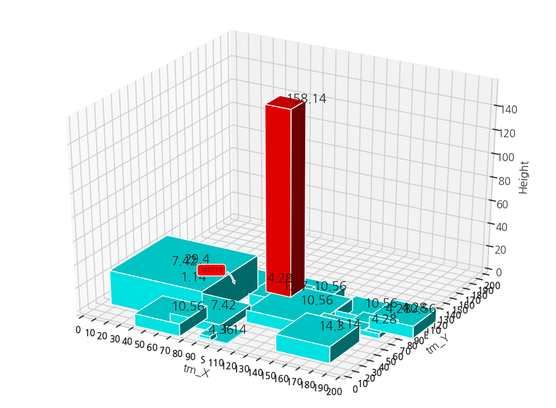


    최대앙각 index  109719
    주위 건물 수 :  18
    rad_angle_max :  0.0
    rad_angle_max_80 :  0.0
    rad_angle_max_160 :  0.0
    rad_angle_max_240 :  0.0
    count_80 :  4.0
    count_160 :  5.0
    count_240 :  9.0


```python
Image("./image/presentation/errordata_angle.png")
```


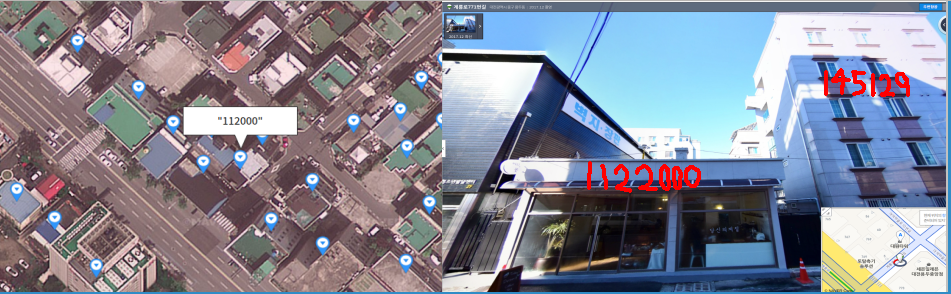


## 7.3 RandomForest 모델로 True-Predict Scatter Plot 시각화 ( 차폐율 오류 )

* <u>학습시킨 RF모델로 True-Predict scatterplot을 그려봤더니 예측을 거의 못하는 몇몇 튀는 값들이 발견되어 가장 오차율이 큰 데이터를 조사해보았더니 차폐율 값이 1이 나왔다. 에러 데이터라고 판단</u>
* 차폐율 값이 1인 데이터 근처를 조사해본 결과 매노동에 근처에있는 데이터가 모두 차폐율이 1이 나왔다


```python
from sklearn.model_selection import train_test_split

build_data = pd.read_csv("./data/2.7/build_data_3group_80100.csv")

model_data = copy.deepcopy(build_data)
y  = model_data['sL_y17']

y_df = pd.DataFrame()
y_df['sL_y17'] = model_data['sL_y17']
for i in range(1,13) :
    y_df['sL'+str(i).zfill(2)] = model_data['sL'+str(i).zfill(2)]
    del model_data['sL'+str(i).zfill(2)]
del model_data['sL_y17']
del model_data['gid']
del model_data['buld_se_nm']
del model_data['sig_nm']
del model_data['emd_nm']

del model_data['apt_yn']
del model_data['sig_cd']
del model_data['emd_cd']

del model_data['buld_se_cd']
del model_data['gro_flo_co']
del model_data['bdtyp_cd']

del model_data['tm_x']
del model_data['tm_y']
del model_data['lon']
del model_data['lat']

model_data['PC1'] = pca_result['PC1']
model_data['PC2'] = pca_result['PC2']
model_data['FACTOR1'] = factors_result['FACTOR1']
model_data['FACTOR2'] = factors_result['FACTOR2']

print("> X data")
model_data.head()
```

    > X data


<div>
<style scoped>
    .dataframe tbody tr th:only-of-type {
        vertical-align: middle;
    }

    .dataframe tbody tr th {
        vertical-align: top;
    }

    .dataframe thead th {
        text-align: right;
    }
</style>
<table border="1" class="dataframe">
  <thead>
    <tr style="text-align: right;">
      <th></th>
      <th>buld_area</th>
      <th>buld_elev</th>
      <th>buld_length</th>
      <th>buld_height</th>
      <th>height</th>
      <th>rad_angle_max</th>
      <th>rad_rel_fl</th>
      <th>rad_rel_height</th>
      <th>rad_angle_max_80</th>
      <th>rad_angle_max_160</th>
      <th>rad_angle_max_240</th>
      <th>count_80</th>
      <th>count_160</th>
      <th>count_240</th>
      <th>height_80</th>
      <th>height_160</th>
      <th>height_240</th>
      <th>nearShadow</th>
      <th>nearScaledShadow</th>
      <th>rel_nearShadow</th>
      <th>rel_nearScaledShadow</th>
      <th>altCount60</th>
      <th>altCount70</th>
      <th>altCount80</th>
      <th>altCount90</th>
      <th>altCount100</th>
      <th>altCount110</th>
      <th>altCount120</th>
      <th>altCount130</th>
      <th>altCount140</th>
      <th>altCount150</th>
      <th>altCount160</th>
      <th>altCount170</th>
      <th>altCount180</th>
      <th>altCount190</th>
      <th>altCount200</th>
      <th>altCount210</th>
      <th>altCount220</th>
      <th>altCount230</th>
      <th>altCount240</th>
      <th>altCount250</th>
      <th>altCount260</th>
      <th>altCount270</th>
      <th>altCount280</th>
      <th>altCount290</th>
      <th>altCount</th>
      <th>PC1</th>
      <th>PC2</th>
      <th>FACTOR1</th>
      <th>FACTOR2</th>
    </tr>
  </thead>
  <tbody>
    <tr>
      <th>0</th>
      <td>199.109760</td>
      <td>80.0</td>
      <td>15.922136</td>
      <td>3.14</td>
      <td>83.14</td>
      <td>5.011625</td>
      <td>1.000000</td>
      <td>1.587692</td>
      <td>0.902407</td>
      <td>5.011625</td>
      <td>0.000000</td>
      <td>11</td>
      <td>9</td>
      <td>6</td>
      <td>83.874546</td>
      <td>84.186667</td>
      <td>82.306667</td>
      <td>514.339502</td>
      <td>514.339502</td>
      <td>10.375585</td>
      <td>10.375585</td>
      <td>0</td>
      <td>0</td>
      <td>0</td>
      <td>0</td>
      <td>0</td>
      <td>0</td>
      <td>0</td>
      <td>0</td>
      <td>0</td>
      <td>0</td>
      <td>0</td>
      <td>0</td>
      <td>0</td>
      <td>0</td>
      <td>0</td>
      <td>0</td>
      <td>0</td>
      <td>0</td>
      <td>0</td>
      <td>0</td>
      <td>0</td>
      <td>0</td>
      <td>0</td>
      <td>0</td>
      <td>0</td>
      <td>-0.272457</td>
      <td>-1.970118</td>
      <td>-0.068656</td>
      <td>0.751213</td>
    </tr>
    <tr>
      <th>1</th>
      <td>77.392318</td>
      <td>71.0</td>
      <td>9.926679</td>
      <td>3.14</td>
      <td>74.14</td>
      <td>35.570123</td>
      <td>2.473684</td>
      <td>6.327369</td>
      <td>1.182603</td>
      <td>35.570123</td>
      <td>15.608649</td>
      <td>14</td>
      <td>20</td>
      <td>5</td>
      <td>73.260000</td>
      <td>77.880000</td>
      <td>80.340001</td>
      <td>706.151655</td>
      <td>706.151655</td>
      <td>16.730038</td>
      <td>16.730038</td>
      <td>0</td>
      <td>0</td>
      <td>0</td>
      <td>0</td>
      <td>0</td>
      <td>0</td>
      <td>0</td>
      <td>0</td>
      <td>0</td>
      <td>0</td>
      <td>0</td>
      <td>0</td>
      <td>0</td>
      <td>0</td>
      <td>0</td>
      <td>0</td>
      <td>0</td>
      <td>0</td>
      <td>0</td>
      <td>0</td>
      <td>0</td>
      <td>0</td>
      <td>0</td>
      <td>0</td>
      <td>0</td>
      <td>-2.680074</td>
      <td>1.390762</td>
      <td>0.454400</td>
      <td>-1.156412</td>
    </tr>
    <tr>
      <th>2</th>
      <td>91.076386</td>
      <td>77.0</td>
      <td>10.768568</td>
      <td>3.14</td>
      <td>80.14</td>
      <td>5.080622</td>
      <td>1.333333</td>
      <td>2.356000</td>
      <td>5.080622</td>
      <td>4.332678</td>
      <td>3.259005</td>
      <td>1</td>
      <td>4</td>
      <td>6</td>
      <td>84.280000</td>
      <td>82.710000</td>
      <td>81.663333</td>
      <td>214.120840</td>
      <td>214.120840</td>
      <td>3.661072</td>
      <td>3.661072</td>
      <td>0</td>
      <td>0</td>
      <td>0</td>
      <td>0</td>
      <td>0</td>
      <td>0</td>
      <td>0</td>
      <td>0</td>
      <td>0</td>
      <td>0</td>
      <td>0</td>
      <td>0</td>
      <td>0</td>
      <td>0</td>
      <td>0</td>
      <td>0</td>
      <td>0</td>
      <td>0</td>
      <td>0</td>
      <td>0</td>
      <td>0</td>
      <td>0</td>
      <td>0</td>
      <td>0</td>
      <td>0</td>
      <td>1.262639</td>
      <td>-1.329675</td>
      <td>-0.887327</td>
      <td>0.571631</td>
    </tr>
    <tr>
      <th>3</th>
      <td>51.201706</td>
      <td>78.0</td>
      <td>8.074159</td>
      <td>3.14</td>
      <td>81.14</td>
      <td>1.555146</td>
      <td>0.000000</td>
      <td>1.000000</td>
      <td>0.000000</td>
      <td>1.555146</td>
      <td>0.000000</td>
      <td>3</td>
      <td>4</td>
      <td>0</td>
      <td>81.140000</td>
      <td>81.640000</td>
      <td>0.000000</td>
      <td>134.841008</td>
      <td>134.841008</td>
      <td>4.020769</td>
      <td>4.020769</td>
      <td>0</td>
      <td>0</td>
      <td>0</td>
      <td>0</td>
      <td>0</td>
      <td>0</td>
      <td>0</td>
      <td>0</td>
      <td>0</td>
      <td>0</td>
      <td>0</td>
      <td>0</td>
      <td>0</td>
      <td>0</td>
      <td>0</td>
      <td>0</td>
      <td>0</td>
      <td>0</td>
      <td>0</td>
      <td>0</td>
      <td>0</td>
      <td>0</td>
      <td>0</td>
      <td>0</td>
      <td>0</td>
      <td>2.108377</td>
      <td>-1.713507</td>
      <td>-1.103517</td>
      <td>0.783682</td>
    </tr>
    <tr>
      <th>4</th>
      <td>455.844167</td>
      <td>80.0</td>
      <td>24.091468</td>
      <td>3.14</td>
      <td>83.14</td>
      <td>7.164204</td>
      <td>1.000000</td>
      <td>2.859999</td>
      <td>1.343876</td>
      <td>3.126923</td>
      <td>7.164204</td>
      <td>1</td>
      <td>1</td>
      <td>2</td>
      <td>84.140000</td>
      <td>85.099999</td>
      <td>87.379998</td>
      <td>81.380586</td>
      <td>81.380586</td>
      <td>1.843745</td>
      <td>1.843745</td>
      <td>0</td>
      <td>0</td>
      <td>0</td>
      <td>0</td>
      <td>0</td>
      <td>0</td>
      <td>0</td>
      <td>0</td>
      <td>0</td>
      <td>0</td>
      <td>0</td>
      <td>0</td>
      <td>0</td>
      <td>0</td>
      <td>0</td>
      <td>0</td>
      <td>0</td>
      <td>0</td>
      <td>0</td>
      <td>0</td>
      <td>0</td>
      <td>0</td>
      <td>0</td>
      <td>0</td>
      <td>0</td>
      <td>2.164670</td>
      <td>-1.398946</td>
      <td>-1.249299</td>
      <td>0.533220</td>
    </tr>
  </tbody>
</table>
</div>


```python
y_pred = forest.predict(model_data)
# y_true = y_df['sL06']
y_true = y_df['sL_y17']

distance_list = []
distanceTup_list = []
p1=np.array([0,0])
p2=np.array([1,1])

for i in range(len(y_true)) :
    p3 = np.array([y_true[i] , y_pred[i]])
    d = np.linalg.norm(np.cross(p2-p1, p1-p3))/np.linalg.norm(p2-p1)
    distance_list.append(d)
    distanceTup_list.append((i,d))
    
```


```python
fig, ax = plt.subplots(figsize=(24,18))

ax.scatter(y_true, y_pred, s=15,color='black', alpha = 0.1 , edgecolors=None)

lims = [
    np.min([ax.get_xlim(), ax.get_ylim()]),  # min of both axes
    np.max([ax.get_xlim(), ax.get_ylim()]),  # max of both axes
]

# now plot both limits against eachother
ax.plot(lims, lims, color='r')
ax.set_aspect('equal')
ax.set_xlim(lims)
ax.set_ylim(lims)

plt.show()

distanceTup_list.sort(key = lambda tup : tup[1] , reverse=True)
distanceTup_list[:15]
```


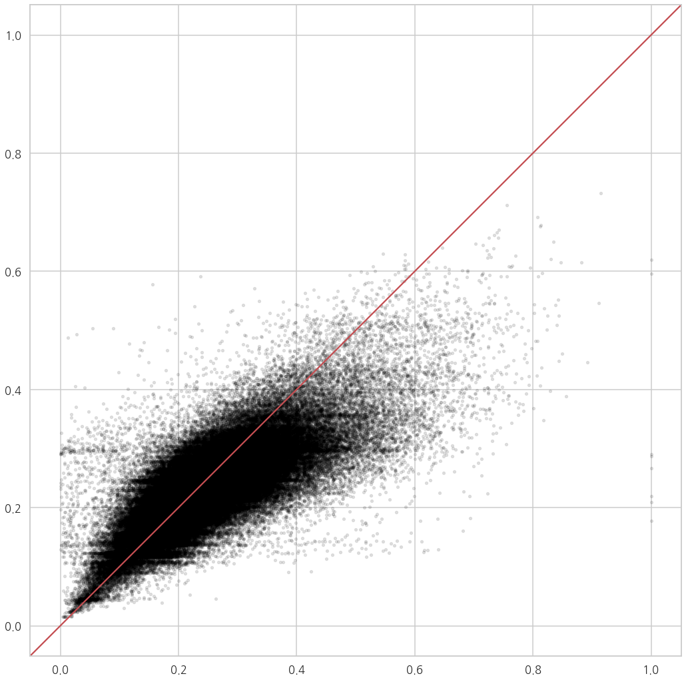


    [(59184, 0.5812335422910362),
     (40666, 0.5592861796219591),
     (41186, 0.5523463437885499),
     (36710, 0.5183428196073864),
     (88812, 0.5039713587508319),
     (133930, 0.5018188052372357),
     (11516, 0.36809624345267244),
     (30176, 0.362130218784808),
     (144204, 0.3614100859126105),
     (14327, 0.35362251400220124),
     (9910, 0.34901318190912006),
     (130329, 0.346191856940049),
     (33057, 0.3449434688427555),
     (116314, 0.33548440712127364),
     (129617, 0.3349600562442802)]


```python
build_data.iloc[59184]
```


    gid                        81156
    buld_se_cd                     0
    buld_se_nm                    지상
    bdtyp_cd                    3999
    apt_yn                         N
    gro_flo_co                     1
    sig_cd                     30170
    sig_nm                        서구
    emd_cd                  30170118
    emd_nm                       매노동
    tm_x                      230535
    tm_y                      405956
    lon                       127.34
    lat                      36.2511
    buld_area                76.1277
    buld_elev                     75
    sL01                           1
    sL02                           1
    sL03                           1
    sL04                           1
    sL05                           1
    sL06                           1
    sL07                           1
    sL08                           1
    sL09                           1
    sL10                           1
    sL11                           1
    sL12                           1
    sL_y17                         1
    buld_length              9.84524
                              ...   
    height_240                 78.14
    nearShadow               203.702
    nearScaledShadow         203.702
    rel_nearShadow           14.6255
    rel_nearScaledShadow     14.6255
    altCount60                     0
    altCount70                     0
    altCount80                     0
    altCount90                     0
    altCount100                    0
    altCount110                    0
    altCount120                    0
    altCount130                    0
    altCount140                    0
    altCount150                    0
    altCount160                    0
    altCount170                    0
    altCount180                    0
    altCount190                    0
    altCount200                    0
    altCount210                    0
    altCount220                    0
    altCount230                    0
    altCount240                    0
    altCount250                    0
    altCount260                    0
    altCount270                    0
    altCount280                    0
    altCount290                    0
    altCount                       0
    Name: 59184, Length: 73, dtype: object


```python
build_data.loc[build_data['emd_cd']==30170118].sort_values(by='sL_y17' , ascending=False).head(5)
```


<div>
<style scoped>
    .dataframe tbody tr th:only-of-type {
        vertical-align: middle;
    }

    .dataframe tbody tr th {
        vertical-align: top;
    }

    .dataframe thead th {
        text-align: right;
    }
</style>
<table border="1" class="dataframe">
  <thead>
    <tr style="text-align: right;">
      <th></th>
      <th>gid</th>
      <th>buld_se_cd</th>
      <th>buld_se_nm</th>
      <th>bdtyp_cd</th>
      <th>apt_yn</th>
      <th>gro_flo_co</th>
      <th>sig_cd</th>
      <th>sig_nm</th>
      <th>emd_cd</th>
      <th>emd_nm</th>
      <th>tm_x</th>
      <th>tm_y</th>
      <th>lon</th>
      <th>lat</th>
      <th>buld_area</th>
      <th>buld_elev</th>
      <th>sL01</th>
      <th>sL02</th>
      <th>sL03</th>
      <th>sL04</th>
      <th>sL05</th>
      <th>sL06</th>
      <th>sL07</th>
      <th>sL08</th>
      <th>sL09</th>
      <th>sL10</th>
      <th>sL11</th>
      <th>sL12</th>
      <th>sL_y17</th>
      <th>buld_length</th>
      <th>buld_height</th>
      <th>height</th>
      <th>rad_angle_max</th>
      <th>rad_rel_fl</th>
      <th>rad_rel_height</th>
      <th>rad_angle_max_80</th>
      <th>rad_angle_max_160</th>
      <th>rad_angle_max_240</th>
      <th>count_80</th>
      <th>count_160</th>
      <th>count_240</th>
      <th>height_80</th>
      <th>height_160</th>
      <th>height_240</th>
      <th>nearShadow</th>
      <th>nearScaledShadow</th>
      <th>rel_nearShadow</th>
      <th>rel_nearScaledShadow</th>
      <th>altCount60</th>
      <th>altCount70</th>
      <th>altCount80</th>
      <th>altCount90</th>
      <th>altCount100</th>
      <th>altCount110</th>
      <th>altCount120</th>
      <th>altCount130</th>
      <th>altCount140</th>
      <th>altCount150</th>
      <th>altCount160</th>
      <th>altCount170</th>
      <th>altCount180</th>
      <th>altCount190</th>
      <th>altCount200</th>
      <th>altCount210</th>
      <th>altCount220</th>
      <th>altCount230</th>
      <th>altCount240</th>
      <th>altCount250</th>
      <th>altCount260</th>
      <th>altCount270</th>
      <th>altCount280</th>
      <th>altCount290</th>
      <th>altCount</th>
    </tr>
  </thead>
  <tbody>
    <tr>
      <th>41186</th>
      <td>81155</td>
      <td>0</td>
      <td>지상</td>
      <td>3999</td>
      <td>N</td>
      <td>1</td>
      <td>30170</td>
      <td>서구</td>
      <td>30170118</td>
      <td>매노동</td>
      <td>230539.261080</td>
      <td>405944.429110</td>
      <td>127.339788</td>
      <td>36.250954</td>
      <td>55.188591</td>
      <td>75.0</td>
      <td>1.00000</td>
      <td>1.000000</td>
      <td>1.000000</td>
      <td>1.000000</td>
      <td>1.000000</td>
      <td>1.000000</td>
      <td>1.00000</td>
      <td>1.000000</td>
      <td>1.000000</td>
      <td>1.000000</td>
      <td>1.000000</td>
      <td>1.000000</td>
      <td>1.000000</td>
      <td>8.382619</td>
      <td>3.14</td>
      <td>78.14</td>
      <td>0.876662</td>
      <td>0.0</td>
      <td>0.759998</td>
      <td>0.000000</td>
      <td>0.876662</td>
      <td>0.0</td>
      <td>1</td>
      <td>6</td>
      <td>1</td>
      <td>78.140000</td>
      <td>78.393333</td>
      <td>78.140000</td>
      <td>148.245147</td>
      <td>148.245147</td>
      <td>5.034109</td>
      <td>5.034109</td>
      <td>0</td>
      <td>0</td>
      <td>0</td>
      <td>0</td>
      <td>0</td>
      <td>0</td>
      <td>0</td>
      <td>0</td>
      <td>0</td>
      <td>0</td>
      <td>0</td>
      <td>0</td>
      <td>0</td>
      <td>0</td>
      <td>0</td>
      <td>0</td>
      <td>0</td>
      <td>0</td>
      <td>0</td>
      <td>0</td>
      <td>0</td>
      <td>0</td>
      <td>0</td>
      <td>0</td>
      <td>0</td>
    </tr>
    <tr>
      <th>59184</th>
      <td>81156</td>
      <td>0</td>
      <td>지상</td>
      <td>3999</td>
      <td>N</td>
      <td>1</td>
      <td>30170</td>
      <td>서구</td>
      <td>30170118</td>
      <td>매노동</td>
      <td>230534.677414</td>
      <td>405955.944930</td>
      <td>127.339738</td>
      <td>36.251058</td>
      <td>76.127734</td>
      <td>75.0</td>
      <td>1.00000</td>
      <td>1.000000</td>
      <td>1.000000</td>
      <td>1.000000</td>
      <td>1.000000</td>
      <td>1.000000</td>
      <td>1.00000</td>
      <td>1.000000</td>
      <td>1.000000</td>
      <td>1.000000</td>
      <td>1.000000</td>
      <td>1.000000</td>
      <td>1.000000</td>
      <td>9.845245</td>
      <td>3.14</td>
      <td>78.14</td>
      <td>0.731985</td>
      <td>0.0</td>
      <td>0.759998</td>
      <td>0.000000</td>
      <td>0.731985</td>
      <td>0.0</td>
      <td>1</td>
      <td>8</td>
      <td>2</td>
      <td>78.140000</td>
      <td>78.330000</td>
      <td>78.140000</td>
      <td>203.702231</td>
      <td>203.702231</td>
      <td>14.625546</td>
      <td>14.625546</td>
      <td>0</td>
      <td>0</td>
      <td>0</td>
      <td>0</td>
      <td>0</td>
      <td>0</td>
      <td>0</td>
      <td>0</td>
      <td>0</td>
      <td>0</td>
      <td>0</td>
      <td>0</td>
      <td>0</td>
      <td>0</td>
      <td>0</td>
      <td>0</td>
      <td>0</td>
      <td>0</td>
      <td>0</td>
      <td>0</td>
      <td>0</td>
      <td>0</td>
      <td>0</td>
      <td>0</td>
      <td>0</td>
    </tr>
    <tr>
      <th>133930</th>
      <td>92486</td>
      <td>0</td>
      <td>지상</td>
      <td>1001</td>
      <td>N</td>
      <td>1</td>
      <td>30170</td>
      <td>서구</td>
      <td>30170118</td>
      <td>매노동</td>
      <td>230183.099040</td>
      <td>406093.572006</td>
      <td>127.335831</td>
      <td>36.252310</td>
      <td>37.892886</td>
      <td>80.0</td>
      <td>1.00000</td>
      <td>1.000000</td>
      <td>1.000000</td>
      <td>1.000000</td>
      <td>1.000000</td>
      <td>1.000000</td>
      <td>1.00000</td>
      <td>1.000000</td>
      <td>1.000000</td>
      <td>1.000000</td>
      <td>1.000000</td>
      <td>1.000000</td>
      <td>1.000000</td>
      <td>6.945986</td>
      <td>3.14</td>
      <td>83.14</td>
      <td>5.264244</td>
      <td>0.0</td>
      <td>3.416470</td>
      <td>5.264244</td>
      <td>3.997460</td>
      <td>0.0</td>
      <td>7</td>
      <td>12</td>
      <td>0</td>
      <td>87.837142</td>
      <td>85.156666</td>
      <td>0.000000</td>
      <td>387.205989</td>
      <td>387.205989</td>
      <td>10.893207</td>
      <td>10.893207</td>
      <td>0</td>
      <td>0</td>
      <td>0</td>
      <td>0</td>
      <td>0</td>
      <td>0</td>
      <td>0</td>
      <td>0</td>
      <td>0</td>
      <td>0</td>
      <td>0</td>
      <td>0</td>
      <td>0</td>
      <td>0</td>
      <td>0</td>
      <td>0</td>
      <td>0</td>
      <td>0</td>
      <td>0</td>
      <td>0</td>
      <td>0</td>
      <td>0</td>
      <td>0</td>
      <td>0</td>
      <td>0</td>
    </tr>
    <tr>
      <th>40666</th>
      <td>81154</td>
      <td>0</td>
      <td>지상</td>
      <td>3999</td>
      <td>N</td>
      <td>1</td>
      <td>30170</td>
      <td>서구</td>
      <td>30170118</td>
      <td>매노동</td>
      <td>230540.791208</td>
      <td>405955.255613</td>
      <td>127.339806</td>
      <td>36.251052</td>
      <td>57.362825</td>
      <td>75.0</td>
      <td>1.00000</td>
      <td>1.000000</td>
      <td>1.000000</td>
      <td>1.000000</td>
      <td>1.000000</td>
      <td>1.000000</td>
      <td>1.00000</td>
      <td>1.000000</td>
      <td>1.000000</td>
      <td>1.000000</td>
      <td>1.000000</td>
      <td>1.000000</td>
      <td>1.000000</td>
      <td>8.546146</td>
      <td>3.14</td>
      <td>78.14</td>
      <td>0.731012</td>
      <td>0.0</td>
      <td>0.759998</td>
      <td>0.000000</td>
      <td>0.731012</td>
      <td>0.0</td>
      <td>2</td>
      <td>8</td>
      <td>0</td>
      <td>78.140000</td>
      <td>78.330000</td>
      <td>0.000000</td>
      <td>185.216536</td>
      <td>185.216536</td>
      <td>9.489584</td>
      <td>9.489584</td>
      <td>0</td>
      <td>0</td>
      <td>0</td>
      <td>0</td>
      <td>0</td>
      <td>0</td>
      <td>0</td>
      <td>0</td>
      <td>0</td>
      <td>0</td>
      <td>0</td>
      <td>0</td>
      <td>0</td>
      <td>0</td>
      <td>0</td>
      <td>0</td>
      <td>0</td>
      <td>0</td>
      <td>0</td>
      <td>0</td>
      <td>0</td>
      <td>0</td>
      <td>0</td>
      <td>0</td>
      <td>0</td>
    </tr>
    <tr>
      <th>142943</th>
      <td>98933</td>
      <td>0</td>
      <td>지상</td>
      <td>1001</td>
      <td>N</td>
      <td>1</td>
      <td>30170</td>
      <td>서구</td>
      <td>30170118</td>
      <td>매노동</td>
      <td>229397.985726</td>
      <td>404700.126739</td>
      <td>127.327044</td>
      <td>36.239776</td>
      <td>9.044060</td>
      <td>99.0</td>
      <td>0.66024</td>
      <td>0.675806</td>
      <td>0.599597</td>
      <td>0.538187</td>
      <td>0.475415</td>
      <td>0.446677</td>
      <td>0.43862</td>
      <td>0.497302</td>
      <td>0.572834</td>
      <td>0.640493</td>
      <td>0.688269</td>
      <td>0.683104</td>
      <td>0.556258</td>
      <td>3.393413</td>
      <td>3.14</td>
      <td>102.14</td>
      <td>3.357151</td>
      <td>0.0</td>
      <td>1.781538</td>
      <td>0.000000</td>
      <td>3.357151</td>
      <td>0.0</td>
      <td>0</td>
      <td>24</td>
      <td>9</td>
      <td>0.000000</td>
      <td>103.021666</td>
      <td>101.028889</td>
      <td>800.032672</td>
      <td>800.032672</td>
      <td>21.959822</td>
      <td>21.959822</td>
      <td>0</td>
      <td>0</td>
      <td>0</td>
      <td>0</td>
      <td>0</td>
      <td>0</td>
      <td>0</td>
      <td>0</td>
      <td>0</td>
      <td>0</td>
      <td>0</td>
      <td>0</td>
      <td>0</td>
      <td>0</td>
      <td>0</td>
      <td>0</td>
      <td>0</td>
      <td>0</td>
      <td>0</td>
      <td>0</td>
      <td>0</td>
      <td>0</td>
      <td>0</td>
      <td>0</td>
      <td>0</td>
    </tr>
  </tbody>
</table>
</div>


# 8. 추후 개선할 일

* 빨간색 글씨로 써져있는 내용들 다 개선
* 빌딩 데이터를 사용해 GNN으로 학습
* predict-true 그래프를 그려서 예측을 못하는 점들 모아서 분석하거나 새로운 모델 만들기
